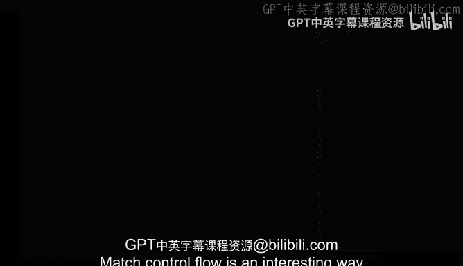
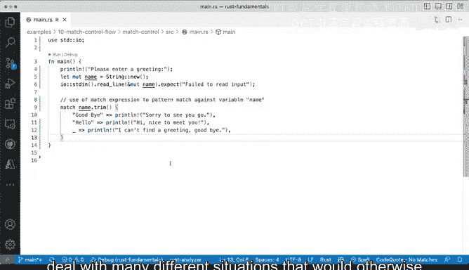

# 038：Rust中的match控制流语句 🔍



在本节课中，我们将要学习Rust编程语言中一个非常强大且独特的控制流结构——`match`语句。`match`语句提供了一种清晰、安全的方式来处理多种可能的情况，它比传统的`if-else`链更强大，尤其适用于枚举类型和模式匹配。我们将通过一个简单的例子来理解它的基本语法和工作原理。

## 概述

`match`控制流是一种处理不同场景的有趣方式。在其他编程语言中，你可能会看到`case`语句或关键字。但在Rust中，它被称为`match`，而不是`case`。它的核心思想是尝试将一个值与一系列模式进行匹配，并为第一个匹配成功的模式执行相应的代码块。

## `match`语句的基本结构

`match`语句的基本语法如下：
```rust
match value_to_match {
    pattern1 => expression1,
    pattern2 => expression2,
    // ...
    _ => default_expression,
}
```
它的工作方式是：将需要匹配的值（写在`match`关键字后）与左侧列出的每一种可能性（即模式）进行比较。每一行代表一种独立的可能性。如果值匹配某个模式，则执行该模式右侧由`=>`符号引导的代码（可以是一个表达式或一个代码块）。

## 一个简单的`match`示例

让我们来看一个具体的例子。假设我们有一个变量`name`，我们想根据它的值打印不同的问候语。

以下是代码示例及其工作流程：
```rust
let name = "hello";
match name {
    "goodbye" => println!("Sorry to see you go."),
    "hello" => println!("Hi, nice to meet you!"),
    _ => println!("I can't find a greeting: {}.", name),
}
```
1.  变量`name`被赋值为`"hello"`。
2.  程序进入`match`块，开始将`name`的值与各个分支进行匹配。
3.  它首先与`"goodbye"`比较，不匹配。
4.  接着与`"hello"`比较，**匹配成功**。
5.  因此，程序会执行对应的代码块，打印出`"Hi, nice to meet you!"`。
6.  匹配成功后，`match`表达式就会结束，不会继续检查后面的分支。

## 通配模式 `_`

在上面的例子中，最后一个分支使用了**下划线`_`**。这是一个通配模式，用于“捕获”所有前面未匹配到的情况。这在此类控制流结构中非常常见，它确保了程序的完备性，即使输入不符合任何预设条件，也有一个默认的处理方式。

## 结合用户输入

为了使程序更有趣，我们可以将`match`与从终端读取用户输入结合起来。这样，程序就能动态地响应用户的输入。

以下是增强版的代码示例：
```rust
use std::io;

fn main() {
    println!("Enter a greeting:");
    let mut input = String::new();
    io::stdin().read_line(&mut input).expect("Failed to read line");

    let trimmed_input = input.trim(); // 使用`.trim()`移除输入首尾的空白字符和换行符

    match trimmed_input {
        "goodbye" => println!("Sorry to see you go."),
        "hello" => println!("Hi, nice to meet you!"),
        _ => println!("I can't find a greeting: {}.", trimmed_input),
    }
}
```
在这个版本中：
1.  程序提示用户输入一个问候语。
2.  使用`io::stdin().read_line(...)`读取用户的输入到字符串`input`中。
3.  使用`.trim()`方法处理输入字符串，移除可能因终端输入而产生的多余空格或换行符，使匹配更精确。
4.  最后，使用`match`语句根据处理后的输入来决定输出哪条消息。

通过这种方式，我们可以构建一个非常健壮的方式来处理终端输入。例如，你可以很容易地将这段逻辑放入一个`while`循环中，持续询问用户并做出响应。

## 总结

本节课中我们一起学习了Rust的`match`控制流语句。我们了解到：
*   `match`是Rust中用于模式匹配的核心语法，它比`if-else`链更清晰、更安全。
*   其基本结构是将一个值与多个模式进行比较，并执行第一个匹配成功的分支对应的代码。
*   通配模式`_`用于处理所有其他未匹配的情况，确保逻辑的完备性。
*   通过将`match`与用户输入（如`io::stdin().read_line`）结合，并辅以字符串处理（如`.trim()`），我们可以构建出能够优雅处理多种情况的交互式程序。



`match`语句是Rust强大表达能力的体现，它允许你以非常简洁和可读的语法处理许多不同的情况，而这些情况在其他语言中可能需要冗长的`if`和`else if`条件链来完成。