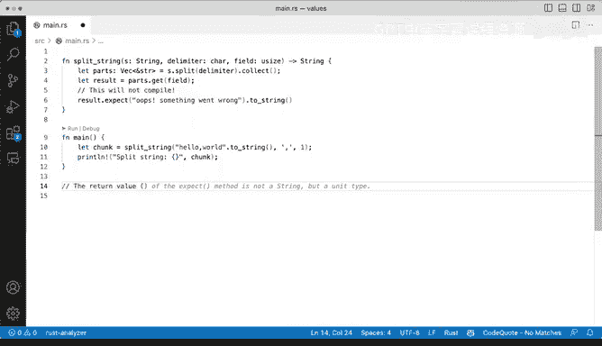
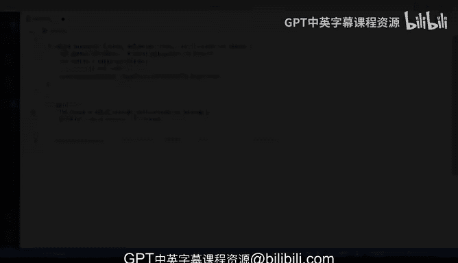

# 042：返回值 📝


## 概述
在本节课中，我们将学习Rust函数中返回值的重要性，并通过一个具体的例子来理解如何处理可能返回`Option`类型的函数，以确保我们的代码能够正确编译和运行。

---

## 返回值的重要性 🔑

在Rust这样的语言中，明确指定函数的返回类型至关重要。函数必须返回其声明中指定的类型，否则会导致编译错误。

例如，`split_string`函数被声明为返回一个`String`类型。这意味着无论函数内部逻辑如何，它最终都必须返回一个`String`。如果不满足这个条件，程序将无法通过编译。

## 问题演示与分析 🔍

上一节我们介绍了返回值的基本概念，本节中我们来看看一个具体的代码示例及其遇到的问题。

我们有一个`main`函数，其中调用了`split_string`。我们向该函数传递了三个参数。虽然参数的具体细节在此不那么重要，但核心问题是：我们期望`chunk`变量是一个`String`。

```rust
let chunk = split_string(...);
```

我们可以利用编辑器（如VS Code）的功能来查看类型提示。将鼠标悬停在`chunk`上，可以看到它被推断为`Option<&str>`类型，而不是我们期望的`String`。这导致了类型不匹配的错误。

错误信息可能看起来复杂，例如：“method `to_string` exists for `Option<&str>`...”。对于初学者，一个很好的建议是：**先尝试运行代码，看看具体的错误上下文**。

运行后，编译器给出了更清晰的建议：它提示我们考虑使用`.expect()`或`.unwrap()`方法来处理`Option`类型，或者检查值是否为`None`。

## 理解 `Option` 枚举 🧩

那么，问题的根源是什么？关键在于`split_string`函数（或类似函数）返回的类型是`Option`。

`Option`是Rust中的一个枚举（`enum`），它用于表示一个值可能存在（`Some`）也可能不存在（`None`）的情况。其定义大致如下：

```rust
enum Option<T> {
    Some(T),
    None,
}
```
这里的`T`是一个泛型参数，可以代表任何类型。对于`Option<&str>`，`T`就是`&str`（字符串切片）。

所以，`result`变量可能是`Some(&str)`，也可能是`None`。直接对它调用`.to_string()`方法是行不通的，因为`.to_string()`是`&str`类型的方法，而不是`Option`类型的方法。

## 解决方案：使用 `expect` 方法 ✅

编译器建议我们使用`.expect()`方法。这个方法的作用是：如果`Option`是`Some(value)`，它就取出这个`value`；如果是`None`，则使程序恐慌（`panic`）并输出我们提供的错误信息。

以下是修改后的代码：

```rust
let chunk = split_string(...).expect("Oops, something went wrong here!").to_string();
```

通过添加`.expect("...")`，我们做了两件事：
1.  安全地从`Option`中提取出内部的`&str`值（如果是`None`则程序终止）。
2.  然后，对这个`&str`值调用`.to_string()`，将其转换为函数签名要求的`String`类型。

修改后代码可以成功编译运行，例如输出分割后的字符串“word”。

## 无返回值函数：`unit` 类型 📦

之前我们讨论了有返回值的函数。那么，像`main`这样没有显式返回值的函数呢？

在Rust中，不返回任何值的函数实际上返回一个特殊的类型，称为**单元（`unit`）类型**，表示为`()`。它类似于其他语言中的`void`，但在Rust中它是一个具体的、唯一的类型。

```rust
fn main() -> () { // `-> ()` 通常可以省略
    // 函数体
}
```

## 总结 🎯

本节课中我们一起学习了：
1.  **返回值的约束**：Rust函数必须严格返回其声明的类型。
2.  **`Option`枚举**：它是一个表示“有值(`Some`)”或“无值(`None`)”的枚举，常用于处理可能失败的操作。
3.  **处理`Option`**：使用`.expect()`方法可以安全地从`Option`中提取值，并在值为`None`时提供明确的错误信息。
4.  **单元类型**：没有显式返回值的函数实际上返回`()`单元类型。





理解并正确处理返回值，特别是像`Option`和`Result`这样的枚举类型，是编写健壮、可编译Rust代码的基础。