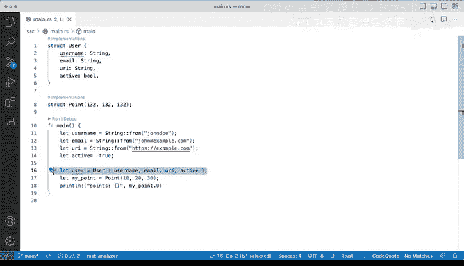

# 052：其他结构体用途 🧱


在本节课中，我们将学习Rust中定义和创建结构体实例的几种不同方法。我们将探讨字段初始化简写语法和元组结构体的使用，这些技巧能让你的代码更简洁、更灵活。

## 结构体实例化的不同方式

上一节我们介绍了如何通过逐一指定字段来创建结构体实例。本节中我们来看看其他更便捷的方法。

### 字段初始化简写语法

当变量名与结构体字段名相同时，Rust提供了一种简写语法来初始化字段。

以下是使用传统方式创建`User`结构体实例的示例：

```rust
struct User {
    username: String,
    email: String,
    sign_in_count: u64,
    active: bool,
}

let username = String::from("john_doe");
let email = String::from("john@sample.com");
let sign_in_count = 1;
let active = true;

let user = User {
    username: username,
    email: email,
    sign_in_count: sign_in_count,
    active: active,
};
```

当变量名与字段名完全匹配时，可以使用简写语法：

```rust
let user = User {
    username,
    email,
    sign_in_count,
    active,
};
```

这种简写语法使代码更简洁。条件是变量名必须与结构体字段名完全相同。在某些情况下，如果字段名发生变化，可能需要重构代码。使用Visual Studio Code等编辑器并安装Rust扩展，可以帮助你重命名变量以保持一致性。

### 元组结构体

Rust还支持元组结构体，它结合了元组和结构体的特性。元组结构体有名称，但其字段没有名称，只有类型。

以下是定义和使用元组结构体的示例：

```rust
struct Point(i32, i32, i32);

let my_point = Point(10, 20, 30);
```

访问元组结构体的字段需要使用索引，因为字段没有名称：

```rust
println!("Point x: {}", my_point.0); // 输出 10
println!("Point y: {}", my_point.1); // 输出 20
println!("Point z: {}", my_point.2); // 输出 30
```

在这个例子中，`my_point.0`对应第一个值10，`my_point.1`对应20，`my_point.2`对应30。运行代码会输出`Point x: 10`。

## 总结



本节课中我们一起学习了Rust结构体的两种高级用法。我们探讨了字段初始化简写语法，它能在变量名与字段名匹配时简化代码。我们还学习了元组结构体，它适用于不需要命名字段的情况。这些方法各有其适用场景，能够帮助你编写更高效、更清晰的Rust代码。