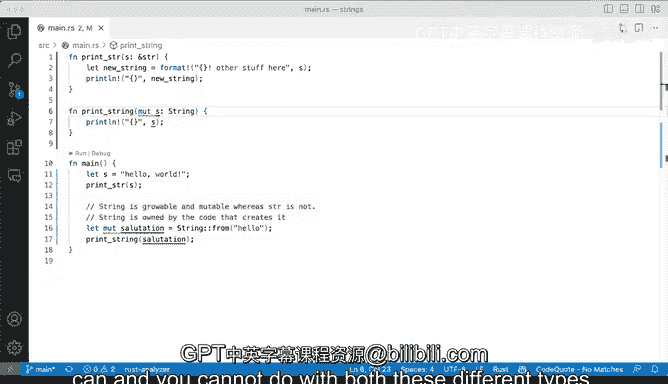

# 055：理解String与str 🧠


在本节课中，我们将要学习Rust中两种重要的字符串类型：`String` 和 `&str`（字符串切片）。我们将通过具体的代码示例来探讨它们之间的核心区别，包括可变性、所有权以及各自的使用场景。

## 概述

Rust中的字符串处理是一个核心概念。`String` 是一个可增长、可变的、拥有所有权的UTF-8编码字符串类型。而 `&str` 是一个字符串切片，它是对存储在别处的UTF-8编码字符串数据的不可变引用。理解这两者的区别对于编写高效、安全的Rust代码至关重要。

---

## 字符串切片（&str）的特性

上一节我们介绍了两种字符串类型的基本概念，本节中我们来看看字符串切片 `&str` 的具体特性。

字符串切片通常以 `&str` 的形式出现。`&` 符号意味着它几乎总是一个指向**由他人拥有**的现有字符串数据的引用。

`&str` 的一个关键特性是**不可变性**。你无法修改一个字符串切片的内容。

```rust
let s: &str = "hello world";
// s.push_str(" new text"); // 这行代码会编译错误，因为 &str 不可变
```

以下是创建和使用字符串切片的示例：

```rust
fn print_str(s: &str) {
    println!("{}", s);
}

fn main() {
    let my_slice: &str = "hello world";
    print_str(my_slice); // 传递 &str 类型，无需额外添加 &
}
```

在这个例子中，`my_slice` 的类型是 `&str`。当我们将其传递给 `print_str` 函数时，因为参数类型就是 `&str`，所以直接传递即可。

---

## 字符串类型（String）的能力

了解了不可变的字符串切片后，本节我们来看看功能更强大的 `String` 类型。

与 `&str` 不同，`String` 类型是可变的，并且拥有其数据的所有权。这意味着你可以修改其内容。

如果你有一个 `&str` 但需要修改它，一个常见的做法是将其转换为 `String`。

以下是转换和操作 `String` 的几种方法：

1.  **使用 `String::from` 或 `to_string` 进行转换**
    你可以从一个字符串切片创建新的 `String`。

    ```rust
    let s1: &str = "hello world";
    let mut s2: String = String::from(s1); // 或者 s1.to_string()
    ```

2.  **使用 `push_str` 方法修改字符串**
    `String` 类型提供了 `push_str` 方法来追加内容。注意，变量必须声明为 `mut`（可变的）。

    ```rust
    let mut s2 = String::from("hello world");
    s2.push_str(" some other string");
    println!("{}", s2); // 输出：hello world some other string
    ```

3.  **使用 `format!` 宏创建新字符串**
    `format!` 宏是一个灵活的工具，它可以格式化文本并返回一个新的 `String`，而不需要改变原始数据。

    ```rust
    let s1: &str = "hello world";
    let new_string = format!("{} - other stuff here", s1);
    // new_string 的类型是 String
    ```

---

## 可变性与函数参数

当在函数中处理字符串时，可变性的规则同样适用。如果你想在函数内部修改一个 `String` 参数，必须将其标记为可变引用 `&mut String`。

```rust
fn modify_string(s: &mut String) {
    s.push_str(" has been modified");
}

fn main() {
    let mut greeting = String::from("Hello");
    modify_string(&mut greeting);
    println!("{}", greeting); // 输出：Hello has been modified
}
```

你需要密切关注Rust的所有权和借用规则。如果你在函数中修改了字符串并可能需要返回它，必须根据所有权是否转移来设计你的函数签名。

---

## 核心区别与使用场景总结

本节课中我们一起学习了 `String` 和 `&str` 的主要区别。以下是核心要点的总结：

*   **所有权与可变性**：`String` 拥有数据且可变；`&str` 是借用数据且不可变。
*   **内存布局**：`String` 在堆上分配内存；`&str` 是对内存中某处字符串的引用。
*   **使用场景**：
    *   当你需要一个可以动态增长、收缩或修改的字符串时，使用 **`String`**。例如，从文件或网络读取的数据，或用户输入。
    *   当你只需要一个字符串的只读视图，或者字符串字面量（在编译时已知）时，使用 **`&str`**。这常用于函数参数，以接受更灵活的类型（既能接受 `&str`，也能接受 `&String`，因为 `String` 可以解引用为 `&str`）。

一个重要的实践原则是：在函数签名中，优先使用 `&str` 作为参数类型，除非你明确需要在函数内部获取所有权（用 `String`）或修改内容（用 `&mut String`）。这能使你的API更通用、更灵活。

```rust
// 好的实践：接受字符串切片，调用者可以传递 String 或 &str
fn good_function(input: &str) {
    // ...
}

// 更具体的需求：需要修改或获取所有权
fn needs_mutability(input: &mut String) {
    // ...
}
fn takes_ownership(input: String) {
    // ...
}
```



通过掌握 `String` 和 `&str` 的区别，你就能更好地利用Rust的类型系统来管理内存和确保数据安全。