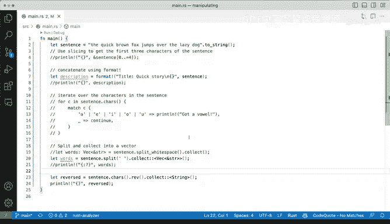
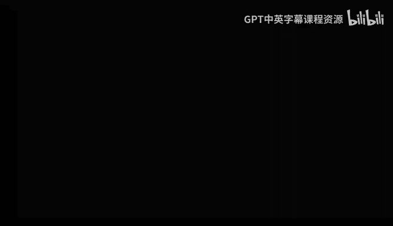

# 056：Rust字符串操作演示


在本节课中，我们将学习Rust中字符串的基本操作。我们将通过几个示例来探索如何对字符串进行切片、格式化、迭代、分割和反转。这些操作是处理文本数据的基础。

## 字符串切片操作

上一节我们介绍了字符串的基本概念，本节中我们来看看如何获取字符串的一部分。

我们可以使用切片语法来获取字符串的前几个字符。在Rust中，字符串切片使用范围索引。

```rust
let sentence = String::from("The quick brown fox jumps over the lazy dog");
let first_three = &sentence[0..3];
println!("{}", first_three);
```

运行这段代码会输出字符串的前三个字符。需要注意的是，范围索引可以是包含的，使用`..=`语法。

```rust
let first_four = &sentence[0..=3];
println!("{}", first_four);
```

## 使用format!宏进行字符串拼接

接下来，我们看看如何使用`format!`宏来拼接字符串。这是一种灵活且安全的方式。

```rust
let formatted = format!("{} - formatted", sentence);
println!("{}", formatted);
```

`format!`宏可以接受字符串切片（`&str`）或字符串（`String`）类型，并返回一个新的`String`。这使得它在处理不同类型字符串时非常方便。

## 迭代字符串中的字符

以下是遍历字符串中每个字符的方法。这在需要检查或处理每个字符时非常有用。

```rust
for c in sentence.chars() {
    match c {
        'a' | 'e' | 'i' | 'o' | 'u' => println!("Got a vowel: {}", c),
        _ => continue,
    }
}
```

这段代码会遍历句子中的每个字符，并打印出所有的元音字母。这是一个简单的例子，展示了如何基于条件处理字符。

## 按空白分割字符串

在处理文本时，经常需要将句子分割成单词。以下是按空白字符分割字符串并将其收集到向量中的方法。

```rust
let words: Vec<&str> = sentence.split_whitespace().collect();
println!("{:?}", words);
```

`split_whitespace`方法返回一个迭代器，我们可以使用`collect`方法将其转换为向量。向量是一种集合类型，类似于其他语言中的数组或列表。

## 反转字符串

作为额外内容，我们还可以反转字符串。虽然在实际应用中不常用，但它展示了字符串操作的另一种可能性。

```rust
let reversed: String = sentence.chars().rev().collect();
println!("{}", reversed);
```

这段代码首先将字符串转换为字符迭代器，然后使用`rev`方法反转迭代顺序，最后收集成一个新的字符串。

---





本节课中我们一起学习了Rust字符串的几种基本操作：切片、格式化拼接、字符迭代、按空白分割以及反转。这些操作是文本处理的基础，掌握它们将帮助你更有效地处理字符串数据。