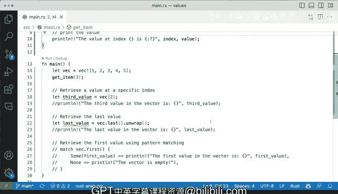

# 058：从向量检索值 🧮


在本节课中，我们将学习如何从Rust的向量（Vector）中检索值。向量是一种可存储多个相同类型值的集合。我们将探讨几种不同的检索方法，包括通过索引直接访问、使用安全的方法获取首尾元素，以及如何处理可能出现的错误情况。

## 从向量中检索值的几种方法

有多种方法可以从向量中检索值。让我们具体看看如何操作。

首先，我们定义一个不可变的向量。这个向量在定义后不会被修改。

```rust
let vector = vec![1, 2, 3, 4, 5];
```

接下来，我们将学习如何从这个向量中检索值。

### 通过索引检索特定值

我们可以通过索引来检索向量中的特定值。请记住，索引从0开始。

例如，第三个值的索引是2。

```rust
let third_value = vector[2];
println!("向量中的第三个值是：{}", third_value);
```

这意味着这里的数字`3`是第三个值。因为索引2对应的是第三项。

### 检索最后一个值

向量提供了一个便捷的方法`.last()`来获取最后一个元素。由于向量可能为空，此方法返回一个`Option`类型，因此我们需要调用`.unwrap()`来获取实际值。

```rust
let last_value = vector.last().unwrap();
println!("向量中的最后一个值是：{}", last_value);
```

`.last()`方法返回`Option`类型的原因是：它可能返回一个值，也可能返回`None`（如果向量为空）。这是一种安全的检索方式，可以避免程序出错。我们使用`.unwrap()`是因为我们确信向量不为空，并希望直接获取其中的值。

### 使用`match`表达式处理检索结果

另一种有趣的方式是使用`match`表达式。例如，我们可以检索第一个元素，并根据结果执行不同的操作。

```rust
match vector.first() {
    Some(value) => println!("向量的第一个值是：{}", value),
    None => println!("向量为空"),
}
```

`.first()`方法同样返回`Option`类型。通过`match`表达式，我们可以优雅地处理有值和无值（即向量为空）两种情况。

运行上述代码，我们将依次得到：`3`、`5`和`1`。

## 处理空向量的情况

如果向量是空的，会发生什么情况呢？

让我们定义一个空向量：

```rust
let empty_vector: Vec<i32> = vec![];
```

此时，如果我们尝试通过索引`[2]`访问元素，程序将会**恐慌（panic）**，因为索引超出了向量的长度。

```rust
// 这行代码会导致 panic!
// let value = empty_vector[2];
```

错误信息会是：`thread 'main' panicked at 'index out of bounds: the len is 0 but the index is 2'`。向量完全为空，我们无法访问索引2处的元素。

同样，尝试对空向量调用`.last().unwrap()`也会导致恐慌，因为我们在一个`None`值上调用了`.unwrap()`。

```rust
// 这也会导致 panic!
// let last = empty_vector.last().unwrap();
```

在这种情况下，使用`match`表达式处理`.first()`方法则不会恐慌，因为它能妥善处理`None`的情况。

```rust
match empty_vector.first() {
    Some(value) => println!("值为：{}", value),
    None => println!("向量为空，没有第一个值。"),
}
```

当Rust无法从上下文推断空向量的类型时，我们需要显式声明其类型，如`Vec<i32>`。

## 创建检索函数并理解索引类型

上一节我们介绍了基础的检索操作，本节中我们来看看如何将其封装成函数，并注意一个关键的索引类型细节。

让我们定义一个函数，它接收一个索引并返回向量中对应位置的值。

```rust
fn get_item(index: usize) -> Option<&i32> {
    let v = vec![1, 2, 3, 4, 5];
    v.get(index)
}
```

这个函数使用`.get(index)`方法，它安全地返回一个`Option<&T>`，而不是直接恐慌。

我们可以这样调用它：

```rust
println!("索引3处的值是：{:?}", get_item(3));
```

输出将是`Some(4)`。为了直接得到数字`4`，我们可以使用`.unwrap()`。

```rust
let value = get_item(3).unwrap();
println!("索引3处的值是：{}", value);
```

现在，如果我们想让函数更通用，允许传入索引参数，需要注意索引的类型。

你可能会尝试使用`u8`作为索引类型：

```rust
// 错误的尝试
// fn get_item(index: u8) -> Option<&i32> { ... }
// get_item(3);
```

但这会导致错误：`the type \`Vec<i32>\` cannot be indexed by \`u8\``。

**关键在于，用于索引向量的类型必须是`usize`。** `usize`是一个指针大小的无符号整数类型，其大小取决于目标平台的内存地址空间（例如，在32位系统上是4字节，64位系统上是8字节）。这是Rust用于索引集合类型的标准类型。

因此，正确的函数签名应该是：

```rust
fn get_item(index: usize) -> Option<&i32> {
    let v = vec![1, 2, 3, 4, 5];
    v.get(index)
}
```

现在，调用`get_item(3)`就能正常工作了。

## 总结

本节课中我们一起学习了从Rust向量中检索值的多种方法：
1.  **通过索引**：使用`vector[index]`，但需注意越界会导致恐慌。
2.  **安全方法**：使用`.get(index)`返回`Option`，或使用`.first()`、`.last()`。
3.  **错误处理**：使用`match`表达式或`.unwrap()`（在确定有值时）来处理`Option`结果。
4.  **关键类型**：向量的索引必须是`usize`类型。
5.  **空向量**：操作空向量时需要格外小心，优先使用返回`Option`的安全方法。



理解这些不同的检索方式及其安全性，是有效使用Rust向量的基础。