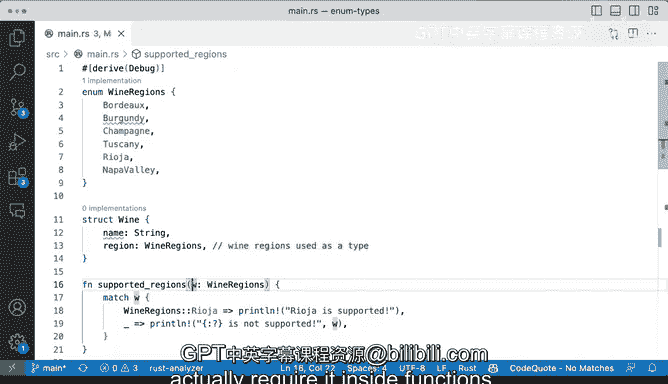

# 063：使用枚举作为类型 🍷


在本节课中，我们将学习如何在Rust中使用枚举（`enum`）作为一种自定义数据类型。我们将看到如何将枚举用作结构体字段的类型，以及如何将其作为函数参数的类型，从而编写出更安全、更清晰的代码。

## 枚举是什么？

枚举是Rust中的一种自定义数据类型。它可以容纳多种不同的信息。在本例中，我们将使用一个表示葡萄酒产区的枚举。

以下是`WineRegions`枚举的定义：

```rust
enum WineRegions {
    Bordeaux,
    Burgundy,
    Champagne,
    Tuscany,
    Rioja,
    NapaValley,
}
```

从第10行到第20行，我们定义了这个枚举，它包含多个不同的变体（如`Bordeaux`、`Tuscany`等）。代码中的花括号下划线提示我们正在使用所有变体，目前这没有问题。

## 在结构体中使用枚举类型

上一节我们介绍了枚举的定义，本节中我们来看看如何将枚举用作结构体字段的类型。

首先，我们将在结构体中使用它。以下两个例子都涉及结构体，但请注意，我们传入了一个名称，然后使用了`region`字段。

枚举允许我们做什么？让我们回头看看这里的`Wine`结构体：

```rust
struct Wine {
    name: String,
    region: WineRegions, // 使用WineRegions枚举作为类型
}
```

你可以看到我们有两个字段：第一个是`name`字段，它接受一个`String`；第二个是`region`字段，它要求使用`WineRegions`类型。这意味着什么？如果我们将其注释掉，并说这也是一个字符串，那就需要你输入各种不同的字符串，比如“Napa Valley”。这容易出错，可能会出现拼写错误。

这就是枚举非常有用的原因。它允许我们非常明确地指定结构体字段将拥有什么类型的数据或描述。在本例中，我们声明任何来自`WineRegions`枚举的值都是有效的。

回到我们的`main`函数，这意味着我们可以用非常符合Rust习惯的方式来表达。这是一种非常地道的说法：“嘿，这是`Wine`结构体，这是名称，产区是`Bordeaux`。”这很有意义。另一款酒将是来自意大利的“Barolo”，产区是`Tuscany`。这个变体让我们能够很好地描述我们所拥有的数据。

如果我们运行以下代码：

```rust
fn main() {
    let wine1 = Wine {
        name: String::from("Chateau Margaux"),
        region: WineRegions::Bordeaux,
    };

    let wine2 = Wine {
        name: String::from("Barolo"),
        region: WineRegions::Tuscany,
    };

    println!("Wine 1 is a {} from {:?}", wine1.name, wine1.region);
    println!("Wine 2 is a {} from {:?}", wine2.name, wine2.region);
}
```

我们将在底部看到输出：
`Wine 1 is a Chateau Margaux from Bordeaux`
`Wine 2 is a Barolo from Tuscany`

这非常棒。我真的很喜欢这个功能，它允许我们在结构体中使用类型。

## 将枚举作为函数参数类型

除了在结构体中使用，我们还可以将枚举作为函数参数的要求。这意味着我们可以声明一个函数，它接受一个特定的枚举类型作为参数。

以下是一个非常简单的函数，它接受一个`WineRegions`枚举类型的参数`w`：

```rust
fn supported_regions(w: WineRegions) {
    match w {
        WineRegions::Tuscany => println!("Tuscany is supported!"),
        WineRegions::Rioja => println!("Rioja is supported!"),
        _ => println!("{:?} is not supported.", w),
    }
}
```

让我们调用这个函数，看看能得到什么。我们不再打印所有内容，而是实际调用我们的函数`supported_regions`。

我们可以这样调用：
`supported_regions(WineRegions::Bordeaux);`
或者：
`supported_regions(WineRegions::Rioja);`

以这种方式做有什么问题吗？其实没有问题。只是我这里有额外的部分，我需要保存它。你绝对可以像这样传递参数。

现在，如果我运行它，我们会看到输出：
`Bordeaux is not supported.`
`Rioja is supported!`

你可以使用`match`关键字进行一些混合匹配，使其工作得非常完美。

## 总结



本节课中我们一起学习了如何在Rust中使用枚举作为类型。我们看到了如何将其作为结构体的一部分添加，使其在描述数据结构时非常清晰和具有描述性。我们还学习了如何在函数内部要求枚举作为参数，并使用`match`表达式对其进行处理。这些技巧能帮助我们编写更健壮、更易维护的代码。