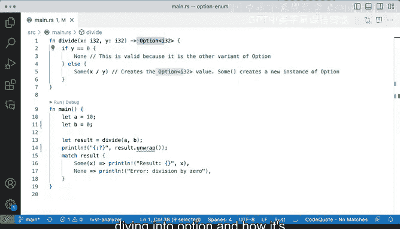

# 064：Option枚举 🧩


在本节课中，我们将深入学习Rust中一个非常重要的概念——`Option`枚举。我们将探讨它的定义、用途，以及如何通过它来优雅地处理可能缺失的值或潜在的错误情况。

## 概述

`Option`枚举是Rust标准库的核心部分，用于表示一个值可能存在（`Some`）或不存在（`None`）的情况。它提供了一种类型安全的方式来处理可能失败的操作，避免了空指针异常等常见问题。本节我们将通过一个具体的除法函数示例，来演示`Option`的工作原理和实际应用。

## Option枚举的定义与理解

上一节我们介绍了枚举的基本概念，本节中我们来看看`Option`这个特殊的枚举。

`Option`是一个枚举，它有两个变体：`Some(T)` 和 `None`。这里的 `T` 是一个泛型参数，意味着`Some`可以包装任何类型的值。其核心定义可以理解为：

```rust
enum Option<T> {
    Some(T),
    None,
}
```

`Some`是一个枚举变体，它包装了一个类型为`T`的值。`None`则表示没有值。对于从JavaScript或Python等语言转来的开发者来说，这个概念可能最初会感觉有些抽象，但它本质上就是一个简单的枚举，用于表示“有值”或“无值”两种状态。

## 示例：一个返回Option的函数

让我们通过一个具体的函数来理解`Option`的用法。我们有一个函数`divide`，它接收两个`i32`类型的参数，并返回一个`Option<i32>`。

```rust
fn divide(x: i32, y: i32) -> Option<i32> {
    if y == 0 {
        None
    } else {
        Some(x / y)
    }
}
```

函数签名 `-> Option<i32>` 意味着这个函数**肯定**会返回一个`Option`类型。更具体地说，它要么返回`None`，要么返回一个包装了`i32`整数值的`Some`。这种设计非常强大，因为它抽象了我们处理错误和边界情况（如除数为零）的方式。

在代码块中，我们检查除数`y`。如果`y`等于0，我们返回`None`。这里可能看起来有点奇怪，因为`None`本身并不是一个`i32`，但由于`None`是`Option`枚举的一个有效变体，所以这样返回是完全合法的。否则，如果`y`不为0，我们就执行除法运算，并用`Some`包装结果`x / y`，从而构造出一个`Option<i32>`值。

## 使用match处理Option的结果

定义了函数后，我们需要一种方式来安全地处理它的返回值。以下是使用`match`表达式处理`Option`的典型模式：

```rust
let a = 10;
let b = 2;
let result = divide(a, b);

match result {
    Some(x) => println!("结果是: {}", x),
    None => println!("错误：除数为零"),
}
```

当`a=10, b=2`时，`divide`函数返回`Some(5)`。`match`表达式会匹配到`Some(x)`分支，并将内部值`5`绑定到变量`x`，然后打印出结果。如果我们将`b`改为0，函数将返回`None`，`match`则会执行`None`分支，打印出错误信息。

## 谨慎使用unwrap方法

除了`match`，`Option`还提供了一个名为`unwrap`的方法。这个方法会直接取出`Some`中的值，但如果遇到`None`，则会导致程序恐慌（panic）。

```rust
// 如果result是Some(5)，这会打印出5
println!("直接解包: {}", result.unwrap());

// 如果result是None，这行代码会导致程序崩溃
// println!("直接解包: {}", result.unwrap()); // 危险！
```

以下是使用`unwrap`的示例输出：
- 当结果为`Some(5)`时，`result.unwrap()`会安全地返回`5`。
- 当结果为`None`（例如除数为零时）时，调用`unwrap`会立即引发恐慌，并产生类似“thread ‘main’ panicked at ‘called `Option::unwrap()` on a `None` value’”的错误信息。

理解这些错误信息并学会查看堆栈跟踪，是调试和解决Rust程序中问题的关键技能，尤其是在你熟悉了所操作的类型（如`Option`）之后。

## 总结

本节课中我们一起学习了`Option`枚举。我们了解到：
1.  `Option<T>` 是一个用于表示可选值的枚举，包含 `Some(T)` 和 `None` 两个变体。
2.  它是处理可能缺失的值或潜在操作失败（如除数为零）的类型安全方式。
3.  我们可以使用 `match` 表达式来安全地检查和提取 `Option` 中的值。
4.  `unwrap` 方法可以快速获取 `Some` 中的值，但在值为 `None` 时会引发程序恐慌，因此需要谨慎使用。



通过掌握`Option`，你为编写健壮、无错误的Rust程序奠定了重要基础。