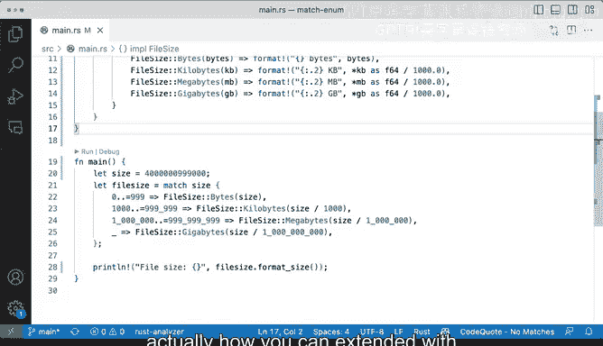

# 065：应用枚举 📂


在本节课中，我们将学习如何在实际场景中应用Rust的枚举（`enum`）。我们将创建一个表示文件大小的枚举，并编写一个函数来将其格式化为人类可读的形式（例如，字节、千字节、兆字节、千兆字节）。通过这个例子，你将看到枚举如何帮助组织代码，以及如何为枚举实现关联函数（方法）。

---

## 概述

我们将定义一个名为 `FileSize` 的枚举，它有四个变体：`Bytes`、`Kilobytes`、`Megabytes` 和 `Gigabytes`。然后，我们将编写一个函数，该函数接收一个以字节为单位的大小值，并根据其数值范围，将其匹配到相应的 `FileSize` 变体，最后格式化为易读的字符串。

---

## 定义枚举

首先，我们定义 `FileSize` 枚举。它代表文件大小的不同单位。

```rust
enum FileSize {
    Bytes(u64),
    Kilobytes(f64),
    Megabytes(f64),
    Gigabytes(f64),
}
```

这里，`Bytes` 变体存储一个无符号64位整数，而其他变体存储浮点数，以便进行除法运算。

---

## 实现格式化函数

接下来，我们实现一个函数 `format_size`。该函数接收一个字节数，通过匹配其数值范围，决定使用哪个 `FileSize` 变体，然后进行格式化。

以下是 `format_size` 函数的实现步骤：

1.  使用 `match` 表达式根据字节数的大小范围选择 `FileSize` 变体。
2.  对于每个变体，进行相应的计算（例如，将字节转换为千字节需要除以1024.0）。
3.  使用第二个 `match` 表达式根据具体的变体生成格式化的字符串。

```rust
fn format_size(size: u64) -> String {
    let filesize = match size {
        0..=999 => FileSize::Bytes(size),
        1000..=999_999 => FileSize::Kilobytes(size as f64 / 1024.0),
        1_000_000..=999_999_999 => FileSize::Megabytes(size as f64 / (1024.0 * 1024.0)),
        _ => FileSize::Gigabytes(size as f64 / (1024.0 * 1024.0 * 1024.0)),
    };

    match filesize {
        FileSize::Bytes(bytes) => format!("{} bytes", bytes),
        FileSize::Kilobytes(kb) => format!("{:.2} KB", kb),
        FileSize::Megabytes(mb) => format!("{:.2} MB", mb),
        FileSize::Gigabytes(gb) => format!("{:.2} GB", gb),
    }
}
```

---

## 在 `main` 函数中测试

现在，我们可以在 `main` 函数中测试这个 `format_size` 函数。

```rust
fn main() {
    let size = 2500; // 示例字节数
    println!("{}", format_size(size));
}
```

运行这段代码，对于输入 `2500`，输出应为 `"2.44 KB"`。你可以尝试不同的字节数值，观察输出如何变化。

---

## 为枚举实现方法

上一节我们介绍了如何使用独立函数处理枚举。本节中，我们来看看如何将格式化逻辑更紧密地与枚举本身耦合，即为其实现一个方法。

在Rust中，就像为结构体（`struct`）实现方法一样，我们也可以使用 `impl` 关键字为枚举实现关联函数和方法。这样做可以使代码组织得更清晰，功能与数据结合得更紧密。

以下是 `FileSize` 枚举的实现（`impl`）块，其中定义了一个 `format` 方法：

```rust
impl FileSize {
    fn format(&self) -> String {
        match self {
            FileSize::Bytes(bytes) => format!("{} bytes", bytes),
            FileSize::Kilobytes(kb) => format!("{:.2} KB", kb),
            FileSize::Megabytes(mb) => format!("{:.2} MB", mb),
            FileSize::Gigabytes(gb) => format!("{:.2} GB", gb),
        }
    }
}
```

现在，更新 `main` 函数，直接使用枚举变体并调用其 `format` 方法：

```rust
fn main() {
    let files = vec![
        FileSize::Bytes(150),
        FileSize::Kilobytes(2.5),
        FileSize::Megabytes(100.0),
        FileSize::Gigabytes(5.2),
    ];

    for f in files {
        println!("{}", f.format());
    }
}
```

这种方法使得 `format` 逻辑成为 `FileSize` 类型的一部分，调用起来更加直观：`filesize.format()`。

---

## 总结

本节课中我们一起学习了Rust枚举的两个重要应用方式：
1.  使用 `match` 表达式和独立函数来处理枚举变体，并根据输入值动态创建和格式化枚举实例。
2.  使用 `impl` 关键字为枚举实现关联方法，将行为与数据类型紧密绑定，从而写出更模块化、更易维护的代码。



通过文件大小格式化的实际例子，你看到了枚举如何使代码意图更清晰，以及如何通过两种不同的代码组织方式（独立函数 vs 关联方法）来达到相似的目标。在实际开发中，为枚举实现方法通常是更受推荐的做法，因为它遵循了将数据与操作封装在一起的原则。