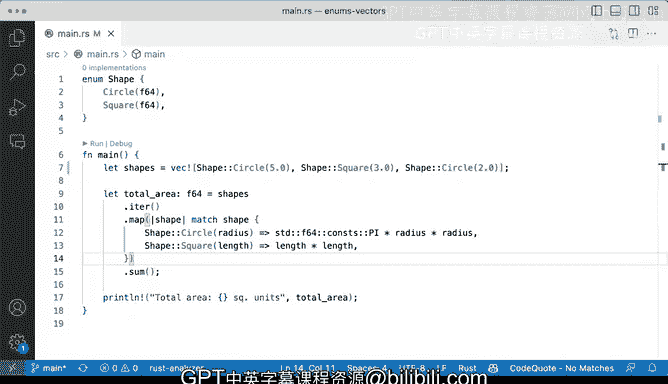

# 066：在向量中使用枚举 🧩


在本节课中，我们将学习如何将枚举（Enums）与向量（Vectors）结合使用。我们将创建一个包含不同形状（圆形和正方形）的向量，并计算所有形状的总面积。通过这个例子，你将看到如何利用枚举的变体（Variants）来存储不同类型的数据，并使用迭代器（Iterator）和`map`方法进行高效的数据处理。

---

## 枚举定义与向量创建

首先，我们定义一个名为`Shape`的枚举。它有两个变体：`Circle`和`Square`。每个变体都关联一个`f64`类型的值。对于`Circle`，这个值代表半径；对于`Square`，则代表边长。

```rust
enum Shape {
    Circle(f64),
    Square(f64),
}
```

接下来，我们创建一个`Shape`类型的向量。这个向量包含两个元素：一个半径为5.0的圆形和一个边长为3.0的正方形。

```rust
let shapes = vec![Shape::Circle(5.0), Shape::Square(3.0)];
```

---

## 计算总面积

现在，我们来计算这个向量中所有形状的总面积。我们将定义一个函数`total_area`，它接收一个`Shape`类型的向量，并返回一个`f64`类型的总面积。

以下是实现步骤的分解：

1.  **迭代向量**：我们使用`.iter()`方法获取向量的迭代器。
2.  **映射与匹配**：使用`.map()`方法处理迭代器中的每个元素。在`map`的闭包中，我们使用`match`表达式来匹配每个`Shape`变体。
3.  **计算面积**：
    *   如果匹配到`Circle(radius)`，则使用圆的面积公式 **π * radius²** 进行计算。
    *   如果匹配到`Square(length)`，则使用正方形的面积公式 **length²** 进行计算。
4.  **求和**：最后，使用`.sum()`方法将所有计算出的面积累加起来。

以下是完整的代码实现：

```rust
fn total_area(shapes: Vec<Shape>) -> f64 {
    shapes
        .iter()
        .map(|shape| match shape {
            Shape::Circle(radius) => std::f64::consts::PI * radius * radius,
            Shape::Square(length) => length * length,
        })
        .sum()
}
```

让我们运行这段代码。对于半径为5.0的圆和边长为3.0的正方形，计算出的总面积约为**87.53**平方单位。

---

## 扩展性与灵活性

这种方法的优势在于其扩展性。如果我们想向向量中添加更多形状，例如再添加一个半径为2.0的圆，只需将其推入向量即可：

```rust
let shapes = vec![Shape::Circle(5.0), Shape::Square(3.0), Shape::Circle(2.0)];
```

再次运行`total_area`函数，总面积会相应更新，例如增长到约**100**平方单位。这演示了如何轻松地处理动态数据集合。

---

## 总结

本节课中，我们一起学习了如何将枚举与向量结合使用。我们定义了一个带有关联数据的枚举，创建了该枚举类型的向量，并利用迭代器的`.map()`方法和`match`表达式，高效地计算了集合中所有元素的总面积。

核心要点包括：
*   枚举变体可以存储数据，使类型更加丰富。
*   向量可以存储同一枚举类型的不同变体。
*   迭代器与`map`、`match`的组合，是处理此类集合数据的强大且优雅的模式。



通过掌握这些概念，你可以在Rust中更灵活地组织和处理复杂的数据结构。