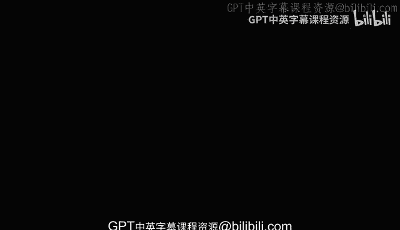
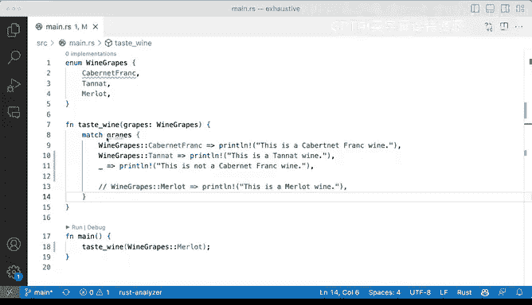

# 067：穷尽匹配 🍇

在本节课中，我们将学习Rust中一个非常重要的概念：**穷尽匹配**。当使用 `match` 表达式处理枚举（`enum`）时，Rust编译器会强制要求你处理所有可能的情况。我们将通过一个关于葡萄酒葡萄品种的枚举示例，来理解为什么需要这样做，以及如何使用通配符 `_` 来简化代码。

## 问题引入：一个编译错误



上一节我们介绍了枚举和模式匹配的基本用法。本节中我们来看看，如果在匹配枚举时遗漏了某些情况会发生什么。

观察以下代码，在 `match` 表达式下，`grapes` 下方有一条红色的波浪线，这表明代码中存在一个错误。

```rust
enum WineGrapes {
    CabernetFranc,
    Tannat,
    Merlot,
}

fn taste_wine(grapes: WineGrapes) {
    match grapes {
        WineGrapes::CabernetFranc => println!("This is a Cabernet Franc wine."),
        // 这里故意注释掉了 Tannat 和 Merlot 的处理分支
        // WineGrapes::Tannat => println!("This is a Tannat wine."),
        // WineGrapes::Merlot => println!("This is a Merlot wine."),
    }
}
```

为什么编译器会报错呢？一个像 `WineGrapes` 这样的枚举定义了若干变体。如果我们定义了三个变体，那么Rust会要求我们在 `match` 表达式中处理所有这三种变体。我们目前只处理了其中一种，所以编译器会提示错误。

## 理解穷尽性要求

Rust的设计目标是安全，它希望确保你的代码不会因为未处理的枚举变体而崩溃。因此，`match` 表达式必须是**穷尽的**，即覆盖所有可能的值。

当我们注释掉 `Tannat` 和 `Merlot` 的分支时，保存代码，红色波浪线依然存在。编译器给出的错误信息类似于：
`missing match arm: Tannat and Merlot not covered` 或 `non-exhaustive patterns`。

这意味着 `match` 没有覆盖 `WineGrapes::Tannat` 和 `WineGrapes::Merlot` 这两种情况。如果我们取消这些注释，让 `match` 覆盖所有三个变体，错误就会消失，代码可以正常工作。

```rust
fn taste_wine(grapes: WineGrapes) {
    match grapes {
        WineGrapes::CabernetFranc => println!("This is a Cabernet Franc wine."),
        WineGrapes::Tannat => println!("This is a Tannat wine."),
        WineGrapes::Merlot => println!("This is a Merlot wine."),
    }
}

fn main() {
    let my_wine = WineGrapes::CabernetFranc;
    taste_wine(my_wine); // 输出：This is a Cabernet Franc wine.
}
```

## 使用通配符简化匹配

那么，是否每次都必须列出每一个变体呢？并非如此。我们之前已经见过一种例外情况：**通配符模式**。

当我们注释掉部分分支再次出现错误时，我们可以使用下划线 `_` 来捕获所有未被明确列出的情况。

以下是具体做法：

```rust
fn taste_wine(grapes: WineGrapes) {
    match grapes {
        WineGrapes::CabernetFranc => println!("This is a Cabernet Franc wine."),
        _ => println!("This wine is fine, but I don't care about the specific grape."),
    }
}
```

你会发现，红色波浪线消失了。这是因为 `_` 代表了“除了 `CabernetFranc` 之外的所有其他情况”。这样，`match` 表达式依然是穷尽的。

这种方法非常有用，特别是当枚举有很多变体，而你只关心其中少数几个的时候。你不需要显式地列出200个变体，只需要处理你关心的，然后用 `_` 处理剩下的即可。

我们可以混合使用具体匹配和通配符。运行修改后的代码，当传入 `WineGrapes::CabernetFranc` 时，会输出对应的信息；如果传入 `WineGrapes::Tannat` 或 `WineGrapes::Merlot`，则会执行 `_` 分支的代码。

```rust
fn main() {
    taste_wine(WineGrapes::CabernetFranc); // 输出关于Cabernet Franc的信息
    taste_wine(WineGrapes::Tannat);        // 输出通配符分支的信息
    taste_wine(WineGrapes::Merlot);        // 输出通配符分支的信息
}
```

## 总结

本节课中我们一起学习了Rust中的**穷尽匹配**规则。核心要点是：
*   **规则**：使用 `match` 处理枚举时，必须覆盖其所有变体。
*   **目的**：这是Rust保障代码安全、避免遗漏情况的重要手段。
*   **简化方法**：使用通配符模式 `_` 可以捕获所有未被明确列出的情况，从而满足穷尽性要求，同时简化代码。



通过这个关于葡萄酒葡萄的例子，你应该理解了为什么编译器有时会“抱怨”，以及如何通过完整列出变体或使用 `_` 通配符来让编译器满意。这是编写健壮Rust代码的关键一步。