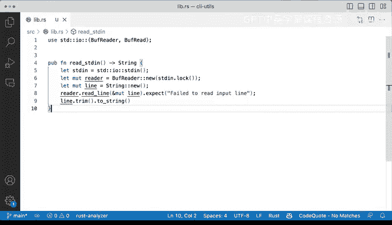

# 071：向库中添加代码 📚

在本节课中，我们将学习如何将代码从一个项目移动到另一个项目的库（lib）文件中。我们将重点关注如何从标准输入读取数据，并处理相关的导入和类型问题。

---

## 概述

我们将回顾 `re_split` 项目，并将 `read_standard_in` 函数的代码复制到另一个 CLI 项目的库文件中。在此过程中，我们将解决导入问题，理解标准输入的概念，并确保代码类型正确。


---

## 复制代码与导入问题

上一节我们介绍了项目结构，本节中我们来看看如何将现有代码整合到库中。

首先，我们从 `re_split` 项目中复制 `read_standard_in` 函数的代码，并将其粘贴到新项目的库文件（`lib.rs`）中。粘贴后，代码会立即出现一些问题，主要是 `BufReader` 未被正确导入。

为了解决这个问题，我们需要使用 `use` 语句导入必要的模块。如果只导入 `BufReader`，我们会遇到错误。

```rust
use std::io::BufReader;
```

将鼠标悬停在错误提示的红线上，会看到信息：“no method named `read_line` found for struct `BufReader` in the current scope”。这意味着在 Rust 中，有时需要导入特定的 trait 才能使某些方法可用。

错误信息明确告诉我们该怎么做：需要导入 `BufRead` trait。这是从标准输入读取数据时的常见操作。

```rust
use std::io::{BufReader, BufRead};
```

---

## 理解函数功能

接下来，我们专注于 `read_standard_in` 函数本身，看看它具体做了什么。

该函数定义如下：它不接受任何参数，并返回一个 `String`。函数内部最终会返回一行经过修剪（trim）的字符串。

```rust
fn read_standard_in() -> String {
    // ... 函数体
}
```

---

## 标准输入（stdin）的概念

在第五行，我们定义了标准输入：

```rust
let stdin = std::io::stdin();
```

如果你从未在终端中使用过命令行工具，标准输入是一种可以向工具传递输入的方式，通常使用管道（`|`）操作符。

以下是一个快速示例，说明如何在终端中使用标准输入：

```bash
echo "some text" | cut -d ' ' -f 1
```

在这个例子中，`echo` 命令的输出通过管道传递给了 `cut` 命令。`cut` 命令将接收到的文本（“some text”）作为标准输入，然后根据空格分隔符（`-d ' '`）提取第一个字段（`-f 1`），最终输出“some”。

这就是标准输入的基本概念，也是我们函数试图实现的功能。

---

## 读取并处理输入

回到我们的函数，我们需要定义一个可变变量来从标准输入读取数据。

以下是实现步骤：

1.  **创建缓冲读取器**：我们创建一个 `BufReader` 的新实例来读取标准输入，并使用 `.lock()` 方法。锁（lock）可以确保在读取期间独占标准输入，直到离开作用域，这是一种非常标准且有用的做法。
    ```rust
    let mut reader = BufReader::new(stdin.lock());
    ```

2.  **定义可变字符串变量**：我们定义一个名为 `line` 的可变 `String` 变量，用于存储读取的内容。
    ```rust
    let mut line = String::new();
    ```

3.  **读取一行数据**：我们调用 `reader.read_line` 方法，并将可变引用 `&mut line` 传递给它。如果读取失败，我们使用 `.expect` 方法处理错误，这会导致程序恐慌（panic）。对于这个简单的示例，这种处理方式是可以接受的。
    ```rust
    reader.read_line(&mut line).expect("Failed to read the input line");
    ```

4.  **修剪并返回字符串**：最后，我们修剪 `line` 两端的空白字符，并使用 `.to_string()` 方法将其转换为拥有的 `String` 类型返回。这一步是必需的，因为 `.trim()` 返回的是一个字符串切片（`&str`），而函数签名要求返回 `String`。
    ```rust
    line.trim().to_string()
    ```

---

## 代码整合与总结

通过以上步骤，我们成功将 `read_standard_in` 函数整合到了库文件中。目前 `main.rs` 中还没有内容，我们正在逐步构建我们的 CLI 实用程序库项目。

本节课中我们一起学习了：
1.  如何将代码移动到库文件中。
2.  如何解决 Rust 中的导入和 trait 范围问题。
3.  理解了标准输入（stdin）的概念及其在命令行工具中的应用。
4.  实现了从标准输入读取一行数据、处理错误并返回修剪后字符串的完整函数。



这个基础函数为我们后续构建更复杂的 CLI 工具功能打下了良好的基础。