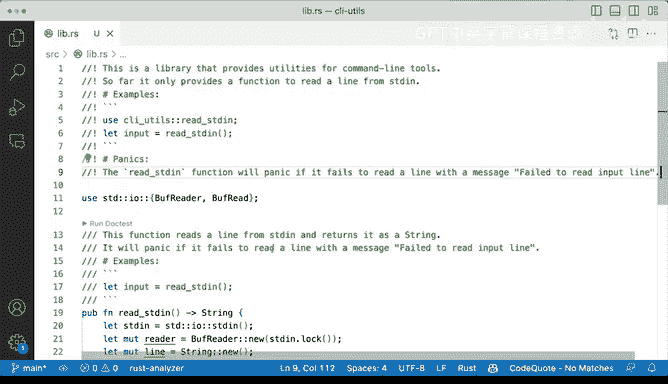

# 072：代码文档化 📚


在本节课中，我们将学习如何在Rust中为代码编写文档。我们将了解如何使用特定的注释语法来生成美观的HTML文档，以及如何为函数和整个库添加描述与示例。

## 概述

代码文档化不仅有助于他人理解你的代码，也能帮助你做出更好的设计决策。如果你发现很难用文档解释某个函数的功能，这可能意味着该函数过于复杂，需要考虑重构。

Rust内置了强大的文档工具`cargo doc`，它能将代码中的特殊注释自动生成为格式良好的网页文档。

## 生成基础文档

首先，我们来看如何为未添加任何注释的代码生成基础文档。

我们可以在项目根目录下运行以下命令：

```bash
cargo doc
```

这个命令会编译你的项目（例如库文件），然后在`target/doc`目录下生成HTML文档。生成的文档结构与Rust官方文档网站（docs.rs）完全一致，包含模块、结构体、枚举和函数等信息的自动排版。

## 为函数添加文档

上一节我们看到了自动生成的基础文档，本节中我们来看看如何为具体的函数添加详细的文档注释。

在Rust中，文档注释使用三个斜杠`///`。以下是为一个函数添加文档和示例的方法：

```rust
/// 该函数从标准输入读取一行，并将其作为字符串返回。
/// 如果读取失败，它会以一个有意义的消息（“failed to read input line”）触发panic。
///
/// # 示例
///
/// ```
/// use cli_utils::read_stdin;
/// let input = read_stdin();
/// println!("你输入了：{}", input);
/// ```
pub fn read_stdin() -> String {
    // ... 函数实现
}
```

添加文档后，再次运行`cargo doc`并刷新浏览器，你会看到函数的描述和“示例”部分已按Markdown格式优雅地呈现出来。

## 为库或包添加文档

除了为函数添加文档，我们还可以为整个库或包添加概述性文档。

以下是添加库级文档的方法，注意这里使用的是`//!`注释：

```rust
//! 这是一个为命令行工具提供实用功能的库。
//!
//! # 示例
//!
//! ```
//! use cli_utils::read_stdin;
//! let input = read_stdin();
//! println!("用户输入：{}", input);
//! ```
```

这种文档会显示在生成的文档页面的最顶部，用于描述整个包的目的和基本用法。

## 文档注释与普通注释的区别

理解不同类型的注释至关重要，这决定了哪些内容会出现在最终的用户文档中。

以下是Rust中注释的主要类型：
*   **文档注释 (`///` 或 `//!`)**: 用于生成公共API文档。`///`用于注释紧随其后的项（如函数、结构体），`//!`用于注释包含它的项（如模块、crate）。
*   **普通注释 (`//`)**: 仅作为代码内部的说明，不会被`cargo doc`提取到公开文档中。

通过合理使用这两种注释，你可以控制文档中向用户暴露的信息，并将内部实现细节保留为普通注释。

## 总结



本节课中我们一起学习了Rust代码文档化的核心方法。我们了解了如何使用`cargo doc`命令生成文档，如何使用`///`为函数添加包含描述和示例的文档，以及如何使用`//!`为整个库添加概述。同时，我们也明确了用于生成公开API的文档注释与普通代码注释之间的区别。良好的文档是创建可维护、易理解软件的关键一步。