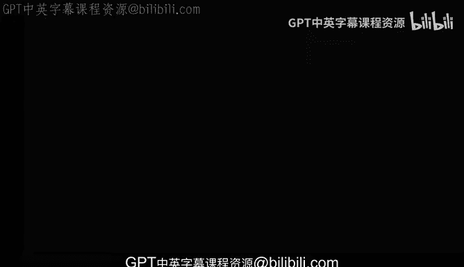
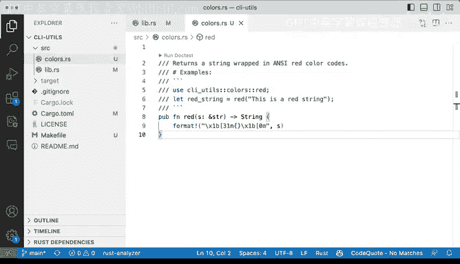

# 078：使用模块扩展



## 概述

在本节课中，我们将学习如何在Rust项目中通过创建新模块来扩展库的功能。我们将以添加终端颜色输出功能为例，演示如何将代码组织到独立的文件中，并在主库文件中声明和暴露该模块。

## 模块化扩展的必要性

上一节我们介绍了基础库的构建。本节中我们来看看如何通过添加新模块来扩展库的功能，同时保持代码的整洁。

`CI U` 库已经非常有用，我们现在想尝试扩展它。`CI utilities` 旨在为我想要构建的命令行工具提供实用程序，这也是我们这里的用例。到目前为止，我们只有一个函数，我想添加更多功能，但我不想污染 `lib.rs` 文件，而是希望使用一个单独的文件。

## 创建颜色模块

对于命令行实用程序，一个常见的模式和需求是为终端输出添加颜色。我将转到 `src` 目录，添加另一个名为 `colors.rs` 的文件。

以下是创建颜色函数的步骤：

1.  在 `colors.rs` 文件中，创建一个函数。
2.  这个函数将命名为 `red`。
3.  函数参数 `s` 的类型是字符串切片 `&str`。
4.  函数返回一个带有颜色输出的 `String`。

这个函数的作用是格式化字符串，使其包含ANSI转义代码。它使用一个变量，并在特定的颜色开始和结束转义码之间放置字符串，这是为输出内容着色的基础。

让我们快速开始记录这个函数。我们将说明它返回一个包裹在红色中的字符串，并提供一些使用示例。

```rust
/// 返回一个包裹在红色ANSI代码中的字符串。
///
/// # 示例
/// ```
/// use ci_utils::colors::red;
/// let colored_text = red("Hello");
/// ```
pub fn red(s: &str) -> String {
    format!("\x1b[31m{}\x1b[0m", s)
}
```
代码保存后看起来很不错。这里需要考虑的一点是，与Python等其他语言不同，在Rust中仅仅创建一个名为 `colors.rs` 的文件本身并没有特殊意义。

## 在库中声明模块

对Rust有特殊意义的特定文件是库的 `lib.rs` 和可执行文件的 `main.rs`。`lib.rs` 是所有内容的入口点。因此，我们需要回到 `lib.rs` 文件进行操作。

我们将在导入语句下方添加模块声明。

```rust
pub mod colors;
```
我们这样做是因为否则 `colors` 模块将不可用。让我们再看一下 `colors.rs` 中的示例。第5行的 `ci_utils::colors::red` 意味着我期望该函数以那种形式可用。通过将代码放在不同的文件中，我命名该文件为 `colors`，并使该模块可用并暴露 `red` 函数，否则这些将无法工作。为了让这些功能可用，我必须到我的 `lib.rs` 文件中进行声明。

## 代码组织策略

这是一种非常简单、直接的方式，我们可以开始暴露功能并添加更多内容，而不必污染或全部放入 `lib.rs` 中。你当然可以将 `red` 函数直接放在 `lib.rs` 中，并在那里处理颜色功能。

选择将其分离到单独的文件中是一种组织决策。何时应该将内容放在单独的文件中？这只是一个组织上的决定，并没有硬性规定你必须将内容放在单独的文件中。你完全可以仍然在 `lib.rs` 中添加内容，但将内容分开可能是一个好主意，以便于解析、阅读和理解代码的不同部分试图实现的功能。

## 总结



本节课中我们一起学习了如何通过创建新模块来扩展Rust库。我们创建了一个独立的 `colors.rs` 文件来存放颜色输出函数，并在 `lib.rs` 中通过 `pub mod colors;` 声明将其暴露给库的使用者。这种方式有助于保持代码结构清晰，便于维护和扩展。记住，模块化是一种代码组织策略，旨在提高项目的可读性和可管理性。