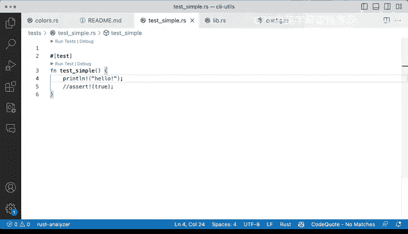

# 085：Rust测试入门 🧪

在本节课中，我们将要学习如何在Rust中编写和运行最简单的测试。我们将从创建一个测试文件开始，了解测试的基本结构，并使用命令行工具来执行测试。

## 测试的基本结构

上一节我们介绍了测试的重要性，本节中我们来看看如何实际编写一个Rust测试。最简单的Rust测试非常直接明了。

我们有一个`tests`目录。它目前是空的。

让我们尝试在这里添加一个简单的文件。当我创建名为`test_simple.rs`的文件时，它里面没有任何内容。

为了编写测试，我们必须添加测试属性。这个属性是`#[test]`。该属性会告诉测试运行器：“请注意，我这里有一个需要测试的函数”。

让我们定义一个名为`test_simple`的函数。我们不做太复杂的事情。我们将在这里做一个简单的断言语句，让它断言`true`。这样就完成了。这是你能写出的最简单的测试。

## 运行测试

我们一直在借助VSCode和Rust Analyzer来运行这些测试。如果我们运行它，我们会得到`test_simple`的结果。

如果我们移除那个`#[test]`属性，测试会立即不被识别。但这不是其他系统运行测试的方式。

让我们看看如何在终端中操作。我将关闭资源管理器。我们会使用`cargo`，而`cargo`有`cargo test`命令。它有很多不同的选项，我们可以使用不同的标志来验证这些测试是否工作。我们必须运行`cargo test`。

进入这个目录的测试通常被称为集成测试，但你当然也可以在那里放置单元测试，这没有硬性规定。但需要理解的是，按照惯例，编写Rust的人通常称之为集成测试，尽管你完全可以100%在那里放置单元测试。

我们的做法是，当我运行`cargo test --test`并指定测试名称时，`test_simple`就会出现在那里。

如果我们把这个断言改为`false`，我们应该会得到一个失败的结果。我们运行它，就会得到一个失败。

## 测试组件详解

因为这是最简单的情况，我们实际上没有做任何太复杂的事情。我们只是做了一个简单的断言。让我们再次回顾一些组件。

我们有一个`test_simple.rs`文件。这是函数，这是文件，这是目录。我们有一个`tests`目录。Rust开发者可能称此为集成测试目录。人们会把集成测试放在这个目录里。这不是硬性规定。你实际上也可以在那里放置单元测试，但惯例是集成测试放在这里，而单元测试会放在你的库文件本身内部。我们稍后会看到这一点。

现在我们有了这个`#[test]`属性。如果我们移除它，我们就无法运行这个测试。定义测试的方法是声明一个函数，然后加上`#[test]`属性，接着写你想要进行的测试，最后做出你的断言。这是你代码的主体。你可以在里面做任何类型的设置。它不一定需要是公开的。我们实际上可以移除`pub`关键字。

切换回终端并再次运行，我们会得到失败，因为我们在断言`false`。让我们把它改成`true`并保存，再次运行，它就会通过所有测试。

## 断言与测试体

接下来是断言。这是关键所在。然后是我们将要断言的内容。

但这不一定必须是一个断言。你完全可以注释掉它，运行一个`println!`宏并输出“hello”，这样仍然可以工作。

如果我们运行那个测试，我们仍然会得到“ok”，并且会在终端打印出“hello”。

以下是测试的主要组成部分：

*   **测试函数**：一个用`#[test]`属性标记的普通函数。
*   **测试目录**：通常名为`tests`，用于存放集成测试文件。
*   **断言宏**：如`assert!(true)`，用于验证条件。
*   **测试体**：可以包含任何有效的Rust代码，用于设置测试环境和执行操作。

这些就是组件，这就是你如何向项目添加一些测试的方法。目前我们还没有将任何东西引入作用域。我们将在下一节看到。

## 总结

本节课中我们一起学习了Rust测试的基础。我们创建了一个简单的测试文件，了解了`#[test]`属性的作用，并使用`cargo test`命令来运行测试。我们看到了测试成功和失败的情况，并了解了测试的基本组成部分：测试函数、测试目录、断言和测试体。这是构建更复杂测试的坚实基础。