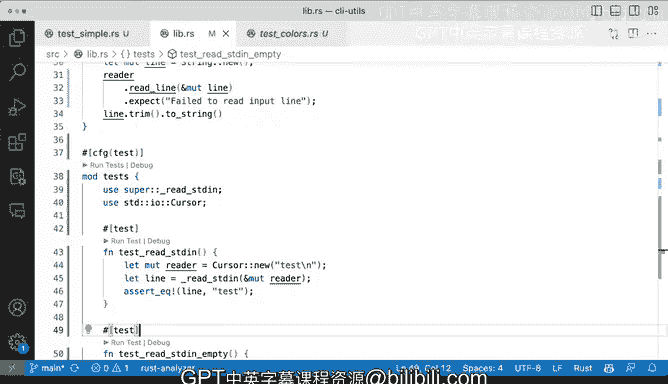

# 087：测试私有代码 🧪

## 概述

在本节课中，我们将学习如何在Rust中测试私有代码。我们将通过一个具体示例，演示如何重构函数以使其可测试，同时保持公共API的简洁性。你将学习到如何编写针对私有函数的测试，以及如何使用`#[cfg(test)]`属性来管理测试代码。

## 私有代码测试的挑战

上一节我们介绍了基本的测试方法，本节中我们来看看如何测试私有函数。我们面临的一个尚未解决的问题是如何测试私有代码。

我们这里有一个名为`read_standard_in`的函数。这个函数目前存在一个问题：它不接受任何参数，并在第24行直接定义了标准输入。随后，它使用`standard_in.lock()`来创建可变的`reader`变量。对于这个函数本身来说，这没有问题，但如果我们无法访问`standard_in.lock()`，该如何测试它呢？

让我进一步解释我们在这里尝试做什么。我正在思考如何向这个`read_standard_in`函数注入输入，以便我们能够为这个函数的工作创造条件。但我无法做到这一点，因为它不接受参数，并且直接在那里调用`standard_in`。

## 重构函数以支持测试

我将采取的方法是将其拆分为两个函数。解决这个问题肯定有多种不同的方法，但我将采用以下方式。

首先，我将提取所有相关代码，然后创建一个单独的私有函数。我将给它加上下划线前缀，命名为`_read_standard_in`。

这个函数将使用泛型。我将使其类型为`R`。我知道我们还没有详细学习泛型，但我本质上是在说这个函数将接受一个`reader`参数。只要它实现了`BufRead`特性，就可以正常工作。

我们将声明它为可变类型。然后它将返回一个`String`。

我们将创建一个可变的`line`变量，然后简单地返回`reader`的`read_line`结果，接着使用`expect`处理。然而，我们还需要像之前一样返回`line.trim().to_string()`，因为这是我们想要返回的内容。

很好，我们已经将这个函数拆分开来。现在在第25行，我将调用`_read_standard_in`并传入可变`reader`。

我们做了什么？我们从`read_standard_in`中提取了这部分代码。现在`read_standard_in`将调用`_read_standard_in`。

我们为什么要这样做？原因是我们现在能够向这个函数传递参数。这个`reader`参数可以是任何类型，只要它实现了上述的读取属性和函数方法。这将使我们能够进行测试。

现在我可以构造这个参数，完全没有问题。这实际上会起作用。这也意味着我不一定能够测试`read_standard_in`本身，但这没关系，因为定义这两个变量是可以接受的。我可以接受这部分不被测试。

但我试图测试的最重要部分就在这里。我想测试的是，当有人想要使用我的API时，他们将执行这个操作，而不一定关注这个函数。这允许我传递某些内容作为参数，并构造内容，使测试更容易，因为它接受`reader`参数。

## 测试私有函数的方法

那么这意味着什么？如何测试私有代码？请注意，我没有添加`pub`关键字。我没有给这个函数加上`pub`前缀。这个函数是`pub`，而这个不是。这个函数能够使用`_read_standard_in`，因为它们在同一个模块中，没有问题。

那么我们如何测试这个私有代码呢？我们不能回到我们的测试中，因为这不是公开可用的。我们无法访问它。

如果我将其改为`read_standard_in`，它将无法工作。如果我保存并运行`cargo test`，它会说这是私有函数，我无法访问它。所以这不会起作用。

让我恢复它并使其正常工作。实际上，让我把它放回去。如果我运行`cargo test`以确保一切正常，是的，它正常工作。

## 编写私有函数测试

现在我将编写测试。如何为私有函数编写测试？

首先，我将定义`#[cfg(test)]`。我稍后会告诉你这是什么。我将声明`mod tests`。

以下是创建测试模块的步骤：

1.  创建一个名为`tests`的模块
2.  使用`use super::*`将当前模块的所有内容引入作用域
3.  显式地引入需要测试的函数
4.  使用`Cursor`来创建测试输入

我将尝试在这里显式一些，我将说`use super::read_standard_in`。我可以访问它，因为我在同一个模块中。所以这将起作用。

接下来，我将使用`Cursor`，因为它允许我为我们的函数创建那个参数，也就是这里的这个`reader`。我将使用引入作用域的`Cursor`来创建它。

接下来，我将开始创建一个测试。我将在这里编写一个测试。

使用那个属性，我将说`function test_read_standard_in`。然后我将打开花括号，然后我将说可变`reader`将是`Cursor::new("test\n")`。

然后我可以尝试运行那个测试。我在这里创建的这个`test_read_standard_in`看起来对我来说是正确的。然后我将通过使用`_read_standard_in`来测试，这是一个来自那里的私有函数。那个`reader`实际上是一个实现了`BufRead`的`Cursor`，所以它应该实际工作。

现在如果我们运行它，我们得到了一个OK。让我们快速看一下这里的断言。我们说来自`_read_standard_in`的`line`实际上来自第44行的这个。我们说，嘿，即使我传递了一个额外的换行符，我应该实际得到的是"test"，没有换行符。这是因为`trim`的作用，我能够将其与字符串进行比较。

## 添加更多测试用例

这就是你如何测试私有函数的方法。你可以继续添加更多测试。

例如，我们可以说`function test_read_standard_in_empty`，如果我们想说，如果我的`Cursor`完全为空怎么办？那将是空的。现在我们缺少属性，我注意到因为我得到了花括号下划线，所以你可以看到它从未被使用。让我继续这样做。

然后如果我运行那个测试，我们将得到一个OK。现在如果我打开终端，我可以做`cargo test --lib`。如果我这样做，你将看到`test_read_standard_in_empty`和`test_read_standard_in`都将工作。

为什么我要做`--lib`？因为如果我仅仅做`cargo tests`，你将看到那里有很多输出，包括我的`cargo test`。它运行所有内容，包括测试，但`--lib`与我们之前看到的不同之处在于，它将忽略所有的`cargo test`，并且只包括定义在我创建的库、包、crate中的代码中的测试。

## 理解#[cfg(test)]属性

我们需要看到的最后一件事是为什么我添加了`#[cfg(test)]`。它接受一个参数，在这种情况下是`test`。这是一种方式，以便我们可以告诉cargo，顺便说一下，当你构建我的库并执行所有代码时，不要包含这段代码，因为这段代码仅用于测试。除非我明确要求包含测试代码，否则我不希望包含它。这是一种轻松、优雅地排除代码的方式，使其不会编译到将要发布的版本中，这样它就不一定是库、包的一部分，无论我将要在crate中发布什么。

## 总结

在本节课中，我们一起学习了如何测试Rust中的私有代码。我们进行了一些"手术"，将`read_standard_in`拆分为另一个函数，使我能够很好地测试它，因为我能够传入`reader`。这样我的外部API看起来非常漂亮和干净，只是一个简单的调用，不需要用户构造那个`standard_in`。我们能够在这里进行一些实际的测试，因为我们能够使用未公开的私有函数，通过使用一些测试代码，在这种情况下，注意我没有使用外部测试目录，其中包含另一个测试模块在测试目录内。