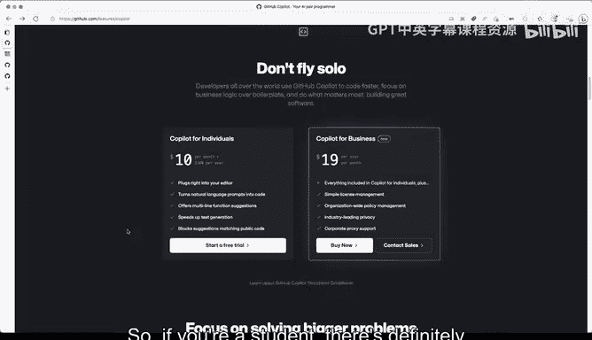
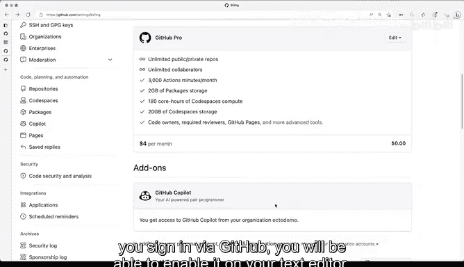

# 杜克大学《rust编程（基础）｜rust programming》中英字幕 - P11：11_01_03_演示：注册GitHub Copilot.zh_en - GPT中英字幕课程资源 - BV1dx4y1b7Vo

Before you start using GiHub Copilot on your text data or in this case Vi Studio code you will have to enable it。

 you will have to purchase a service with Copiot now if you're a student you might still be able to get it for free or included as part of a verification process now if you go to GiHub。

com/features coppit you will be able to see the pricing and how does that work and even start a free trial if you are not a student。

Now， once you go ahead and do that， you will be able to see that on your billing settings for your account and verify that that's actually working。

 so if you're a student， there's definitely a way to go ahead and do that。

 if you look for the GiHub student and Github Cos as a student developer you will be able to reach this page where we've captured the details on how to get that result。

 so it definitely involves a few different steps that you will have to follow in order to get that validation。

 but essentially the main point here is that as a student youll have to go through the verification process with your email address for your school where you're going through cursing。

Where you're going through your current studies and your current course or whatever program it is that you're under now there are certain constraints about that。

 but if you go through all of these steps， you will be able to set up coppit no problem you can also try it out for free and the contents for dis course will definitely allow you to will probably be enough if you've able Github Copiot for free and try to go through this course with the help of Copit Now once you are done if you've enabled all of these you're definitely going to want to verify that as accessible so let me show you how it looks like for me on my settings so these are my billing plans for my personal account。

 you can see here this actually says personal account and I'm going to make a little bit bigger so that we can see here very well that this is the billing summary and here I have certain。

that I've enabled because I'm teaching and these are certainly covered here what about Github Copid。

 Where is that and I can go and go all the way here to add ons and Github compile will show here and if you haven't accepted yet you will get probably like a verification button here that says yes。

 I want to enable Copit。 So that will allow you to see what basically like if it's enabled or not once it's enabled on your ready to go it will show up here and you will be able to use it no problem。

 The other thing that you w you want to be doing， I'm going to show you here if I keep scrolling on code planning and automation。

 you might see compilepi right here so let me click on that one and I' will get here Now I have an organization that is already covering the cost of compilepi for me but you can get a little bit of basically settings that you can customized for。

organization， if you're a member of different organizations。

 then you will be able to tweak and change some of the settings well not cover those here。

 but definitely it will allow you to here you can see suggestions matching public code that's I have that blocked for my personal account so definitely what happens here is that you get other other options so you can tweak but what you want is you need to make sure if I go back to the settings slash billing to make sure that compile shows up here and that you've activated it and now once that is done through your Vicious studio code authentication you sign in via GiHub you will be able to enable it on your text editor。

