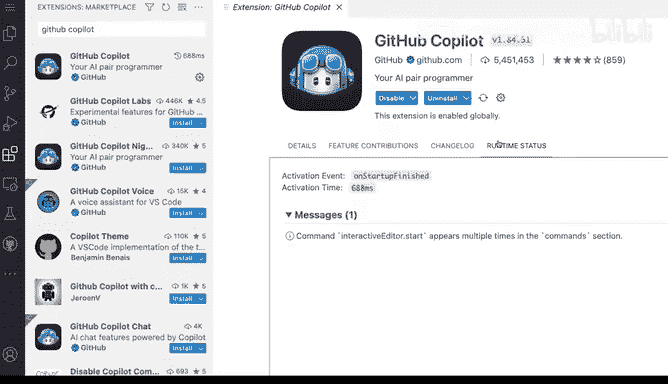

# 杜克大学《rust编程（基础）｜rust programming》中英字幕 - P12：12_01_04_演示：在Visual Studio Code上安装并启用Copilot.zh_en - GPT中英字幕课程资源 - BV1dx4y1b7Vo

After signing up for Githubcopilot signing up for the service and setting up either if you're a student and getting some of the benefits of that or if it's a free trial。

 you may want to actually start using it in the text data in this case we have Vi Studio code here I'm going open up the extensions and the first thing I'm gonna to say I'm gonna say GiHub Copilot and hit enter and the first option I'm gonna get is Github Copit and I'm gonna click on the installation button right here so I'm gonna click on installing it。

 this will bring up this very useful detailed page that is again the same as the marketplace that you can see here what is Github Copilot。

 some of the things that you will be able to see and this is pretty rich。

 pretty useful and full of details you can see here that there's a change log some things to to actually browse around and。

highly suggest that you actually go through regularly the change log because you will see some of the release notes Now the runtime status appears that this is running。

 So one of the the actual things that you may want to do is like well I've installed it is it really enabled So how can I tell it like if it's if this is actually working Well you will get。

This thing here， this icon here。 that is the logo for copal。

 Its actually this logo here made for visual studio code here for the status bar。

 So that is how you can tell if it's running。 And if I click on this。

 it will tell me if I want to disable it。 Well， I don't want to disable it。

 how about manage well bring me to this page。 I don't want to disable it。 I can have settings here。

 I can I can do all kinds of different things here。 But there's not much here to configure。

 that is how you know it's installed and available for installation。 So if I go here to any file。

 So say for example， that read me。I can actually go ahead and start typing and get some suggestions so if I say for example。

 well I didn't type anything and something showed up。

 that's how you know that coppit is running but your case might be slightly different if I lose some section for example you start getting suggestions as you type now like this went away。

 but if I say type C you see that I get auto completion now that auto completion is not based on anything other than coppit being able to tell me exactly what it thinks I should probably want to do which will cover next but this is essentially how you install it you enable it and you verify that this is working。

