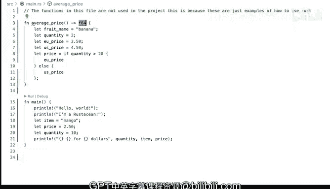

# Rust编程（基础）：P13：使用Copilot进行编程 🚀

在本节课中，我们将学习如何利用GitHub Copilot的代码建议功能来辅助Rust编程。我们将通过一个简单的示例，演示如何通过引导Copilot生成代码，并理解其工作原理。


## 概述

GitHub Copilot是一个强大的AI编程助手，能够根据上下文提供代码自动补全和建议。本节将展示如何在Rust编程中利用这一工具，即使你对Rust的细节尚不熟悉，也能快速生成代码框架。

## 启用Copilot与基础设置

首先，确保你的开发环境中已安装并启用了GitHub Copilot扩展。你可以通过编辑器扩展面板进行确认。我们将在一个名为`main.rs`的空白文件中开始演示。

## 基础函数与自动补全

上一节我们确认了环境准备就绪，本节中我们来看看如何开始编写代码并接收建议。

在Rust中，使用`fn`关键字定义函数。当你开始输入时，Copilot会提供自动补全建议。

```rust
fn main() {
    println!("Hello, world!");
}
```
输入`fn main()`后，Copilot可能会自动补全花括号`{}`和`println!("Hello, world!");`语句。按下`Tab`键即可接受该建议。

## 引导Copilot生成复杂代码

仅仅接受建议可能不够，我们常常需要引导Copilot生成更符合我们意图的代码。以下是引导Copilot的几个步骤：

1.  **定义新函数**：我们尝试定义一个计算平均价格的函数。
    ```rust
    fn average_price() {
        // Copilot可能会在此处生成一些示例代码
    }
    ```

2.  **指定变量名**：当建议的变量名（如`item`）不符合需求时，我们可以通过继续输入来引导。例如，输入`Banana`，Copilot可能会将变量名修正为`banana`。

3.  **修改变量类型与值**：同样，我们可以通过输入来改变建议的变量类型和初始值。例如，将`price`改为`quantity`，或将数值进行修改。

## Copilot的行为模式与限制

将Copilot的行为类比为引导一个学步的幼儿是恰当的。它不会总是给出完美的结果，需要你通过持续的“输入反馈”来将其引导至正确的方向。有时它的建议完全正确，你可以直接使用`Tab`键补全，这能极大提升编码速度。有时则需要进行手动调整。

## 添加注释与文档

我们还可以利用Copilot来生成注释。在Rust中，使用双斜杠`//`进行单行注释。

```rust
// 这个文件中的函数用于演示Copilot的使用。
```
输入`//`后，Copilot也可能会提供相关的注释补全建议，帮助我们快速编写文档。

## 总结



本节课中我们一起学习了如何使用GitHub Copilot辅助Rust编程。我们演示了如何通过简单的输入触发代码补全，并通过持续输入来引导AI生成更符合预期的代码。Copilot是一个强大的工具，能够帮助初学者快速构建代码框架，但理解其建议并适时进行手动修正同样重要。随着编写的Rust代码增多，你会更加熟练地利用这个工具来提升开发效率。