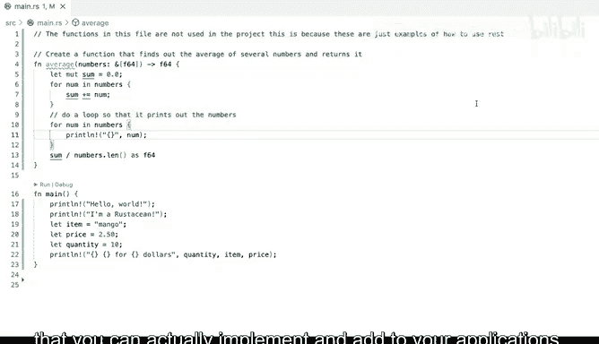

# Rust编程（基础）：P14：使用Copilot提示编程 🚀


在本节课中，我们将学习如何利用GitHub Copilot进行基于提示（Prompt）的编程。我们将看到，通过编写描述性的注释，可以引导Copilot生成我们想要的代码，而不仅仅是依赖它提供的自动补全建议。

## 从建议编程到提示编程

上一节我们介绍了如何使用Copilot的建议进行编程。现在，我们来看看当建议不完全符合需求时，如何主动引导Copilot生成代码。

假设我们正在编写一个函数，但遇到了问题。我们确切地知道自己想要什么，但当前的代码并不完全正确。例如，我们想要一个计算平均价格的函数，它可以处理多个项目并计算平均值。

与其像之前那样手动输入代码，我们可以使用Copilot进行基于提示的编程。具体做法是，先删除现有代码，然后从一个注释开始。通过注释，我们可以告诉Copilot我们想要什么。

以下是具体步骤：

1.  首先，删除有问题的函数代码。
2.  然后，输入一个描述性的注释。例如：
    ```rust
    // 创建一个函数，计算多个数字的平均值并返回。
    ```
3.  等待片刻，Copilot会根据注释生成相应的函数代码。
4.  检查生成的代码，如果正确，按`Tab`键接受。

通过这种方式，我们不再需要手动编写所有代码，而是通过注释“提示”Copilot生成我们想要的功能。这种方法生成的代码通常是正确的，并且不会出现之前遇到的错误下划线提示。

## 在函数内部使用提示

基于提示的编程不仅限于创建新函数，在函数内部同样有效。例如，假设我们有一个数字列表，我们想在函数内部添加一个循环来打印这些数字。

我们可以这样做：

1.  在需要添加循环的地方，输入一个描述性的注释。
2.  例如，输入：
    ```rust
    // 循环遍历数字并打印它们。
    ```
3.  Copilot会根据这个注释，生成一个`for`循环代码块。
4.  按`Tab`键接受生成的代码，然后保存文件。

这样，Copilot就会生成一个遍历列表并打印每个数字的循环。目前，我们无需担心具体的语法细节或代码是否完全符合我们的最终项目结构。这个例子主要展示了Copilot如何超越简单的命令补全，允许我们通过注释提示来生成有用的代码片段，并将其应用到程序中。

## 总结




本节课中，我们一起学习了GitHub Copilot的提示编程功能。我们了解到，当自动建议不满足需求时，可以通过编写清晰的注释来主动引导Copilot生成特定功能的代码。这种方法不仅适用于创建新函数，也适用于在现有代码块中添加复杂逻辑。通过结合注释提示，我们可以更高效地利用Copilot构建应用程序。