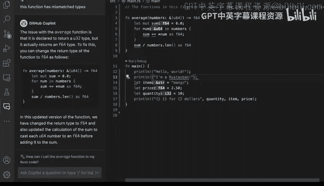
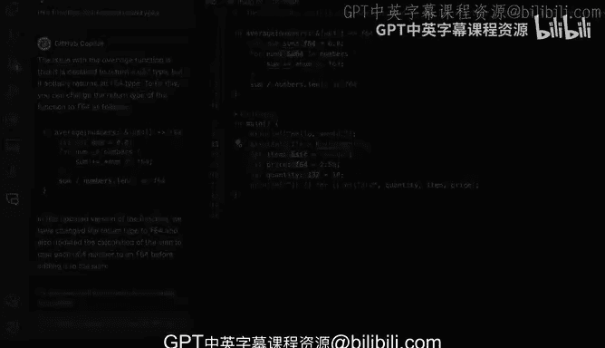

# Rust编程（基础）：P15：演示：Copilot X与基于聊天的学习 🧠💬

在本节课中，我们将学习GitHub Copilot X，这是一组由GitHub Copilot推出的新功能。它将AI结对编程的能力扩展到更多场景。我们将通过实际操作演示，了解如何利用基于聊天的界面来学习、调试和理解代码。

---

上一节我们介绍了Copilot的基本代码补全功能。本节中，我们来看看Copilot X如何通过聊天交互，将学习与编程过程深度融合。

Copilot X是GitHub Copilot的一系列增强功能。它允许你在几乎任何地方实现AI结对编程。这意味着什么？我们已经看到Copilot本身能提供代码建议，而Copilot X在此基础上更进一步。它集成了类似GPT-4的模型，使你能够进行各种交互，而不仅仅是基于提示生成代码或获取智能建议。

如下图所示，你可以选中一段代码，然后通过一个类似聊天机器人的界面与之互动，尝试实现我们想要完成的任务。

让我们看看它的实际应用。在制作本视频时，该功能处于技术预览阶段。但当你观看此视频时，它可能已经结束预览并广泛可用。因此，这绝对是一个值得关注的功能，你可能会直接体验到它。

那么它具体是什么样子呢？我现在切换到了Visual Studio Code的另一个会话。这是我之前构建的内容，你可以看到界面略有变化。首先，一个明显的标志是会出现一个聊天图标。你的设置可能看起来不同，但Copilot已启用，一切准备就绪。

如果我点击那个聊天图标，会收到一条欢迎消息：“你好，我是你的Copilot，我在这里为你提供帮助和建议。”这很好。

假设我是一个Rust新手，不理解当前的代码。我想了解发生了什么。我可以输入：“请解释高亮的代码。”Copilot会进行思考，然后针对我的代码上下文给出解释。这是一种极佳的学习方式。因为当我被Rust（或任何编程语言）的问题困住时，我能够获得一些解释。

例如，假设我犯了一个错误。我把代码中的 `f64` 改成了 `u64`，然后保存。接着，我写 `let a = 30.2;` 并保存。这时会出现红色的波浪线错误分析。我知道这些更改不会工作，但作为一个新开发者，你可能会疑惑：这段代码看起来没问题，为什么不行？为什么会出现这个错误？我不明白发生了什么。

我可以选中整个函数，然后输入：“这个函数没有按预期工作。”好处是，GitHub Copilot可能会返回信息，即使最初没有直接给出你想要的答案。在这种情况下，你从编译器得到了类型不匹配的错误。Copilot会提供一个详尽解释，说明哪里出了问题。

这是一个有趣的功能，因为我现在在这里获得了输出。我可以说：“哇，这实际上很好，它修复了问题。我理解它所说的，这对我来说很有道理。它解释了更新后的版本在做什么。”然后我可以点击“在光标处插入”按钮。执行后，注释可能消失了，但这没关系。现在代码完美运行了。

这超越了仅仅通过打字获取建议。你能够与生成输出的Copilot模型进行更好的交互，几乎就像在聊天一样。这肯定需要一些时间来适应，但你可以学到很多，产出大量优质、完整的代码，并避免陷入困境。每当你被卡住时，你都可以提问并获得答案，甚至得到关于你可能做错了什么的非常非常好的解释。

即使是我自己，拥有超过11、12年的专业Python开发经验，现在也做很多Rust开发，我肯定会犯一些错误。有时当我从一种编程语言切换到另一种时，我可能会犯诸如漏掉分号这样的错误。这在某些语言中不是问题，但在Rust中就是问题，这确实发生在我身上。

除此之外，我实际上可以说：“我不明白为什么这会发生在我身上。”然后你可以询问GitHub Copilot并获得很好的解释，从而提升你的学习效果。

---

本节课中我们一起学习了GitHub Copilot X的聊天交互功能。我们看到了如何通过选中代码并提问来获得解释、调试错误以及理解代码逻辑。这种基于聊天的学习方式，将AI辅助编程从简单的代码补全提升到了交互式教学和问题解决的层面，能有效帮助初学者和资深开发者更高效地学习和编写代码。