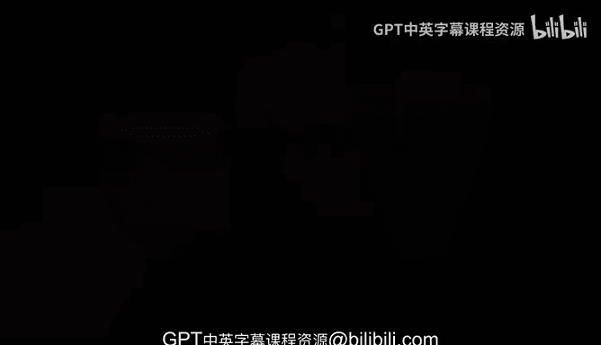

# Rust编程（基础）：P16：AI结对编程总结 🧠🤖

在本节课中，我们将总结AI结对编程的核心要点。你将了解其重要性、基本配置方法以及如何在学习Rust的过程中有效利用它。

---

AI结对编程是一项新颖且非常有趣的技术。我很高兴能将其纳入本课程。到目前为止，你不仅应该能够利用它，还应该知道如何安装和配置它，或许还能与它进行一些互动。

现在，在你的开发环境中以及在整个课程学习过程中使用AI结对编程工具至关重要。虽然这不是100%必需的，但它绝对能帮助你在学习不同课程内容时尝试掌握Rust。因此，到目前为止，你应该已经能够在你的环境中完成安装、配置，并希望已成功启用它。

---

本节课中，我们一起学习了AI结对编程的总结。你了解了它的价值、基本设置步骤，以及如何将其作为学习Rust的辅助工具。掌握这些将有助于你更高效地进行后续的编程学习与实践。