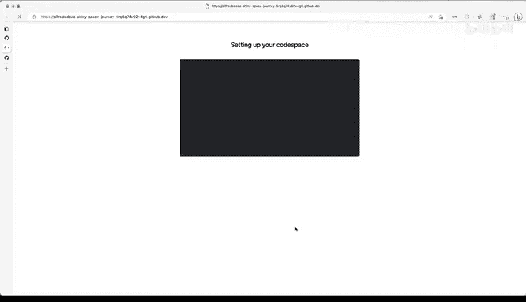
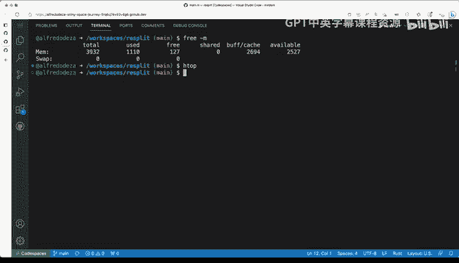
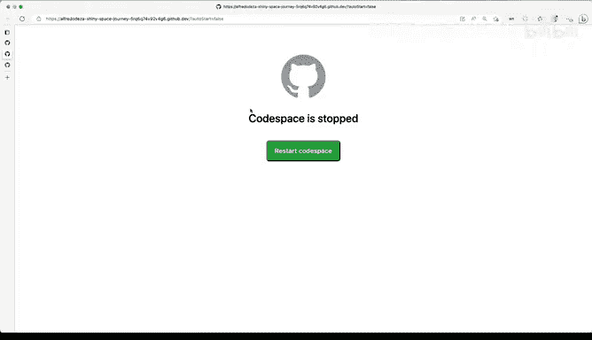

# 杜克大学《rust编程（基础）｜rust programming》中英字幕 - P18：18_01_03_演示：Codespaces基础.zh_en - GPT中英字幕课程资源 - BV1dx4y1b7Vo

To get started with codespaces， all you need to do is ensure that you are logged in to GiHub as you can see here。

 I've logged into my account already and you should probably do the same before trying these steps out now with basically almost any repository especially if it's on your account you will see a button like these code and usually before codespaces was announced。

 you would click here and you would see the local portion of it now these codespaces tab is available and in most cases that will be the default And once you click on this you will see that there's no codespaces and you can create a codespace on main that means that you will get your development environment created on the cloud for the main branch So before we do that though like I want to show you what it means that。

3 buttons here because they definitely have several different options can set up pre bills。

 which we're not going to cover， which is just a way of setting up specific configurations or you can configure a development container which we'll see later。

 but I want to concentrate here new with options and see what that means so I'm going to click on that。

And here we have the ability of using a different branch other than main in this case。

 this project only has the main branch， but if you have some other branch when you want to create a development environment with that code on a different branch。

 you will be using that over there the region is automatically selected for the one that is closer to where I'm located and in this case USE sounds correct。

 Now the machine type two core 4 gigs of Ram that looks pretty good to me。

 but I can go all the way to 16 cores， 32 gigs of Ram and 128 gigys of space Now depending on what you want this defaults will always be fine So let me go back to my repository and I'm just going to click create code space on main So once you do that you will get to a page that looks similar to these and B code will load so you will have all of the capability。

a Vicious studio code。 but on the cloud。 now behind the scenes and this will take a few minutes。

 actually， depending on what you're trying to do， you saw they managing extensions and extensions are getting updated over there and because everything ist synchronous you can you will get this welcome message saying。

 hey， we we're running， we're trying to install things。

 feel free to poke around but right of the bat， you have your code here。

 was I was using an example Github repository with a rust project that I have there was building that has a few files already。

 but you can see this is going。Going a little bit crazy there。

 doing a lot of installation of extension， so that's going behind the scenes but right off the bat I'm able to try and work around and see what this environment is now。

Let me take a look at what we're dealing with here。 So I'm gonna make this a little bit bigger。

 Al right， I've made my terminal font a little bit bigger。

 Let me see this is a Linux system by default fault。

 And so let's take a look what we have and what we're dealing with here。

 So it's by default fault Uuntu。 That's fine。 that's Lts。

 this is a Linux system is definitely not my machine。

 you can see here that I am working off of a browser。

 Now one thing that won't work is if I want to do copy paste。

 if I do control C and then control B will'll get a message like this one。 because it is a browser。

 you have to make sure that you allow these and I'm going to allow it。

 and now I can paste but definitely already powerful and I can do certain things like I can I can。

I can definitely interact with the operating system so I can do suit up get update to get all the latest packages。

 In this case， this is a Linux system in other systems， it might be slightly different。

 So why is this important because we will be able to work in a normalized environment。

 that means that if you are visiting these repository of yourre forking this repository and you click on code and get started with code spaces。

You will have the same environment as I am instead of like trying to figure out what will work on OS 10 on Apple computer and a Windows computer and a Linux computer。

 what version of Linux it will definitely be a little bit more complicated so。

Because this is normalized， then we won't have these problems because we're using good spaces。

So when we're here， we can start setting up and do all the things that we would normally do with our own environment。

 except that we're on the cloud。Close these and when to open up all of the things that I'm used to here So I when to look at main Rs。

 I have certain things already working。 I can actually take a look at the extensions I can see that certain things are installed I can actually I can actually install the pre-release in code spaces for rust analyzer that's perfect now this will probably have some problems because I don't have the rust tool chain install so that will cause some problems。

 but why would this be important and why why would you want to use code spaces because later we'll see how we can customize and we can add some of these extensions by default what does that mean that whenever someone including myself goes to these project and wants to open up this project instead of having to figure out what extensions to install like the rust analyzer or even some system dependencies like。

we will be able to preconfigure those and let those be available for anyone opening up that cool space。

 So this is a pretty straightforward。 We haven't done anything really a dance here the last thing I want to show you is how many CPU core how much memory。

 so let's open up the terminal again。 So I'm going to this is the terminal I'm going use three dash m to see a little bit of memory so you can see here have almost four gigtes there。

 I've used about a gig of Ram so that's pretty good。 And now let's play around here with with H top。

 which is a tool to see what are the processes's what do we have here So two cores those look like pretty happy we there and we are using about one gig of Ram out of almost four gigs of Ram。

 So pretty good and that's。That's how you would check what we're dealing with here and we will be able to interact with this and configure it later so this is good for now because now we're able to see that we have we have these tool and we have codespaces running and now it's also listed here you can see it has this funny name it's active and it's up on running and I can actually go ahead and do other things like stop or delete it behind the scenes is's a container so the ability to stop it so if I click stop and I go to the other tab it will probably say hey your codespace is getting stopped right it's just like a container that you can start and stop so that's it for fundamentals of or' getting started with codespaces and trying to start it out in almost any repository that you may find out on GitHub。

