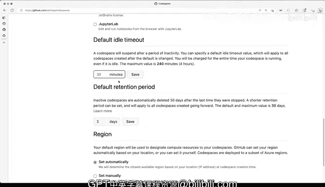

# 杜克大学《rust编程（基础）｜rust programming》中英字幕 - P19：19_01_04_演示：理解使用量与配额.zh_en - GPT中英字幕课程资源 - BV1dx4y1b7Vo

Understanding usage and quotas with codespaces is essential because it'll allow you to avoid hitting some limits。

 We've already talked a little bit about how you can use it for free or with an included quota but let's see how those quotas work well you'll have to go well you'll have to do is go to settings slash billing on Github。

 co and then get to your billing summary and then scroll all the way down until you reach the code spaces section so I'm going to go and get here to codespaces and you can see that I have 180 hours included of like core hours and my current usage is just a little bit here and include quotas resetting 15 days what does this mean essentially that I have it is about 30 days so every 30 days this。

Will reset so if I no longer use code spaces at all。

 this will go and reset to actually0 of 180 core hours used now I don't have a spending limit because I haven't I'm only using the included the included quo that I have in your case if you don't have student verification this number might look differently and and I'll show you in a second what that might be I think I believe it's 90 core hours now what is a core hour and why is this explaining things in core hours well remember you can use code spaces with two cores。

 four cores， eight cores，16 cores or all kinds of different number of courses so by saying 180 core hours it means that if I'm using a machine that has。

2 cores， then I'll be able to use 90 hours of code spaces。

 So lets let's open up these so that we can see what's going on。 And here you can see two cores，4，8。

16 and 32。I've mostly been using the two core because that's plenty for me。

 here's price per hour It's 18 cents。 but since I'm using the included quotas。

 then I'm not really paying for it at all Now this is this is how this number is calculated。

 So I've been using 12。46 hours of 180 hours that included Now once's the deal with storage let's open that up。

And what this means is whenever I have an instance that is running。

 you will see that the storage will start getting consumed in this case I have 0。

32 of 20 included Giabytes per month Now we'll get into a second of how that is calculated but essentially if you want to know where you're at and how you're doing with your code spaces quotas and how long until it gets reset you'll have to go two settingslash billing All right so let's go to the documentation you will have to click here some billing documentation so this is the billing page for GiHub code spaces so I'm going keep scrolling here so that we see kind of like that quotas and allow allow quotas and what those limits are for GiHub free for personal accounts you will get 15 gigtes per month and 120 core hours per month GiHub Pro like if you are a student for example this is kind of like the tier that you will be that's why I have 180 hours。

I'm a verified educator， so I get that benefit if you are a verified educator or a student。

 you can also get that benefit。So the gigabyte per month explanation is explained in detail here。

 essentially one GBte a month being one GBab of storage usage for one whole month。

 so that means that if you are using 20 gigabytes per month。

 that's how definitely thats measured for more details， refer to this node and explanation over here。

Al right， so now that you know quotas， how do you prevent or guard against reaching those limits。

 So let's go to settings slash code spaces and I'm going to go and scroll all the way down to。

The default retention period what does this mean when I'm stopping a code space by default you will get it deleted after 30 days that default and maximum value is 30 days I have it in two days because what I do is I try to commit and push and make those changes available on my Github repository and then I don't run into situations where my code space has been idle paine or consuming that storage quota for more than two days you can change these here and then save that configuration to lesser than that。

Now that will allow you to prevent running into those situations so make sure that you't leave these don't leave these cold spaces running and the one that you want to take a look at is the default idle timeout I have it on 30 minutes so if it's idle for 30 minutes the cold space will get stopped automatically that will allow me to not consume core CPU hours so I will be able to guard against the consumption of those quotas and and prevent the problem where I'm running out of those limits you can change these to pretty much anything but 30 minutes here it's pretty good for me but you might want to get that to lower if you are worried about not getting you know you want to try to use your quotas more aggressively。

