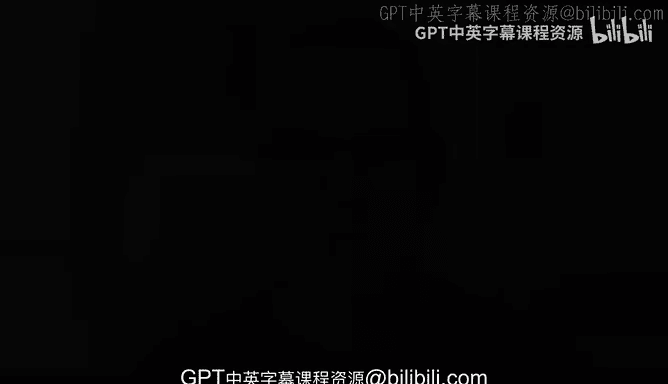

# Rust编程（基础）：01：认识你的课程讲师 🎓

在本节课中，我们将认识本课程的讲师，并了解这门Rust基础课程的目标与结构。

大家好，我是Alfredo Deza，欢迎来到这门Rust课程。我们将探讨Rust编程语言的基础知识。

我们将学习你需要掌握的基础Rust知识。我们的目标不是深入最复杂的Rust特性，而是在课程结束时，应用所学概念来构建一些可操作、实用的项目。这样，你学到的所有概念在开始动手构建时都会变得有意义。用刚学到的知识来构建项目，是无可替代的学习方式。

我拥有超过10年的软件工程经验。

我曾在小型公司、大型公司以及大型企业工作过。在本课程中，你将看到我在这些年软件工程师生涯中学到的一些概念，我会尝试将这些经验融入即将讲解的概念中。

学习一门新的编程语言可能有些令人却步。

但我总是尝试从最实用和务实的角度来教授这些内容。希望你能在课程中感受到，这些概念是细小且易于理解的。你将能够跟上课程内容的节奏。最后，你将能够综合运用所学，从零开始使用Rust编程语言构建项目。

我认为Rust编程语言非常有用。它拥有极快的速度，并具备许多不同的积极特性。它有一个编译器和类型检查器，编译器会为你进行类型检查，捕捉你可能未意识到的错误。与其他一些编程语言不同，它不会让你陷入“Google搜索错误”的境地。此外，它还具备惊人的运行速度和更低的资源消耗。我非常兴奋。

让我们开始学习Rust吧。

---

本节课中，我们一起认识了讲师，并了解了本Rust基础课程旨在通过实践项目来巩固所学概念，让学习过程更加直观和有意义。