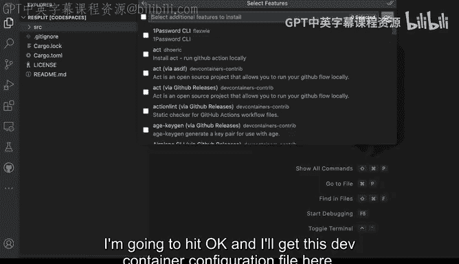
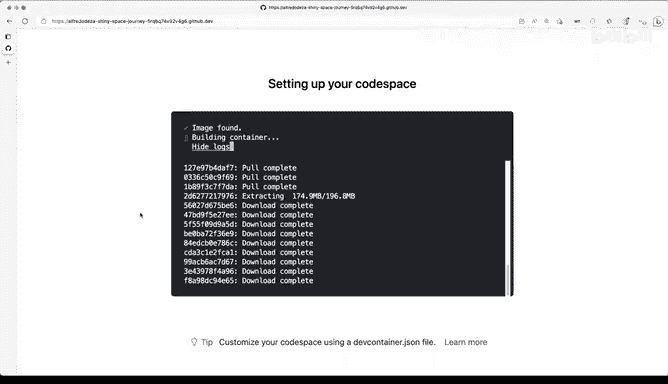
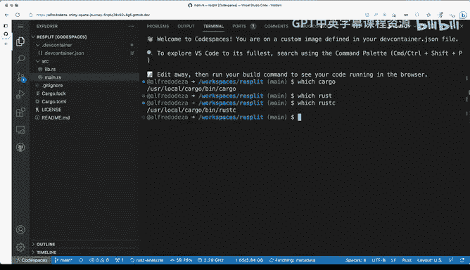
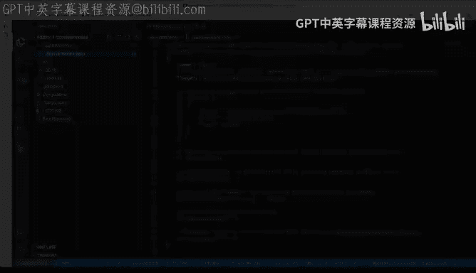

# 杜克大学《rust编程（基础）｜rust programming》中英字幕 - P20：20_01_05_演示：开发容器基础.zh_en - GPT中英字幕课程资源 - BV1dx4y1b7Vo

Let's take a look at some of the basics of dev containers and what are dev containers is the way that we have to configure an environment with code spaces。

 So in this case I have like default full code space have just my files here for my rust application nothing out of the ordinary I'm going to add them how do I add them very easily I can come here to the commemlate and say dev containers and I'll get this nifty thing here called addde container configuration files So in this case and I want to say that I want to create a new configuration because that's what I want to do I don't have an active configuration I to click this one and I'll get these options in this case I want rust but there's plenty of other options like if I say Python and show all definitions I'll get several different things in Python like even Python with is functions or all kinds of different things here。

 but no I want actually rust rust de containers， rust and nails rust。Pas SQL。

 all kinds of different things here for rust， but rust Dev containers sounds good enough。

 I'll get the operating system version and I'm gonna select both sides the default and here you have all kinds of other different extras that you can select in this case I don't want anything extra I'm gonna hit okay and I'll get these dev container configuration file here So this is good and right off the bat。

 the de container will say hey， it seems like this is slightly different do you want to rebuild and yes。

 I actually want to rebuild and while this is rebuilding。

 I want to mention like what is going on well behind the scenes youll get these new dev container this container configuration that is going to come It's a different image that will have rust enabled and why that's important and I'm actually gonna click here looking at the logs so that you can see how it's。

Pull in the images。 So let's just wait it out here a second until this completes and then come back to see what are some of the changes。

Okay so it seems like this finished， everything loaded and I can now close this deaf container configuration。

 open up SRC， look at main that Rs and rust and Lizer seems like it's doing something it's fetching meada let's open up the terminal and take a look at which cargo and we can see that cargo is installed now and if I do which rust actually rust C we can see that that's also installed so whats what's the deal here。

 why is this special well if I look at the container。

 devaf container that J that was added we'll see that it was adding an image has rust with everything in it so this is why this is important we were able to add that right away now by default fold you will get just a deaf container that Json file if you want to do our thing。

You can also additionally have a Docker file as well here that you can reference and do some changes if you want to as well。

 so by default， just having a depth container adjacent and the way that I added here would be enough to start customizing your environment so those are the things that you would need to do in order to get all these files and you can see that this is essentially a JSO file with some configurations that will try to make some changes as we try to improve and enhance our development environment with certain specifics for our project。

