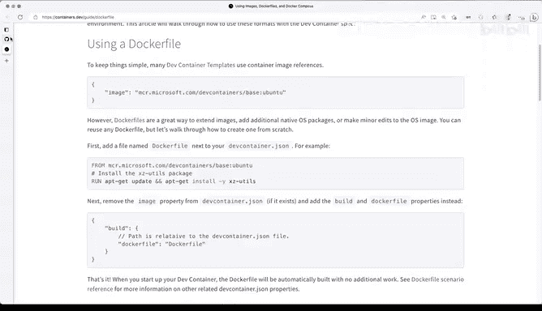
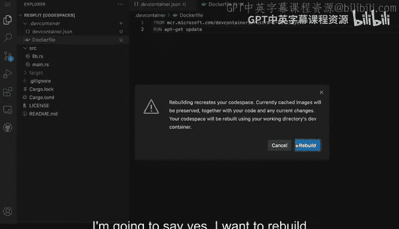
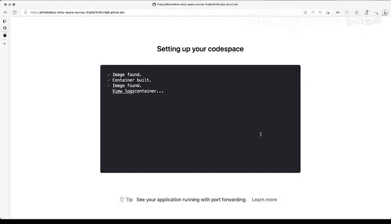
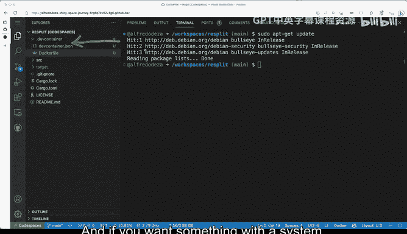
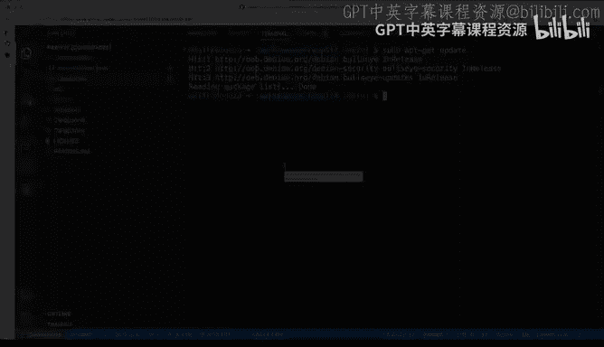

# 杜克大学《rust编程（基础）｜rust programming》中英字幕 - P22：22_01_07_演示：自定义环境.zh_en - GPT中英字幕课程资源 - BV1dx4y1b7Vo

Finally， if you want to add changes to the operating system or the underlying system， like say。

 for example， you want to expose certain file or add some files and make some changes to the operating system。

 it might not be really clear how to do that， looking at this JSON file that we have here。Okay， well。

 what are some of the things that we can do Well， we can customize the Docker file Well the Docker file is now here。

 you can definitely see that you can use a Docker file or a Docker compose file and you can click here in the containers that dev and the guide for the Docker file which is right here and that's fine and this is the default。

 but you definitely have the ability of running up gate update and install some some for example。

 some us or some package and then that's fine。 Now the path is always relative to to the dev container file and that's that's fine。

 All right so how we're going to do this well let's make some changes Okay so I'm I come here and I'm going to say well this is not the image that I want I am going to say that we're going to have a build configuration here and we're going to open up new section。

I'm going to say。Let's see some of the things that I'm going to use Copi for these。 that's fine。

 I'm going to remove that line， save it。 we're not going to pass any args， let's just remove that。

And let's just remove that last comma。 And then that's fine。

 So this is good enough for what we want to try to do。 we're not going to pass any arguments。 Next。

 we're going to come here to depth container。 I'm going to say I'm going a new file and I'm going to make it a doctoral file。

 So thats that's good enough。I don't want to install that just yet。

 and what we're going to be doing here is essentially we're going to add this from。

And let's go and take a look at the file here。 So this is the actual image that we want we still want to use that the image that was preconfigured before。

 So I'm going to do that。 and then we can actually try to run some command。

 So how about get update I'm going to save that。And that looks pretty pretty good like this export aviian front end。

 non interactiveactive。 It's like if you want to prevent a prompt when you're installing something。

 but this looks pretty good to me so if I go back to dev container this looks okay it's the same is the same image but now I have the ability to put some system things here in my Docker file like update。

 so I can save now I can try it out and do a rebuild。

 So if I say rebuild container then I'm going click that one。 I'm gonna say yes。

 I want to rebuild and this will trigger a full container rebuild with the instructions that I have with the Docker file now separate from the dev container file and will get all the extensions installed。

 remember we added the Githubcoil it and we did some changes to the rust analyzer great So the dev container has been。

Buill now， you can see that that Github Co is not installed， but now it appeared right here， right。

 as I was saying that it wasn't installed。 If I open up the terminal and I do pseudo app to get update。

 it should be pretty quick because I've already run that command when， when this was getting。

 getting customized with this file。 So there you go。

 dev container is what you want to have dev container digest for most of your changes。

 And if you want something with a system， you'll have to add that Docker file and made the changes that I just did。

