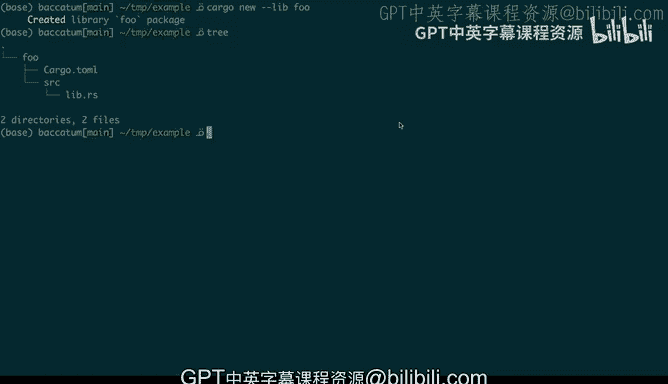

# Rust编程（基础）：P25：创建新的Rust项目 🚀


在本节课中，我们将学习如何使用Cargo工具创建新的Rust项目。Cargo是Rust的官方包管理器和构建工具，它能帮助我们快速初始化项目结构，管理依赖，并执行构建、测试等任务。

## 概述

我们将探索使用Cargo创建Rust项目的几种不同方式，包括在当前目录创建项目和创建独立子目录项目，并区分创建二进制应用包和库包。

## 使用Cargo创建项目

首先，确保你的系统已经安装了Cargo。如果你已经按照Rust的官方安装步骤操作，那么Cargo应该已经准备就绪。虽然不使用Cargo，手动创建文件也是可行的，但使用工具可以自动设置正确的项目结构，从而更高效地推进工作。

以下是创建项目的几种方法。

### 在当前目录创建项目

有两种主要方式可以在当前工作目录中初始化项目。

第一种方式是使用 `cargo init .` 命令。这个命令会利用当前目录的名称作为项目名来初始化项目。

```bash
cargo init .
```

运行此命令后，默认会创建一个二进制应用包。执行 `ls` 或 `tree` 命令查看目录，你会发现生成了 `Cargo.toml` 文件、`src` 目录以及 `src/main.rs` 文件。

查看 `Cargo.toml` 文件，可以看到项目名被设置为当前目录名（例如“example”），`edition` 字段设置为“2021”。`Cargo.toml` 是项目的清单文件，我们稍后会详细讨论其内容。这里的关键点是，因为它创建了包含 `main` 函数的 `src/main.rs` 文件，所以这是一个二进制应用包。

如果你想创建一个库包，可以使用 `--lib` 选项。

```bash
cargo init . --lib
```

运行此命令后，项目结构会发生变化：不再有 `src/main.rs` 文件，取而代之的是 `src/lib.rs` 文件。查看 `src/lib.rs`，可以看到它定义了一个模块和测试，以及一个名为 `add` 的公共函数。这为编写可复用的代码库提供了基础。

### 创建独立子目录项目

上一节我们介绍了在当前目录创建项目，本节我们来看看如何创建一个位于独立子目录中的新项目。

要实现这一点，我们需要使用 `cargo new` 命令，而不是 `cargo init`。`cargo new` 命令允许我们指定一个路径参数，该路径将成为新项目的目录名。

例如，要创建一个名为 `my_project` 的二进制应用包，可以运行：

```bash
cargo new my_project
```

这个命令会创建一个名为 `my_project` 的子目录，并在其中初始化项目。使用 `tree` 命令查看，可以看到所有项目文件（如 `Cargo.toml` 和 `src/main.rs`）都包含在这个子目录内。这种方式有助于将项目内容组织在独立的文件夹中。

同样，你也可以使用 `--lib` 选项来创建一个库包。

```bash
cargo new my_lib --lib
```

执行后，会在 `my_lib` 目录下创建一个库包，其中包含 `src/lib.rs` 文件，而不是 `src/main.rs` 文件。

## 总结

本节课中，我们一起学习了使用Cargo创建Rust项目的四种方法：
1.  在当前目录创建二进制应用包：`cargo init .`
2.  在当前目录创建库包：`cargo init . --lib`
3.  在新子目录创建二进制应用包：`cargo new <project_name>`
4.  在新子目录创建库包：`cargo new <project_name> --lib`



二进制应用包主要用于生成可执行文件，而库包则用于封装可供其他应用程序使用的函数、方法和结构体。掌握这些创建项目的方法是开始Rust编程之旅的第一步。