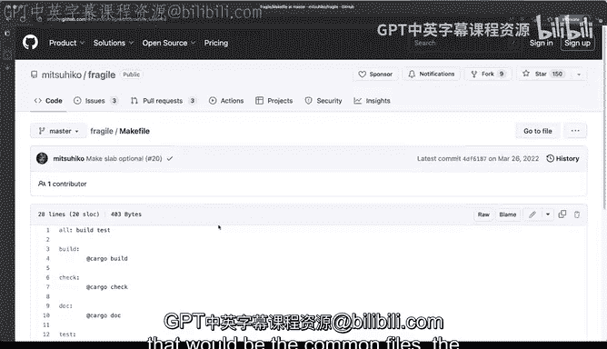
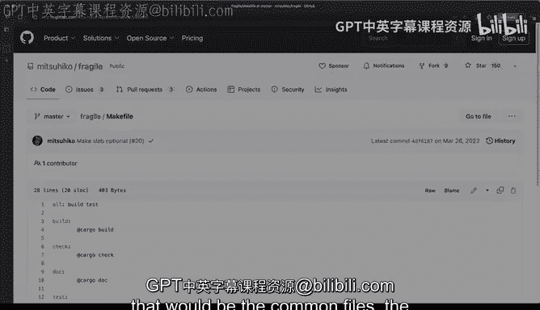

# 杜克大学《rust编程（基础）｜rust programming》中英字幕 - P26：26_02_05_演示：项目文件概览.zh_en - GPT中英字幕课程资源 - BV1dx4y1b7Vo

There are many different files in a bra project and different projects will use well different files and different structures Now we've seen a little bit of some of those files already I have here a very small project that I called re split and allows me to split strings for like it's basically a command main tool that split strings kind of like cut when you want to split certain very long strings with a limiter now the details don't matter really because what we want to do is poke around what are some of the files so this is very common but read me that MD markdown file just so you can write your initial project description what this is about youll usually have a license now not everybody has a license in this format but this is also pretty common。

As you've seen already， cargo generates some of these files cargo。

el and I'll click here and in this case you can see there my name and and the addition of rust that I'm using and what the version of these packages and what the name is some of the dependencies I have some of these things already here and I've defined this thing called clamp which is a dependency and I'm defining the version and some of the features that I'm using Now I'm not going too specific into cargoel but definitely the dependencies will always go here defining this way and these goes about like the details about my package and some of the things that I want now some of these are already pregenerated but you can read more about cargoel and all of the fields that you can actually add in there actually you get all of that in the manifest documentation here All right let。

Back and let's see some of the other things now cargo that lock we haven't explored。

 but what it does is it does a pinning of all of the libraries and their exact correct version that my library or my package in this case is using so you can see here there is a package called andstream and the version 0。

3。0 and it has several dependencies so what this is doing is it's gathering all of the dependencies of a dependencies I just had that one dependency called clab and actually if we search for it you will see that it right here but this is pulling all kinds of other dependencies like clap builder and cl arrive and Lex and whatnot so all of those things are being pulled in and this allows anyone that would like to recreate these to be building。

From scratch， one caveat of this is that。It is usually very common to do this for binary package。

 like in this case， but if you're using a library， you'll probably don't want pinning and include the cargo that lock。

 so something to keep in mind because libraries are usually not it's not okay to pin them with cargo that lock。

 its more flexible if you just include cargo that Tael with the dependencies right here。Alright。

 so what else do we have Well SRC which is very common for rust it's actually the expectation and again we saw that we have a special file called LibRS if we want to extend some modules and for command line tools binary packages。

 executables mainRS is going to be what you want to be using again if this was only a library then we wouldn't have mainRS it would only have LibDRS now this is a very small project let's take a look at another small project from someund actually writes a lot of rust and in this case you can see that the files are very similar this case this is a library it is not a command line tool but you can see that it includes a readmi MD it does have a make file which we haven't covered yet has a license file right here let's take a look at the cargo do so here we get a lot more fields and the only depend。

I this one called Slab Now it doesn't include the cargo that lock as we saw from my command line tool。

 my binary my executable so this is a difference this is a library so you have some examples directories that you can actually take a look and will have some ways that you can take a look at something that gives you an idea or how to use these in the source or SRC will have live that arrest and no main that arrest and will have all of these order files that allow you to separate the concerns of things as you start modularizing we haven't taken a look yet at modules and how they work but in this case this is more than enough to take a look at the overview of the packages definitely will take a look at make file later and it is definitely something that is a very common pattern that you will see in bra projects as well where。

You will have the ability to kind of you know group together a certain commands in this case component at rust format so it always makes sure that format will be there and installed and similar here with format check and LinkedIn and testing all of those things will be will be present and it's a way of normalizing throughout your projects so it's definitely something to look for and that would be the common files。

 the overview of project files in rust projects。

