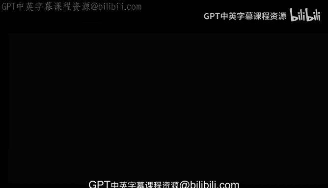
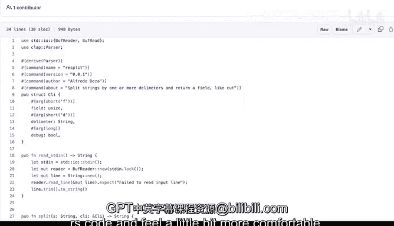

# 杜克大学《rust编程（基础）｜rust programming》中英字幕 - P27：27_02_06_演示：Rust代码基本组件.zh_en - GPT中英字幕课程资源 - BV1dx4y1b7Vo

Reusing this example project that I already have here。

 Let me show you some of the basic components of rust code。 Let's go to main that rest。 And in here。

 there's already， even though this is 11 lines long， there's a lot of stuff going on。

 So let's start from the top and in here， we're using the use keyword。 This allows us to import。

Import modules， import libraries and bring them into scope so that means that in this case this CLI we will be able to bring it into the scope for this file that's why I can use it right here online number six。

And this double column means that this CLI is part of the re split。

 so it is a way of you know it's similar to other proing languages where not necessarily C+ but like or actually very similar to c++ but in languages like Python or ja where you want to have like a limiter or that double column will definitely be one where we're able to separate that now in this case we're importing that and then we're also terminating with a semicolon。

 that means that that's the end of the statement in this case these statement will bring CLI so the same thing happens here and the semicolon is very special because in some situations you will not have a semicolon and that has a special meaning which will be covering later。

Allright， so we have CI and parser and what's happening at line number5。

 we are declaring a function with Fn which does a keyword for declaring functions in this case is called main we're using pars but empty because there's nothing in there we're not accepting any arguments if we were accepting arguments that's where they would go Next we have the curly brackets and that starts here and ends right there and the reason why it because it means that all these will be within scope that means that the code here is scoped to only these section and it won't escape from that scope Now it is possible to have nested scope we won't go there yet but that's why these curly brackets are are useful and that's what what's the reason why we're using them。

Now we are defining variables using lead。We have already a little bit of we've seen code already with a led keyword。

 but that's what this is doing where we're defining these variables。

 we're cover variables and creating them and using them later， but that's what those are。

 We'll see these double column in several different places that's fine。

And essentially that's it for these main thats， I mean。

 there are certain things that will be learning more as we progress。

 but from a very high point of view and a very simple oversimplified way that's more than enough but now let's take a look at lib that are rest now here there's a lot more things going on and we wont cover absolutely everything。

 but it's definitely something that I want to show you similar to before we have our use statements here that will bring all of these libraries and modules into scope but we also have attributes。

 we haven't seen what astruct is but its basically is basically a way to organize things of of a similar category so to say and these things at the very top are called attributes。

 these are attributes。that are part of thestruct again we will have these curly brackets right here and right there and those are indicating scope in this case these attributes will be part of everything here in thisstruct it looks very complicated we'll see later how how does this work and demystify or make it more simple how to grasp what are all of these things that are going on now。

A new thing here that we haven't seen is the pub and that means public。

 We're making it publicly available。 We haven't seen yet what's private and what's public。

 but by default fault， everything will be private。 and when we want to expose them somewhere else we want to make sure that those will be using pub similarly here we're using pub and we have seen function and fn will create this read Sdn function in this case。

 it is returning a string。 we haven't seen types yet。

 but this means that it will return the string type。 Now remember we were looking at semicolons。

 Well， there's one line here in this function that doesn't have a semicolon and that function or that line rather is the last one So why do you think it doesn't have a semicolon it doesn't have one because this is the return。

ValueSo this thing right here is returning an actual string by not using a semicolon。

 we are telling rust， hey， by the way， this line over here， that's what we're returning。 So if。

 for example， I forget to return to actually add that semicolon here and line 19。

 that will mean that the return value will be this thing right here。

 So that will probably cost some errors and the compile will be complain complaining at it。

 but that's what what not including the semicolon means。 So there you go。

 those are some of the the components。 Some of the the common components on rust code and it will allow you to better identify what's what's going on when you're looking at rust code and feel a little bit more comfortable。

