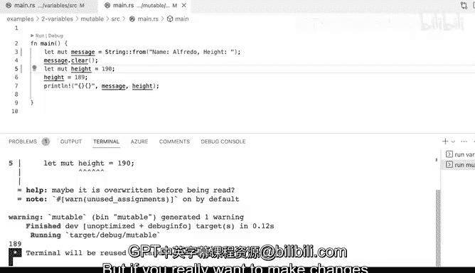

# Rust编程（基础）：P28：变量赋值与不可变性 🦀


在本节课中，我们将学习Rust中变量赋值的基本概念，特别是其独特的**默认不可变性**规则。我们将通过编写代码、观察编译器错误并修复它们，来理解如何声明变量、为何默认不可变，以及如何显式地声明可变变量。

---

## 变量赋值基础

上一节我们介绍了课程概述，本节中我们来看看Rust中如何进行基本的变量赋值。

在Rust中，使用 `let` 关键字来声明一个变量。其基本语法非常直接：`let` 后跟变量名，然后是赋值表达式。

```rust
let name = "Alfredo";
let weight = 190;
```
在上面的代码中，我们声明了两个变量 `name` 和 `weight`。Rust编译器会自动推断它们的类型（分别是字符串和整数）。每个语句以分号 `;` 结尾。

---

## 类型推断与运算

当我们对变量进行运算时，需要注意操作数的类型必须匹配。Rust是一门强类型语言，编译器会严格检查。

以下是一个常见的错误示例：
```rust
let weight = 190;
let kilos = weight / 2.2; // 错误：整数除以浮点数
```
运行这段代码会产生编译器错误：“cannot divide integer by float”。这是因为 `weight` 是整数类型，而 `2.2` 是浮点数。Rust没有为“整数除以浮点数”这个操作提供默认实现。

要修复这个错误，我们需要确保操作数类型一致。可以将其中一个操作数转换为浮点数：

```rust
let weight = 190.0; // 将 weight 声明为浮点数
let kilos = weight / 2.2; // 现在可以正确计算
```
或者，也可以在运算时进行类型转换。修复后，程序可以正常运行并输出结果。

---

## 变量的默认不可变性

这是Rust一个核心的安全特性。与许多其他语言不同，Rust中**所有通过 `let` 声明的变量默认都是不可变的**。这意味着一旦给变量赋值，就不能再改变它的值。

请看以下代码：
```rust
let message = String::from("Hello");
message.clear(); // 错误：尝试修改不可变变量
```
在这段代码中，我们尝试调用 `.clear()` 方法来清空 `message` 字符串的内容。由于 `message` 默认是不可变的，编译器会报错：“cannot borrow `message` as mutable”。

---

## 如何声明可变变量

如果你确实需要一个其值可以改变的变量，必须使用 `mut` 关键字来显式声明。

以下是修复上述错误的方法：
```rust
let mut message = String::from("Hello"); // 使用 mut 声明可变变量
message.clear(); // 现在可以成功清空字符串
```
通过在 `let` 后添加 `mut`，我们告诉编译器这个 `message` 变量是可变的，允许后续修改。

关于变量重新赋值，还有一点需要注意：在同一个作用域内，如果变量已经用 `let` 声明过，后续重新赋值时**不需要**再次使用 `let` 关键字。但是，如果变量是不可变的，重新赋值仍然会出错。

```rust
let height = 180;
height = 185; // 错误：不能给不可变变量赋值两次

let mut height = 180; // 声明为可变
height = 185; // 正确：可以修改可变变量的值
```

---

## 总结



本节课中我们一起学习了Rust变量赋值的核心概念：
1.  使用 `let` 关键字进行变量声明，编译器支持类型推断。
2.  进行运算时需确保操作数类型匹配，否则编译器会报错。
3.  Rust变量**默认是不可变的**，这是其保障内存安全和并发安全的重要机制。
4.  如果需要修改变量的值，必须使用 `mut` 关键字显式声明变量为可变的。
5.  理解默认不可变性有助于编写更安全、更易于推理的Rust代码。