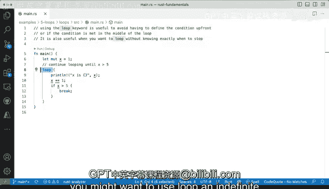

# 杜克大学《rust编程（基础）｜rust programming》中英字幕 - P33：33_02_03_演示：Rust循环入门.zh_en - GPT中英字幕课程资源 - BV1dx4y1b7Vo

There are several ways to loop in rust and we'll look at all of them really。

 but I will also take care of explaining in what situations you might want to use one or the other。

 so let's start with the loop keyword Now if you're coming from Python and some other programming languages where something like a specific keyword for a looping is not available well this might looks or pricing。

 so you might be wondering like when what situations you would want to have a loop like these with a keyword Now the idea here is that you may want to have block execution。

 a code block execution like this one to go on indefinitely。

In programming languages like Python， you would do something like wild true。

 So my wild true would mean like a condition that never never changes is always going to be true。

 So it's always going to be executing。 So in rust， we have something that says loop。

 So these signals that。These block here will execute indefinitely Now we do have one condition。

 which is we haven't seen yet breaks， but I'm giving it away here with this lesson we're going to be able to break away from this loop that will seemingly run forever so lets let's walk through some of the components of this function that is going to run a loop so first we the finer variable it's x equals1 it is going to be mutable because we're going to be changing x right here on line 10 so because we're going to be changing that it has to be declared with mute which is the specialty that will allow us to get that to be mutable so let's just run it and see what happens Okay so we run from one to three all the way to5 that's fine and I'm going clear this out So this is pretty straightforward in this case。

This is printing right here and this right here is going to go afterwards the plus equals is a way to add add and redefine this is shadowing we've already seen shadowing a little bit so you should be familiar with that concept we don't need to do let there because x is still within the scope。

Alright， so now if x is bigger than5 well then it breaks and it no longer continues so that is why this condition。

 this if condition will need the brackets here so that we can actually break over here so there you go that's the loop keyword and you will use it when you want to run an iteration。

 a loop a piece of code indefinitely or you actually don't really know when to stop I mean this condition here is pretty obvious but you might not that condition might not be obvious to you at the time where you are writing the code in this case we're making making it explicit and then that's fine。

 but in a situation where you don't know well you might want to use a loop an indefinite way of looping over a piece of code。

