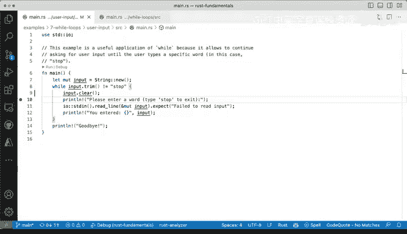

# Rust编程（基础）：P35：演示：Rust中的while循环 🌀


在本节课中，我们将学习Rust编程语言中的`while`循环。我们将通过两个具体的例子来演示其基本用法和一个更高级的应用场景。`while`循环是一种控制流结构，只要给定的条件为真，它就会重复执行一段代码块。

## 基础while循环示例

首先，我们来看一个基础的`while`循环示例。这个例子展示了如何使用一个计数器变量来控制循环的执行次数。

```rust
fn main() {
    let mut i = 0;
    while i < 5 {
        println!("i 的值为：{}", i);
        i += 1;
    }
}
```

以下是上述代码的逐步解释：

1.  我们声明了一个名为 `i` 的可变变量，并将其初始值设为 `0`。
2.  循环的条件是 `i < 5`。只要 `i` 的值小于5，循环就会继续执行。
3.  在循环体内，我们首先打印出 `i` 的当前值。
4.  然后，我们使用 `i += 1;` 将 `i` 的值增加1。这是通过变量遮蔽和加法赋值操作完成的。
5.  当 `i` 的值增加到5时，条件 `i < 5` 不再为真，循环终止。

运行这段代码，输出结果将是：
```
i 的值为：0
i 的值为：1
i 的值为：2
i 的值为：3
i 的值为：4
```
正如预期，循环从0开始，一直执行到4。花括号 `{}` 之间的代码块会重复执行，其行为与其他编程语言中的 `while` 循环非常相似。

## 进阶while循环示例

上一节我们介绍了基础的计数器循环，本节中我们来看看一个更贴近实际应用的例子。这个例子会持续读取用户的输入，直到用户输入特定的命令才停止。

```rust
use std::io;

fn main() {
    let mut input = String::new();

    while {
        println!("请输入一个单词（输入‘stop’退出）：");
        input.clear();
        io::stdin().read_line(&mut input).expect("读取失败");
        input.trim() != "stop"
    } {
        println!("你输入的是：{}", input.trim());
    }

    println!("再见！");
}
```

以下是这个进阶示例的关键点说明：

1.  我们首先导入了 `std::io` 库，以便处理控制台输入。
2.  创建了一个可变的 `String` 变量 `input` 来存储用户输入。
3.  循环的条件是一个代码块，它执行以下操作：
    *   提示用户输入。
    *   清空 `input` 字符串，准备接收新输入。
    *   从标准输入读取一行文本到 `input` 变量中。
    *   检查去除首尾空格后的输入是否不等于字符串 `"stop"`。如果不等于，条件为真，循环继续。
4.  只要条件为真（即用户没有输入“stop”），循环体就会执行，打印出用户输入的内容。
5.  一旦用户输入“stop”，条件变为假，循环结束，程序打印“再见！”并退出。

这个例子涉及一些我们尚未深入讲解的概念，例如：
*   `io::stdin().read_line(&mut input)`：从标准输入读取一行。
*   `&mut input`：以可变引用的方式传递 `input` 变量。
*   `.expect(“读取失败”)`：处理可能出现的错误。

不过，这些细节目前不重要，我们会在后续课程中详细讲解。这个例子的核心在于展示了如何在 `while` 循环中使用更复杂的条件逻辑，这里我们使用了条件表达式的**否定形式**（`!= “stop”`）来控制循环的继续执行。

运行这个程序，交互过程可能如下：
```
请输入一个单词（输入‘stop’退出）：
hello
你输入的是：hello
请输入一个单词（输入‘stop’退出）：
rust
你输入的是：rust
请输入一个单词（输入‘stop’退出）：
stop
再见！
```

## 总结



本节课中我们一起学习了Rust语言中`while`循环的两种用法。我们首先通过一个计数器循环了解了其基本语法和工作原理。接着，我们探索了一个更高级的示例，它通过读取用户输入并检查特定条件来动态控制循环的终止。这两个例子是学习`while`循环非常实用和基础的入门方式。