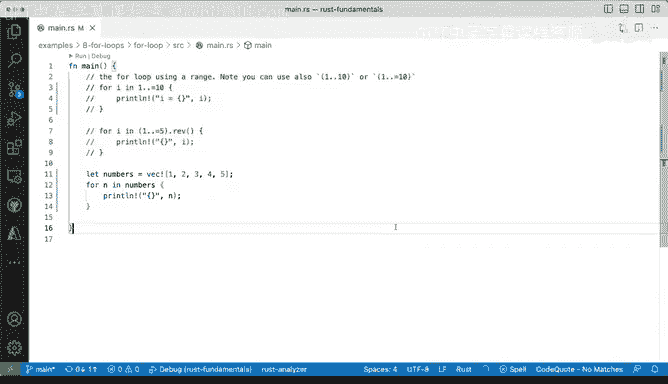

# 杜克大学《rust编程（基础）｜rust programming》中英字幕 - P36：36_02_06_演示：Rust中的for循环.zh_en - GPT中英字幕课程资源 - BV1dx4y1b7Vo

Now let's do a four loop。 We've seen the loop key word before but we haven't seen the for loop so I have three examples here and this main function will un the code as we make progress so we start over here on actually line number three where we're doing a range the range in rust is defined by starting at one number and then using those two dots and then the ending the ending number so the one is the start the10 is the end and then it will run and print what the value of i is So let's just run it and see what we get so this might be expected。

 we are starting at number one but we're ending at number9 and why that is well because we actually have nine iterations to go because we started on one and we ended on 10 So this is the off by one error that might get you if you。

A trying to get into a situation where you really want to have all of the integers inclusive of 10 or exclusive of 10 in this case so let me clear that out and I have a couple of options where we we can change these so the way we change it and by the way might you might see this construct be done with pars it is the same thing as not having pars but I'm going add the parentss here and I'm going to add these equal so let's just see how this changes by running run and then you can see now10 appears so why is that because this syntax where we say equal allows me to say I want to include10 definitely there and we can again this doesn't matter we don't need to have the pars and we can run it again and we'll have the same thing again no problem so。

This is a pretty straightforward to do a loop with a range。

 but now let's do the other example where we are having a reverse a reverse loop so let's just run these and see what happens so54。

3，2 and1 is going in reverse so we definitely have the ability to do that the other way around。

 so that's fine you have all of these things that you can do with with a range object so if I click dot you can we'll get all of these from the vS code itself where we're saying what we want to chain it。

 we want to clone it， we want to compare the iterator there's all kinds of different things we can count all different things here but ref is definitely one thing that we can try there so there you go that's ref and finally。

I'm going to briefly show you a vector， so how does that work with a vector well， with a vector。

 it's like a list like an array in some other languages， we have a container of a list。

A grouping of integers so we have numbers I'm going to loop over them。

 This is a very common type in rust where we can actually go and loop over certain items in in this container called a vector when you see this back in a xlamation sign that it means it's a vector and in this case this is actually a macro we've been using macros before and better I haven't gone into those and the macro the most used one is the print lane or print linem sorry that uses the the ampers so this is actually not a function it looks like a function it kind of like behaves like a function but it is not quite a function it is a macro that's the right way to save it so lets let's go ahead and run these and save it and run it again and we get one。

2，3 and4 and5 as expected。Very similar to the range over there。

 so that's four loops and allows you to do this with the range and with modifying the range on the fly as well with three different examples that are pretty straightforward。

