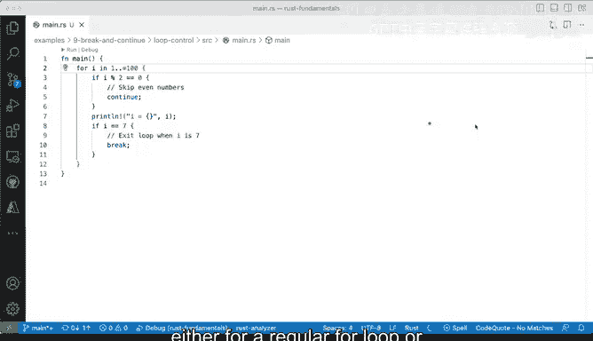

# Rust编程（基础）：P37：Rust中的break与continue语句 🚦


在本节课中，我们将学习Rust中两个用于控制循环流程的关键字：`break`和`continue`。它们能让我们更灵活地管理循环的执行，无论是`for`循环、`while`循环还是其他循环结构。

## 概述

`break`和`continue`是控制流语句，它们允许我们在循环内部根据特定条件改变程序的执行路径。`continue`用于跳过当前迭代的剩余部分，直接进入下一次循环迭代；而`break`则用于立即终止整个循环。

上一节我们介绍了Rust中的基本循环结构，本节中我们来看看如何使用`break`和`continue`来更精细地控制循环行为。

## continue语句：跳过当前迭代

`continue`关键字的作用是跳过当前循环迭代中剩余的代码，并立即开始下一次迭代。这在需要过滤掉某些不符合条件的值时非常有用。

以下是`continue`语句的一个典型应用场景，用于在循环中仅处理奇数：

```rust
for number in 1..=10 {
    if number % 2 == 0 {
        continue;
    }
    println!("{}", number);
}
```

在这段代码中，`for`循环遍历数字1到10（包含10）。`if`条件检查数字是否为偶数（即`number % 2 == 0`）。如果条件为真，`continue`语句会跳过当前迭代的剩余部分（即`println!`语句），直接进入下一次循环迭代。因此，只有奇数（1, 3, 5, 7, 9）会被打印出来。

## break语句：终止循环

`break`关键字用于立即终止整个循环，无论循环条件是否仍然满足。这在找到所需结果或满足特定条件后提前退出循环时非常有用。

以下是`break`语句的一个示例，它在找到数字7后停止循环：

```rust
for number in 1..=10 {
    if number == 7 {
        break;
    }
    println!("{}", number);
}
```

在这段代码中，循环同样遍历1到10。当`number`等于7时，`break`语句被执行，整个循环立即终止。因此，程序只会打印数字1到6。

## 综合示例：结合使用break与continue

现在，让我们看一个结合使用`break`和`continue`的完整示例，以更好地理解它们如何协同工作。

```rust
for number in 1..=10 {
    if number % 2 == 0 {
        continue;
    }
    if number == 7 {
        break;
    }
    println!("{}", number);
}
```

以下是这段代码的执行步骤分析：

1.  循环从数字1开始。
2.  检查`number % 2 == 0`。对于偶数，`continue`语句跳过打印步骤。
3.  对于奇数，检查`number == 7`。当遇到数字7时，`break`语句终止整个循环。
4.  因此，只有数字1、3、5会被打印出来。循环在遇到7时停止，不会处理数字9。

运行此代码，输出结果为：
```
1
3
5
```

## 应用场景与注意事项

`break`和`continue`语句可以应用于所有Rust循环结构，包括`while`循环和`loop`循环。它们为循环控制提供了额外的灵活性。

使用这些语句时，需要注意逻辑清晰，避免创建难以理解的循环逻辑。确保`break`条件最终能够被满足，以防止无限循环。

## 总结



本节课中我们一起学习了Rust中`break`和`continue`语句的用法。`continue`用于跳过当前迭代，直接进入下一次循环；`break`用于立即终止整个循环。通过合理使用这两个关键字，我们可以更有效地控制循环流程，编写出更清晰、更高效的Rust代码。