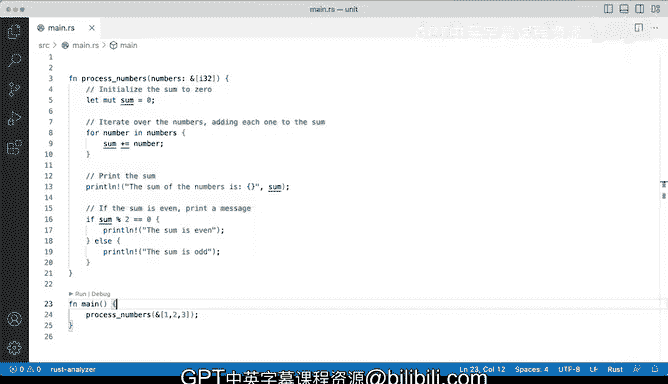

# Rust编程（基础）：P41：演示：简单单元函数


在本节课中，我们将学习Rust中的函数，特别是被称为“单元函数”的类型。我们将了解什么是单元函数，如何定义和调用它们，并通过一个简单的例子来演示其工作流程。

## 概述

Rust是一门支持函数式编程的语言，函数在其中扮演着核心角色。本节我们将重点介绍一种特殊的函数——单元函数。这类函数执行某些操作，但**不返回任何值**。我们将通过一个具体的代码示例来理解其概念和用法。

## 单元函数的概念

上一节我们介绍了Rust中函数的基本角色。本节中我们来看看什么是单元函数。

在Rust中，当你调用一个函数，而该函数不返回任何内容时，这类函数被称为**单元函数**。它们的主要目的是执行某些处理或操作，而不是计算并返回一个结果。你可以将其理解为“调用即忘”的模式：你调用函数，它完成工作，但你并不期待它返回一个值，即使你可能向它传递了参数。

## 代码演示与分析

以下是本节课将要演示的代码示例。它展示了一个`main`函数如何调用一个名为`process_numbers`的单元函数。

```rust
fn main() {
    let numbers = [1, 2, 3];
    process_numbers(&numbers);
}

fn process_numbers(nums: &[i32]) {
    let sum: i32 = nums.iter().sum();
    println!("数字之和是 {}", sum);

    if sum % 2 == 0 {
        println!("和是偶数。");
    } else {
        println!("和是奇数。");
    }
}
```

在这个例子中：
*   `main` 函数是程序的入口点。
*   `process_numbers` 是一个我们定义的单元函数。
*   我们向 `process_numbers` 函数传递了一个切片（`&[i32]`），它看起来类似于其他编程语言中的列表。
*   该函数计算切片中所有数字的总和，并打印出该和以及它是奇数还是偶数。

## 工作流程解析

现在，让我们详细解析一下这个“调用即忘”的工作流程。

1.  **函数调用**：在`main`函数中，我们创建了一个包含数字`1, 2, 3`的数组，然后调用`process_numbers`函数，并将这个数组的引用（切片）传递给它。
2.  **执行过程**：`process_numbers`函数接收这个切片，计算其元素的总和（`1+2+3=6`），然后执行打印操作。
3.  **输出结果**：运行程序后，我们将在控制台看到执行结果：“数字之和是 6”和“和是偶数。”。这些是函数内部处理工作的执行细节。
4.  **无返回值**：关键点在于，`process_numbers`函数完成了所有工作（计算和打印），但并没有使用`return`关键字向调用者（`main`函数）返回任何值。它的返回类型是`()`，即单元类型，这标志着它是一个单元函数。

## 总结



本节课中我们一起学习了Rust中的单元函数。我们了解到，单元函数是那些执行某些操作但**不返回任何值**的函数。它们遵循一种“调用即忘”的模式。我们通过一个传递切片、计算总和并打印结果的简单例子，演示了从主函数调用单元函数的完整且直接的工作流程。虽然Rust中还有更复杂的函数交互方式，但理解单元函数这一基础概念非常有用。