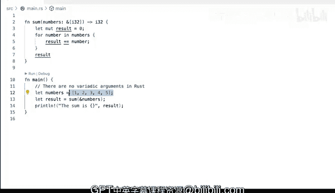

# Rust编程（基础）：P43：演示：使用参数 📚

在本节课中，我们将学习如何在Rust函数中使用参数，特别是如何处理可变数量的参数。我们将通过一个具体的例子来理解Rust中参数传递的类型系统和设计思路。

## 函数参数基础

在之前我们接触过的许多不同示例中，我们已经见过函数的参数。在本例中，`main`函数不接受任何参数，这由此处可见的空括号`()`表示。

然而，`main`函数依赖并实际调用了另一个名为`sum`的函数。`sum`函数有一个参数，这个参数本质上需要一个名为`numbers`的实参，并且该实参具有类型。类型由冒号`:`指示。在本例中，它使用了`&`符号，表示借用该值。

## 参数类型详解

它实际上使用了一个`i32`类型的切片，这就是实际的类型。该函数将返回一个`i32`类型的结果，即一个32位整数。这是一种表示整数的方式，我们使用的整数是32位长的。因此，我们对于要执行的操作非常明确。

这个函数要做的事情就是将所有的项相加，最后返回最终的总和，即所有项相加的结果。

## Rust的参数设计哲学

这些细节本身并不那么重要，我们想要传入一些数字。在其他一些语言中，比如Python，你实际上可以传递任意数量的参数，其函数签名会与此非常不同。

但在Rust中，我们没有可变参数。这意味着所有参数都必须被明确定义，包括它们的类型。

## 实现“可变参数”功能

一种在Rust本身不支持的情况下实现类似可变参数支持的方法是，使用类似我们这里展示的方式：我们将多个不同的值传递到一个数据结构中。在本例中，我们传递的是一个数字切片。这绝对是处理该问题的一种方式，也是你可能需要习惯的方式。

你也可以使用向量，虽然我们还没有详细讨论向量，但将多个不同的值封装在一个数据结构中传递的能力，绝对是处理此问题的一种方法。在本例中，我们完全遵循了这一点。

## 代码执行流程

我们在此处借用切片，然后进行一些计算。它实际上并没有修改那个值，这是正确的，然后返回一个`i32`类型的结果。这样代码就能编译通过。

## 总结与对比

这就是我们如何在Rust中使用“可变参数”的方法，尽管Rust本身并不直接支持可变参数。可变参数意味着参数数量可以是零个或多个。归根结底，在像Python这样的语言中，这最终会转化为某种可迭代对象（在Python中我认为是元组），但在这里本质上是相同的事情。

因此，你需要更多地思考你传递的是什么，以及支持和使用它的方法。使用切片绝对是一种有效的方式。

---

本节课中我们一起学习了Rust函数参数的基本用法，理解了Rust严格类型系统下参数传递的特点，并通过切片数据结构探索了模拟“可变参数”功能的实现方式。关键在于将多个值封装到单一数据结构（如切片或向量）中进行传递。