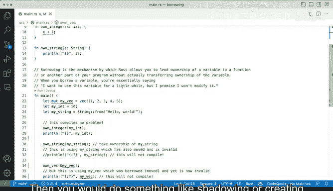

# Rust编程（基础）：P44：借用概念演示 🧠


在本节课中，我们将学习Rust语言中一个核心且独特的概念：**借用**。我们将通过具体的代码示例，理解所有权、借用、移动和拷贝之间的区别，并学习如何避免常见的编译错误。

---

## 概述

Rust通过一套严格的所有权系统来保证内存安全，无需垃圾回收。**借用**是这套系统的关键组成部分，它允许你临时地引用一个值，而不获取其所有权。理解借用对于编写正确且高效的Rust代码至关重要。

上一节我们介绍了Rust的基本语法和所有权概念，本节中我们来看看**借用**的具体规则和实际应用。

---

## 变量定义与所有权

首先，我们定义几个变量作为示例：

```rust
let mut vector = vec![1, 2, 3]; // 一个可变的向量（动态数组）
let my_int = 10;                 // 一个整数
let my_string = String::from("Hello World"); // 一个字符串
```

这些定义都能正常编译，没有问题。

---

## 整数与拷贝行为

让我们从一个简单的整数函数开始：

```rust
fn own_integer(x: i32) {
    println!("{}", x + 1);
}

fn main() {
    let my_int = 10;
    own_integer(my_int);
    println!("{}", my_int); // 这里仍然可以访问 my_int
}
```

`own_integer` 函数接收一个 `i32` 类型的参数 `x`，并打印 `x + 1` 的结果。当我们调用 `own_integer(my_int)` 时，程序可以正常运行，并且在函数调用后，我们仍然可以打印 `my_int` 的值。

**这是因为对于像整数、布尔值这样的简单类型（实现了 `Copy` trait），Rust会在传递时自动进行值拷贝。** 拷贝的成本很低，所以 `my_int` 的所有权并没有被移动，原变量依然有效。

---

## 字符串与移动行为

现在，让我们对字符串进行类似的操作：

```rust
fn own_string(s: String) {
    println!("{}", s);
}

fn main() {
    let my_string = String::from("Hello World");
    own_string(my_string);
    println!("{}", my_string); // 这里会导致编译错误！
}
```

当我们保存这段代码时，编译器会立即报错。函数 `own_string` 只是打印了字符串，并没有修改它，为什么不行呢？

**原因在于：字符串（`String`）类型的大小在编译时是未知的，进行深拷贝的成本可能很高。因此，Rust默认不会拷贝它，而是进行“移动”。**

当我们将 `my_string` 传递给 `own_string` 时，**所有权**从 `main` 函数中的变量 `my_string` 移动到了函数 `own_string` 的参数 `s` 中。移动之后，原来的 `my_string` 就失效了，不能再被使用。这就是编译器报错“value borrowed here after move”的原因。

---

## 引入借用：使用引用

那么，如何让函数能够读取字符串而不获取所有权呢？答案是使用**引用**，也就是“借用”。

以下是修改方法：

```rust
fn own_string(s: &String) { // 参数类型改为 &String，表示一个不可变引用
    println!("{}", s);
}

fn main() {
    let my_string = String::from("Hello World");
    own_string(&my_string); // 传递一个引用（借用）
    println!("{}", my_string); // 现在可以正常访问了
}
```

我们在函数参数类型前加上 `&` 符号，表示接收一个**引用**。在调用函数时，我们也使用 `&` 符号来传递变量的引用。

**`&my_string` 的含义是“我将 `my_string` 借给你用一下”。** 函数 `own_string` 只是临时借用这个值来打印，用完后所有权仍然归 `main` 函数中的 `my_string` 所有。因此，在函数调用后，我们依然可以访问 `my_string`。

---

## 向量与可变借用

向量的行为与字符串类似。尝试直接传递所有权也会导致移动：

```rust
fn own_vector(v: Vec<i32>) {
    // ... 对向量进行操作
}

fn main() {
    let mut vector = vec![1, 2, 3];
    own_vector(vector);
    // 此后不能再使用 vector
}
```

如果我们希望函数能修改向量，则需要使用**可变引用**：

```rust
fn modify_vector(v: &mut Vec<i32>) { // 参数类型为 &mut Vec<i32>
    v.push(10);
}

fn main() {
    let mut vector = vec![1, 2, 3];
    modify_vector(&mut vector); // 传递可变引用
    println!("{:?}", vector); // 输出: [1, 2, 3, 10]
}
```

注意，要使用可变引用，变量本身必须用 `mut` 声明为可变的，并且在传递引用时使用 `&mut`。

---

## 替代方案：返回新值

有时，为了避免复杂的借用和所有权转移，一个更简单的策略是创建并返回新的数据，而不是修改传入的参数。

例如，我们想实现一个向向量添加元素但不修改原向量的函数：

```rust
fn add_to_vector(v: &Vec<i32>) -> Vec<i32> { // 接收不可变引用，返回新的 Vec<i32>
    let mut new_vector = v.clone(); // 克隆原向量的数据
    new_vector.push(10);
    new_vector // 返回新的向量
}

fn main() {
    let vector = vec![1, 2, 3];
    let new_vector = add_to_vector(&vector);
    println!("Original: {:?}", vector); // 输出: [1, 2, 3]
    println!("New: {:?}", new_vector); // 输出: [1, 2, 3, 10]
}
```

在这个例子中：
1.  函数 `add_to_vector` 接收一个向量的不可变引用 `&Vec<i32>`。
2.  在函数内部，我们通过 `.clone()` 方法创建了原向量的一个完整拷贝（这需要消耗额外的内存）。
3.  我们对拷贝进行修改，然后将其返回。
4.  这样，原向量 `vector` 完全没有被触动，所有权清晰，避免了借用带来的复杂性。

---



## 总结

本节课中我们一起学习了Rust的核心概念——借用。我们通过对比整数、字符串和向量的不同行为，理解了以下关键点：

*   **拷贝**：适用于实现了 `Copy` trait 的简单类型（如 `i32`, `bool`），传递时自动复制值，原变量保持不变。
*   **移动**：对于复杂类型（如 `String`, `Vec`），默认传递会转移所有权，原变量随之失效。
*   **借用**：通过引用（`&`）允许函数临时访问数据而不获取所有权。这分为：
    *   **不可变借用** (`&T`)：允许多个同时存在，但不能修改数据。
    *   **可变借用** (`&mut T`)：同一时间只能有一个，并且可以修改数据。
*   **替代策略**：当所有权和借用规则使代码变得复杂时，可以考虑通过克隆数据并返回新值的方式来简化逻辑。

理解这些概念是掌握Rust内存安全模型的基础。最好的学习方法是多写代码，并仔细阅读编译器给出的错误信息，尝试用本节课学到的概念去理解它们。