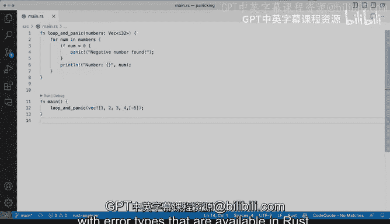

# Rust编程（基础）：45：演示：使用panic停止程序 🚨


在本节课中，我们将学习Rust中一个名为`panic`的核心概念。`panic`是一种立即停止程序执行的机制，通常用于处理程序无法或不应继续运行的严重错误情况。

## 概述

在JavaScript等语言中，你可以使用`throw`来抛出错误或异常。在Python中，你可以引发这些异常。而在Go和Rust这类语言中，你可以调用`panic`。`panic`会立即停止程序的执行，并输出一条消息，导致程序提前退出，同时可以选择性地提供回溯信息。

## 理解panic的基本用法

上一节我们介绍了`panic`的概念，本节中我们来看看它的基本用法。

我们可以在代码的最顶部直接调用`panic!`宏。例如，我们可以这样写：
```rust
panic!("Error: We are panicking or we're crashing the program");
```
现在，文本编辑器会立即知道这行代码之后的语句将不会被执行。如果我们运行这段代码，会看到类似“unreachable statement”的警告，因为`panic!`之后的任何代码都是不可达的。执行程序会输出“thread ‘main’ panicked”，并显示我们提供的错误信息，然后程序崩溃退出。

## 在条件逻辑中使用panic

直接调用`panic`可能不是最佳实践。更常见的做法是在检测到特定错误条件时触发`panic`。

以下是使用`panic`处理错误条件的一个示例：
```rust
fn main() {
    let numbers = vec![1, 2, 3, 4, -5];

    for &number in &numbers {
        if number < 0 {
            panic!("Negative number found: {}", number);
        }
        println!("{}", number);
    }
}
```
在这个例子中，我们遍历一个数字向量。当遇到负数（例如-5）时，程序会调用`panic!`并停止执行。这是一种处理你希望不惜一切代价让程序崩溃并停止执行的场景的方法，因为程序无法合理地继续运行。

## 何时使用panic？

那么，为什么要使用`panic`呢？`panic`在Rust中确实可用，但在生产环境的优秀Rust代码中，除非在非常特定的情况下，通常不鼓励使用它。

一般来说，你不会用`panic`来处理错误条件。`panic`适用于示例代码或演示中，当你希望立即停止执行时。就像我们之前在循环前做的那样。

当然，也存在一些你可能想要实现`panic`的情况，例如当某个条件是100%禁止的，违反它意味着程序必然陷入麻烦。但你必须非常小心地使用它。

## 谨慎使用panic的示例

为了更清晰地说明，让我们看一个可能意外引发`panic`的例子。我们还没有深入讨论向量或字符串，但这里有一个简单的示例：
```rust
fn main() {
    let s = String::from("hello world");
    println!("{}", s);
    // 尝试访问不存在的索引会导致panic
    // println!("{}", s.chars().nth(100).unwrap());
}
```
如果我们尝试访问字符串`s`的索引100（例如使用`s.chars().nth(100).unwrap()`），这很可能会引发`panic`，因为“hello world”没有那么多字符。

因此，请谨慎使用`panic`。只有在某些你必须使用`panic`的情况下，当你确信在你编写的程序中，某种情况是绝对不可想象的，并且除了`panic`别无他法时，才使用它。我们在Rust标准库的许多不同部分都能看到这种用法，这使其成为可接受的，但它并不是处理错误最常见或最推荐的方式。

## 总结



本节课中我们一起学习了Rust中的`panic`机制。我们了解到`panic`是一种立即终止程序执行的工具，适用于处理不可恢复的严重错误。我们演示了它的基本用法、如何在条件逻辑中触发它，并重点讨论了应谨慎使用`panic`的原因。在大多数情况下，更推荐使用Rust中提供的`Result`等错误类型来优雅地传递和处理错误。