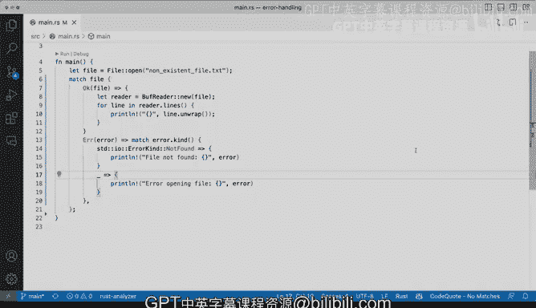

# 杜克大学《rust编程（基础）｜rust programming》中英字幕 - P46：46_02_08_演示：使用match进行基础错误处理.zh_en - GPT中英字幕课程资源 - BV1dx4y1b7Vo

If you're seen panic， if you've dealt with panicking before in Ru programs as a way of dealing with errors。

 well， there are other ways that we can deal with errors and that is using match and we've seen a little bit of match before but not for dealing with errors and in this case we are going to be using we're going to be demonstrating how you can use this matching to say hey。

 is this okay or are we going to get an error， So here we're going to have like a file that open now this can。

As if you've ever worked with files in any file system you might understand that you know a file might not exist。

 a file might be in the incorrect place or you have the wrong permissions or not enough permissions to read it or to write to it or you can read it but not write to it。

 I mean all kinds of different things that can happen so in this case we open the file and we say hey。

 you know like this file that we just open let's just make sure that it does exist and let's deal with the situation where it might not exist。

And in a situation where other things can happen。 So let's just go line by line and figure out what's going on here。

 So we're doing a match。 we've seen matches before or matching on a condition。

 the condition is either in this case， an okay which is an num and the R1 is an error condition。

 So in this case if it's okay then just the file will go back to the variable and we'll be able to continue。

 So let's just go through that first。 So if that happens， So file gets it gets assigned here。

 and then we create a new reader So instantiate this puff reader new using file that is actually coming from here and all the way there。

 and then we loop over each line to print to print the contents of the new file。

 this is a fairly common operation dealing with files and this case， that sounds fine。

 So that's a happy path。 Now the error path like。sWhat happens when we get into an error Well。

 if we get into an error condition and again， this might feel a little bit backwards if you're coming from languages like Typescript。

 jascript or Python where we're saying error in this case in these languages you might say hey。

 error is not defined well that's the actual return that you can get from the actual matching in this case we're having a nested match that we haven't seen before why are we having a nested match here because the error might be one of many different types of errors and we're saying well we want to deal specifically with a file now found and if the file now found。

 we're going to panic that's an acceptable our program is going to crash and we want to we want to do this thing we're going to passing the error and we're going to say file now found。

Anything else that's the underscore we've seen before， anything else we're going to say， hey。

 we just had an error， we couldn't open this file and that file is right here。

So there you go that's one match and a nested match right here and right here and that nested match is looking at the kind of error and the kind of error is can be a not found or something else that we don't care in this case we're saying anything So if we run these we of course going to get a panic because we're saying file not found no such file directory OS error to one of the things that you have to be careful about this is because when we're doing match we have to have the same types that we're returning in this case file is expecting a type of file so you can see here if I use the BS codeator。

 it expects a file so that has to what's coming back from match has to be a file so you can see here okay we'll get a file and in case error is not returning anything that's why we're getting a panic we're using panic here to deal with that So definitely be careful because if we try to do a print。

Instead of a panic， you might be tempted to release。

 I'm gonna to say print print line and suddenly we're going to get into trouble。 if we run these。

 we'll say match arms having incompatible types we're expecting type of file but we're getting a a unit right like remember the empty unit the empty parenthesis that is what we be doing if we're doing print line。

 So definitely have something to care about types here when we must make sure that everything that we're doing will not get into trouble here because of this file that might not be exactly what we want So again。

 matching is a way of dealing with errors and a way of handling that problem and it gives us the ability of of dealing with that now in this case we assign this to a variable。

But we could， we could just get rid of the variable and do match file here。 And in the case。

 in the case of like making it okay， we could actually get get this code here reading or wise could we could do the print line and be fine with that because then we're not assigning that variable right So let's actually try and get that going。

 Allright， so I made some some surgery， some serious surgery to to this file。

 and what I did was I remove the file variable。 and I'm saying match file。 So if it's okay。

 I'm going to go ahead and like open up a curly bracket here closer right there。

 This is the scope and I'm going to execute this thing。 Everything's fine。

 this is going to work work correctly。 All of this is going to work correctly。

 Like if it's an error then I'm still going to do the panic So that allows me to not necessarily go ahead and panic。

 I can do print。Line here and then print line here as well。 And that would be fine。

 So that's the difference。 Like now it's no longer the conditions are no longer mapped to a variable。

 I can do the handling in these very way I can say print line and not a problem。

 So now if I run I'm not going in a panic error I'm actually able to handle here and I can say this is printing and then that's absolutely fine。

 So many different options。 all kinds of different flexibility here with doing matching and we can definitely try to adapt this to a way where you want to handle the errors in a specific way using matching and using certain actions for different types of output。

