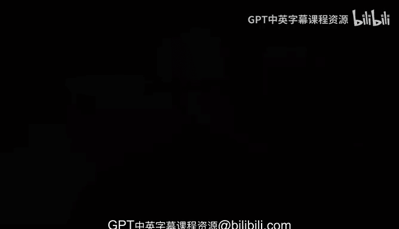

# 杜克大学《rust编程（基础）｜rust programming》中英字幕 - P47：47_02_12_函数基础总结.zh_en - GPT中英字幕课程资源 - BV1dx4y1b7Vo

As you've seen， rust is a functional programming language we have and we have functions。

 it will deal with functions and you will work with functions， we've seen how to create them。

 how to use them， some of the values that come and go。

 what are some of the values that are get returned。

 sometimes functions don't return something explicitly but beyond that you've also seen a little bit of the borrowing concept which is one of the primary concepts in the rust programming language that makes it so efficient and by making sure that you're comfortable by dealing with the borrowing concept in rust you're essentially making it easier to cover more advanced concepts in rust。

 everything will have to deal with this borrowing concept and what happens when we're sending one value and that ownership。

It gets transferred to some other function or to some other piece of code and rust will， of course。

 prevent you from making。Potentially catastrophic errors down the line。

 but the essential thing is that now you're feeling comfortable with functions a little bit with the control flow and also with the borrowing concept。

 which is such an essential piece for the rocking language。

