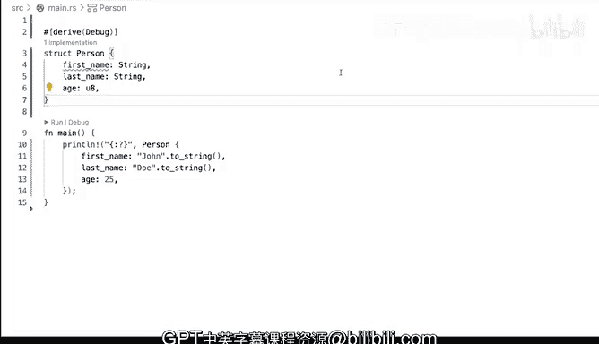

# 杜克大学《rust编程（基础）｜rust programming》中英字幕 - P49：49_03_04_演示：定义结构体.zh_en - GPT中英字幕课程资源 - BV1dx4y1b7Vo

Rust has a way of defining structured data。 you can see it as a collection of related items。

 almost like an object you would do in languages like Python or a Ruby or even Java where you have an object and you have some attributes。

 Let's start up here by creating astruct and creating one defining one actually。

 So you do that with a keywordstruct。 And I'm going to create one sure why not a person。

 I think beyond name and age。 how about we change these to first name and then last name string。

And this is the most basic way of defining a stroke so here you have this thing called person it's a structured data for person and then you start having related attributes data that is related to each other for these for this person so that is a neat way of organizing your your data now I'm not going go into lots of details on how to instantiate create astruct we'll cover that later。

 but let's try and do something something very small here。

 let's just print print line and we're going to do a debug。

And we're going to call that person and then and then put it on the on the terminal output。

 Now I'm getting all kinds of red here because one thing that we need in order to do this kind of interaction we're printing an actual like struggle。

 We're not printing a specific field。 So we're not you know talking to first name or last name or even reference in the H。

 we want to print the whole thing。 So how would you do that， we add a debug。

So we do that attribute and then that allows me to this。

 So if I run it very quickly we'll get still some complaints because I'm not using any of the fields I'm just printing the wholestruct wholesale and how does that look Well it's right here you can see person is astruct and we have first name last name Johndo H25 So so thats that's pretty much beyond the name the actual key word that we're using here to the final which is struck then these things on the left are called are called fields and these are the values So the fields and actually this is actually not the values。

 these are the types So in this case we're saying hey the first name is going to be a string。

 the last name also a string and the H is going to be an unsigned integer eight bits。

Maximum made bits。 So restricting kind of like how much how much of an integer we can use right there。

 So that is that is essentially like it's just worth noting that you're using you're using columns here。

 you're not using the equal signs very similar to a hash map or hashes in other languages Python dictionaries。

 for example， that are kind of kind of defined in this way， right。

 except that there's no types in Python and again， using it to print what what that value is。

 what thatstruct these and write right there。 So always remember to use these debug attribute that you can you can use to make that available or wise。

 the compiler will will not like that very much。

