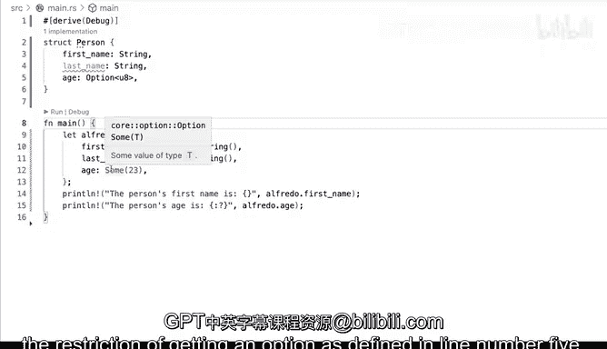

# 杜克大学《rust编程（基础）｜rust programming》中英字幕 - P50：50_03_05_演示：创建结构体实例.zh_en - GPT中英字幕课程资源 - BV1dx4y1b7Vo

Now let's see what it involves to create a str instance I'm going to put some data in and we' kind of like we were already doing that before right like we were in this case with the person we were adding adding the valuess for the fields and we were printing that so let's actually just go ahead and actually let's get started by defining creating one of these so if we say for example let Fredo equals person and then we can start actually doing that in this case yeah sure Sanchez and H 25 that sounds okay to me we are complying we're complying with the strings otherwise if we were to do this。

And then comma right here， we will get into trouble because this would be a string。

 which is the STR again， this is not a compile time we're actually asking for a string， not STR。

 which is you know a string slice also referred to as that in rust so we're going to have to say two string。

To a string right here， which makes it correct。 So we're complying。 that's fine。

 And now when we're printing， well we can do something a little bit more simpler。

 we can we can definitely we can definitely get rid of the struck right there。

 we can say alfredo right there and run it and this will run perfectly fine just as before， however。

 if we want to do and actually use some of these fields we can we can actually do the fields。

 how do you access the fields。 So for example， if you wanted to say something like。嗯。

The person's first name is。You lose something like these， and then you have your variable there。

You can say first name and you're gonna to be able to access those attributes。

 So if I hover you will see that this is the creating person first name string size and you're getting all of that extra information from visual Studio code that understands kind of like what is behind this thing thisstruct instance you have which is coming from person So when you do that and when you safe and then run it youll get the access to that。

 but let's just say for example， and by the way all of these things are required。

 So if I were to comment out age even though I just want to say first name and last name we would immediately get a red underline and why is that because we have missingstructure fields we have to we have to pass in all of the things required all of the fields values for for thestruct itself。

 So what is one way that you can get around with is a bit not fully but just a little bit。

Is that you can make this an option so if we say option you wait。

 that type means that this could be actually an integer or a nu。

 so see that this red underline doesn't still doesn't go away。

 but it allows me to say something like this instead of H25， I can say none。

 so I can indicate that well， I just don't know， I just don't know what the value is and I can say print line。

And I can say the persons。H。A so federal H and I don't think there's a necessity to do this。

 but we'll see let's just run it and we'll get a nu。s that's fine。

 And so you start accessing some of the fields and you'll see that last name is not used at all。

 but we're using first name right here and H right there。 So those are those are a couple ways。

 I mean we haven't seen nums yet enumerators yet just as slightly right we've seen a little bit of enumerators when we were handling errors where we might get the actual the actual value or we might get an error in this case option allows me to say I might get a value here。

And if so， is going to be an unsign integer for a bit in size， Otherwise I might get a nun。

 so this is what this allows me to and that's perfectly fine that's how we can we can say H none we can even go back and say you know 100 that might get me very close but not quite and let's see why I'm going to hover and we get try wrapping the the expression in sum why is that well because we we expect the expectation is an option so if we say sum。

We are able to do this directly and now it is satisfied。 Now that's correct。

 but we cant we can do some none。 So it is it is one of those things where you have to get used to say。

 well I'm going pass a none or if I'm going to pass an actual value。

 I have to use some and in this case it could be you know yeah sure 23 sounds okay and then comply because some allows me to get comply with the restriction of getting an option as defining line number5。

