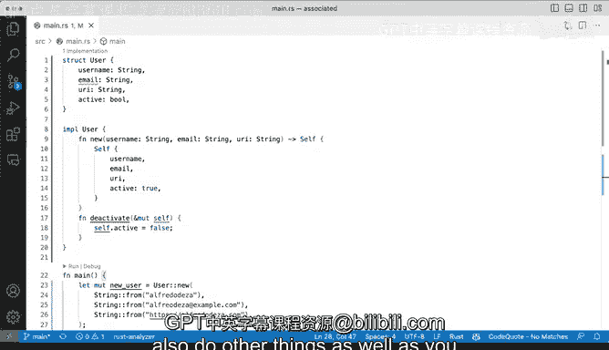

# 杜克大学《rust编程（基础）｜rust programming》中英字幕 - P51：51_03_06_演示：关联函数与构造函数.zh_en - GPT中英字幕课程资源 - BV1dx4y1b7Vo

Somestructs are fine to have in a simple definition like we do here where you have a userstruct right so we have a username。

 an email， Uri。 And if it's active or not。 So we're having a bulloleion there。

 So that's fine and you might start populating that that's fine。 but in some other cases。

 you may want to have a constructor。 Now a constructor is a powerful way of automating tedious。

 repetitive things And in this case， we might want to provide an easy way to create a user。 Now。

 how do you do that in rust is with an associatedative function and an asciative function is a function that doesn't require self。

 but I'm getting ahead of myself let's start looking at how we can do do this。

 And we're going to start by using that。Implementation that implements keyword by using IMPL。

 so implement some functionality for a type， this is not only specific forstructs。

 but it definitely allows us to extendstruct by using stuff by adding adding functions and adding some code related to it。

 but so we're going to say implements user。And this all looks fine with me。

 So let me actually go ahead and accept that suggestion and save it。 Now。

 let's go step by step here and see what is going on。 So when we say implements user。

 it means that it will extend the ability of user so that we can actually have that new be part of user。

 and when I say it doesn't it doesn't require self that is because it is it is not necessarily requiring you know access to some some of these fields。

 So this is the constructor and this is a convention。 this new function。

 it's a convention to create a new instance of thisstruct name user。

 So the way it works is we're going to accept certain parameters you can see that these are the same types as theystruct right there and。

And then that's fine。 Now， one bit of change here is that it might feel repetitive to require all of these ones from the get go。

 But you get some abstraction here that we're taking care of。

 And that is that we're setting the active to true。 Why， because。

Imagine you're building this service and you have a user somewhere。 And of course。

 if like it's it's assumed that if you are going to create a user is's because this user is active。

 So we're we're defaulting these to having a true。 So that's a great way of abstracting away your construction because you're gonna default to true unless let's our wise note。

 So how do how do I use this a new constructor。 Well， let's create a new user here。

 So we're going to say let new user and we're going to call user and then were it's separate by this double colon and then we're gonna to say new and we're going to pass passing。

The strings。 And when it say string。The username is going to be let's make it something more believable so in this case let's do my username right here let's also passing an email address so we can say from we can say something like Pretodesa example example。

com sure why not and then finally we want a UI' sure that sounds okay how about we change that to docom and these looks okay to me。

And then we're going to save that。 And then we have this new users。

 So now we can actually go ahead and take a look at this。

Thesestruct in the fields and we're not obviously using email or UI， but it's active and say， yeah。

 that's my username。 I can actually go ahead and use that。

 So this is a pretty effective way of creating of creating something like an instantiator。

 a constructor of the userstruct。 So definitely lots of things that you can you can abstract here and make use of that。

 Now returning a user is definitely possible， but we can also return self。

 So we can also refer to these self and this would be you can also use here self and in this case what does self refer to well it refers to itself and we can pass in we can pass in user for sure not a problem。

 So this is a very useful way where the requirement is not to pass。Passing self。 and we'll see。

 we'll see how to do that later。 Well， actually， why don't we go ahead and add another function here。

 I'm gonna pass in。 We're gonna create these new， new function that is going to accept that is going to accept self。

 So I'm going say。I'm going to change attributes here。

 I'm going to say instead of like changing the active to something else。

 I'm going to implement a function that says I'm going to deactivate it。 So here。

 sorry for the scrolling。 I'm going to say。We're going to say print， print line。

 I'm going to say count。Is account status is I'm going to say that。

 and I'm going to pass in new user。 and if it's active。 and then we're going to say new user。

And deactivate。 So we're going to do that。And then we're going to have to make some changes because a new user is immutable。

 remember， this is always immutable。 We want to mutate this。

 and we're going to have to add mute right there and now we can say we can actually copy these and put it there and see if it runs any compiles and of course it doesn't compile because I forgot a semicolon。

 Let's very quickly fix this， remember a semicolon right here means that this will get returned This is I can't find that right key there。

 if I missed that it means that this will get returned。

 but because I forgot that of course I was getting into trouble， which is now what I wanted right。

 I'm running that and it's like okay my username is a Fdesa account。

 status is true and then I change that to false because I am using my awesome little helper here。

 that is making changes directly。Directly to itself and that is a function if you're coming from Python or from say for example。

 other languages similar to Python with classes and methods this is kind of like a change for the actual instance and the instance is whatever instantiated object we have from these userstruct so we're changing some of these fields and some of its instances and that's why that's why we're taking self it's the same instance of the userstruct So those are two ways that you can extend in this case user with the awesome implementation keyword there that we can actually use to to keep adding more functions any more functions that you want and you have here two flavors one is a constructor and there one is something that will have the ability to change fields but also do other things as well as you come up with more automation ideas。

