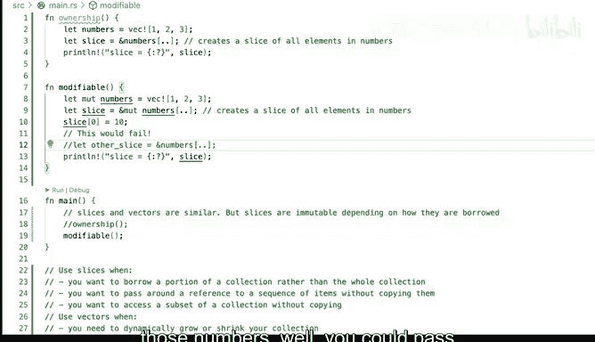

# 杜克大学《rust编程（基础）｜rust programming》中英字幕 - P57：57_03_05_演示：向量基础.zh_en - GPT中英字幕课程资源 - BV1dx4y1b7Vo

Vectctors and slices in rust are have like a similar relationship as strings and string slices。

 just like we've seen before。 Now， let's take a look at some of the differences。

 So here we have a main function。 And I would say like one of the the main things is that slices you should see them as almost like fixed in size and they immutable。

 Not always though。 So it's I'm hesitant to say that that's like like a mandatory or exclusive thing。

 but if you think about something that is notgable or or that the size can be unknown。

 then then vectors are your the go to data structure that you want to use。 otherwise slices are fine。

 So let's start with ownership。 And I'm gonna。Commentee album modifiable is going to be comment out and we'll take a look at that in a second。

 So let's run ownership and let's see what is going on。 So we're going to get a sample slice and1。

2 and 3。 and let's take a look at what we have here。 So first we define the vector。

 The vector will have33 items。 This is 1，2 and3。 the integers， let's take a look at what。

Well we have here so it's a vector of 32 bits that's the type that we're getting here。

 Then we go ahead and create a slice Nowt don't do this thing like I'm doing here in these examples where I'm actually naming the variable as the thing that I'm actually going to get return in practice you would want to name these in a more readable way。

 So what is these what are these numbers going to be doing and what exactly said that you want to do so if these were prices don't call them numbers。

 call them prices you know and if you're calling if these are averages of something just call them averages and that's a good way of being more idiomatic here for examples is fine to just use a slice but in real real world scenario errors't don't just use the name of the actual type or the underlying type All right so to create this slice we。

Are going to pass in a reference。 We're going to say from numbers and we're going to use these syntax。

 So what does the dot dot means in rust， that means that we are going to use the full range。

 like everything that is contained inside of the vector。

 So all of the elements in numbers are going to get copied over。 That's why when we print slice。

Everything looks the same as the vectors， the items。 so if I run this again， if you remember。

 we'll get the slice1 to 3， which is exactly what we had before。Um so。

Let's now take a look at modifiable and modifiable。 So now let's comment out ownership。

And let's do modifiable。 And let's walk through what we're going to get here， so。As always。

 variables are immutable， so we have to add mute for mutable here， we need to define it as mutable。

 we're going to make some changes。Now， when we're doing that。

 I mentioned that slices are not necessarily mutable， but I mean， you can， I mean。

 depending on how you're borrowing。The， the values， you can make them mutable。

 And the way you do that is by using the ampers and mute。 So that reference is going to be mutable。

 So you're borrowing a mutable reference for numbers。

 This also creates a slice of all elements in the numbers。

 And it will give you the exact the exact same result， except that we are adding。

We're adding a 10 here to say instead of like a one on the index0， just make that at 10。

 so we're modifying that。 So let's see what we are actually getting and you can see that the10 appears So instead of one to3。

 we're getting a 102，3 so we are able to make a change here it just takes a special care。

 Now I added a comment here that says this will fail。

 so let's take a look at what that means So if uncommented this line here and I'm creating another slice and I'm saying well you know this other slice is not even used right so it's not even used that's why it's grayed out but I'm getting the red curly underlined so I'm having a problem what's the problem if I'm only printing only printing slice which is coming from here everything was working what's the deal here so let's take a look at the message cannot borrow numbers as immutable。

Because it is also borrowed as mutable， immable B， of course。

 occurs here when we can actually see the actual full compiler diagnostic， so that's how it looks。

 we can do that right。The first thing that you might want to try is to say， well。

 if if it's borrowed as inmutable， which is correct。

 you might be tempted to say I then mute here and do that。

 but that would inquire work because you cannot borrow numbers as mutable more than once at a time。

In rust， you can do this one at a time， not multiple different times because otherwise you get into trouble that would mean if this was allowed。

 that would mean that these could get changed and while these could get changed as well so both of these things could get changed they're all referencing the same the same thing the slice。

 the representation is coming from here so you can get into lots and lots of trouble so don't do that only borrow once and if you're borrowing a mutable don't borrow it again。

 but also remember that once you borrow mutable， then you can't borrow immutable and you have to start getting more creative so perhaps here one strategy could be like if you really need to have those access to those numbers well you could pass ownership to another function or perhaps even create a new vector。

