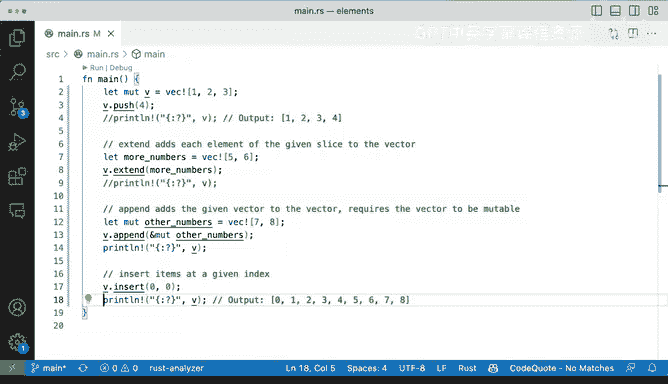

# 杜克大学《rust编程（基础）｜rust programming》中英字幕 - P59：59_03_07_演示：向向量添加元素.zh_en - GPT中英字幕课程资源 - BV1dx4y1b7Vo

Now adding elements to vectors again， we've already it's kind of like difficult to try to go through all of these without kind of like spellan a little bit or try out some of these options as we're moving forward。

 but so some of these we've already seen we're defining a mutable vector that that's required if we're going to make some modifications to these afterwards and of course if we're adding elements。

 we're going to modify it。 So let' start with push。

 we've already seen push where we're going to get that get that into into our mutable vector here。

 So if we run these of course we should expect one2，3 and4。Otherwise， okay。

 we hover here we'll get a pen one element to the very back of that collection。

 so the vector will have this item pushed at the very very back and the last the last item。

So what else is there Well we've already simply I'm going to comment this one out extend extend adds each element of the given slice to the vector so we can say we want more numbers we're going to create this new vector is five and6 and we're going to extend it So how is that going to look and I'm going hover over extend we have to have like an iterator and why is it an iterator because it doesn't necessarily need to be a vector it could certainly be a slice so in this case is going to extend it。

 we're going to run it and see what happens and now we're getting five and6 added to that now extend this kind of similar to a pen but a pen doesn't necessarily take an iterator so what it takes is another vector and it has to be mutable so why is that well。

In the case of extend， what what's happening here is taking every single element and it looping over all the elements in the iterator and then appending them or extending the actual vector and putting them at the very back。

 So that's what extent is doing。 So when would you want to use aend Well。

 aend takes an another vector wholesale like completely and and adds that。

 So that is why it is a requirement to have that mutability Otherwise it wouldn't work。

 So let's print that let's。Uncom that print line statement and comment this one out and run this again。

 So if I run these now get all the way to8， which is kind of like what we wanted because we're adding 7 and 8。

 Now finally， we can insert items these operations are very similar to all languages as well。

 remember ja and Typescript and Python as well。 you have insert append extend probably in a push。

 but that's definitely possible。 Alright， so finally insert。

 we can say we want to insert something at the index of 0 and let's run these and we'll get you can see before it was one through8 and now it's 0 all the way to 8。

 So those are a few ways that you can modify vectors you can add values and extend certainly you can do that with loops as well。

 And these are basics that will help you deal better with vectors knowing and understanding。

Some of these methods are similar and do similar things。

 and sometimes they require slightly different things when you are calling them。

