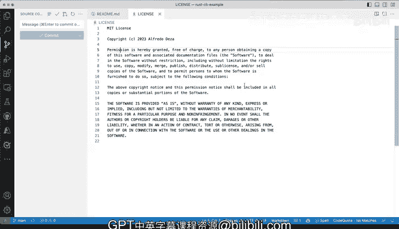

# Rust编程（基础）：P5：演示：Visual Studio Code 🛠️

在本节课中，我们将学习如何设置和使用 Visual Studio Code 作为 Rust 开发的主要编辑器。我们将介绍其核心界面、关键功能以及如何配置以优化 Rust 编程体验。

---

虽然你几乎可以使用任何支持 Rust 的文本编辑器，但本课程将主要使用 Visual Studio Code。大部分示例都将在此编辑器中演示。它非常方便，几乎支持所有主流操作系统，并且拥有良好的社区支持。因此，本课程中使用的所有工具和配置都将围绕 Visual Studio Code 展开。如图所示，它会自动检测操作系统（例如 Mac），但同样为 Windows 和 Linux 用户提供了相应版本，这为开发者提供了灵活性。安装源可能不同，但最终环境是一致的，所以无论你使用哪个系统，所有示例、扩展和配置都将正常工作。

这就是 Visual Studio Code。接下来，让我们深入了解它的一些核心组件。

## 界面概览与基本操作

我已经启动了 Visual Studio Code，这是你初次打开时可能看到的界面。如果你从未使用过它，本节将快速介绍其布局以及我们将如何使用它进行 Rust 开发。

我在这里有一些代码，这是一个 Rust 的 CI 示例。文件内容本身不重要，重要的是理解界面。左侧是**资源管理器**，这里列出了工作空间中的所有文件。通常，你的项目文件都会在这里。你看到的是欢迎页面，在底部有一个“启动时显示欢迎页面”的选项。如果你取消勾选，下次启动时就不会再显示。

欢迎页面提供了快速概览和一些有用的入门指南。如果你从未使用过 Visual Studio Code，我强烈建议你浏览这些指南并尝试操作。不过，对于我们的 Rust 学习目标，从 Jupyter 笔记本开始可能不那么相关，但了解 Visual Studio Code 的基础知识仍然很有价值。

好的，我关闭了欢迎页面。界面变空了，但我仍然有示例项目。任何时候你想关闭这些面板，只需点击产生它的图标即可。例如，点击资源管理器图标可以隐藏或显示文件列表。

如果我点击这些文件，比如 `README.md`，它会在编辑区打开。注意，它的标签是斜体，这表示它是**临时**打开的。这意味着如果我打开 `LICENSE` 文件，它会替换掉 `README.md`。如果我希望文件固定打开，可以双击标签页，这样它就不再是斜体，变成了永久标签。此时再打开 `LICENSE`，它会作为一个新标签页打开。如果你曾因文件被替换而感到困扰，现在你知道如何解决了。

## 核心功能面板

除了资源管理器，界面左侧还有其他重要图标：

*   **搜索**：你可以在这里搜索项目中的文件。虽然我们不会使用大量文件，但这个功能很有用。
*   **源代码管理**：如果你在系统中安装了 Git，这里会显示你的版本控制状态。我强烈建议你预先安装并配置好 Git。虽然本课程不深入讲解 Git，但它是现代开发的必备工具。
*   **运行和调试**：这是我们后续会详细讲解的功能。你可以在这里运行和调试 Rust 应用程序。通常需要为项目创建一个自定义的 `launch.json` 配置文件，里面包含了如何启动应用并进入调试模式的指令。

## 扩展：增强你的编辑器

接下来，我想重点介绍**扩展**。这是 Visual Studio Code 最强大的功能之一，你可以通过安装扩展来极大地增强编辑器的能力，优化 Rust 开发体验。

在扩展面板中，你可以搜索和安装各种工具。如图所示，我已经安装了许多扩展。例如，如果我搜索“license”，会出现像“Choose a License”或“License Injector”这样的扩展。点击任何一个，你会看到详细的扩展信息页面，这相当于 Visual Studio Code 扩展市场的网站版。你可以查看更新日志、详细信息、发布信息以及使用文档。

安装更多扩展后，你可能会在活动栏看到新的图标出现。例如，我安装了 Azure、GitHub、远程资源管理器等相关扩展，它们为我提供了更多功能。虽然我们可能不会用到所有高级功能，但扩展、运行和调试以及源代码管理是我们将频繁使用的核心部分。

如果我点击源代码管理图标，所有文件的更改都会显示在这里。如果我修改了文件，更改会立即出现。你可以在这里提交更改，当然，你也可以选择在终端中完成这些操作。

## 命令面板：快速操作的入口

另一个我想展示的重要功能是**命令面板**。有时我们需要快速更改设置或与特定扩展交互，命令面板就是为此而生的。

在我的系统上，我使用快捷键 `Cmd + Shift + P`（在 Windows/Linux 上通常是 `Ctrl + Shift + P`）来打开它。这被称为命令面板。如果你想更改设置或与不同扩展交互，可以在这里进行。你也可以通过菜单栏的“查看”菜单找到“命令面板”选项，旁边会显示对应的快捷键（虽然字体很小）。通过这个面板，你可以快速执行各种命令和修改设置。

---

本节课中，我们一起学习了如何设置 Visual Studio Code 作为 Rust 开发环境。我们快速浏览了其用户界面，包括资源管理器、搜索、源代码管理和运行调试面板。我们重点介绍了如何通过安装扩展来增强编辑器功能，并演示了如何使用强大的命令面板进行快速操作。掌握这些基础知识，将为后续的 Rust 编程实践打下坚实的基础。