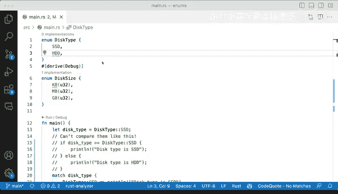

# Rust编程（基础）：P62：定义枚举 🧩


在本节课中，我们将学习Rust中一个强大的特性——枚举（`enum`）。我们将了解如何定义枚举、如何为枚举的变体关联数据，以及如何使用`match`表达式来比较和处理枚举值。通过一个磁盘类型的例子，我们将看到枚举如何帮助我们清晰地组织和处理不同类型的数据。

---

## 枚举的定义与基本概念

枚举（`enum`）是Rust中一种用于定义一组命名值的数据类型。它允许你将一个值限定为几个可能的变体之一。与结构体（`struct`）不同，枚举的每个变体可以持有不同类型和数量的数据。

以下是定义一个枚举的基本语法：
```rust
enum EnumName {
    Variant1,
    Variant2(Type1, Type2),
    Variant3 { field1: Type1, field2: Type2 },
}
```

在上一节我们了解了枚举的基本概念，本节中我们来看看如何具体定义一个枚举。

---

## 定义磁盘类型枚举

让我们通过一个具体的例子来学习。假设我们要表示两种类型的磁盘：固态硬盘（SSD）和机械硬盘（HD）。我们可以定义一个名为`Disk`的枚举。

```rust
enum Disk {
    SSD,
    HD,
}
```

这里，`Disk`是一个枚举类型，它有两个变体：`SSD`和`HD`。每个变体目前不关联任何额外数据。

---

## 使用枚举值

定义了枚举之后，我们可以创建该类型的变量。例如，我们可以声明一个`Disk`类型的变量并为其赋值。

```rust
let disk_type = Disk::SSD;
```

这行代码创建了一个名为`disk_type`的变量，其值为`Disk`枚举的`SSD`变体。注意，我们使用`枚举名::变体名`的语法来指定具体的变体。

---

## 比较枚举值

在像Python或JavaScript这样的语言中，你可能会尝试使用`==`运算符来比较枚举值。但在Rust中，直接比较枚举变体是不允许的，除非为枚举类型实现了`PartialEq`等特质。

以下尝试会导致编译错误：
```rust
if disk_type == Disk::SSD {
    println!("This is an SSD.");
}
```

编译器会提示类似“binary operation `==` cannot be applied to type `Disk`”的错误。这是因为我们没有为`Disk`类型实现相等性比较。

---

## 使用Match表达式处理枚举

在Rust中，处理枚举值的标准方式是使用`match`表达式。`match`允许你根据枚举的变体执行不同的代码分支。

以下是使用`match`表达式处理`Disk`枚举的示例：

```rust
match disk_type {
    Disk::SSD => println!("This type is an SSD."),
    Disk::HD => println!("This type is a spin drive."),
}
```

这段代码的意思是：检查`disk_type`的值。如果它是`Disk::SSD`，则打印“This type is an SSD.”；如果它是`Disk::HD`，则打印“This type is a spin drive.”。

运行这段代码，如果`disk_type`是`SSD`，输出将是：
```
This type is an SSD.
```

---

## 为枚举变体关联数据

枚举的强大之处在于，它的变体可以关联数据。例如，我们可以修改`Disk`枚举，让`SSD`变体关联一个表示容量的无符号32位整数。

```rust
enum Disk {
    SSD(u32),
    HD,
}
```

现在，`SSD`变体可以携带一个`u32`类型的值。我们可以这样创建一个带数据的`SSD`实例：

```rust
let disk_with_data = Disk::SSD(128);
```

这表示一个容量为128GB的固态硬盘。我们可以使用`match`表达式来提取并打印这个数据：

```rust
match disk_with_data {
    Disk::SSD(size) => println!("This is an SSD with {} GB.", size),
    Disk::HD => println!("This is a spin drive."),
}
```

运行这段代码，输出将是：
```
This is an SSD with 128 GB.
```

---

## 使用Debug特质打印枚举

与结构体一样，你也可以为枚举派生`Debug`特质。这允许你使用`println!("{:?}", enum_value)`来方便地打印枚举值及其关联的数据。

```rust
#[derive(Debug)]
enum Disk {
    SSD(u32),
    HD,
}

fn main() {
    let disk = Disk::SSD(256);
    println!("{:?}", disk);
}
```

输出：
```
SSD(256)
```

---

## 枚举变体的命名

在枚举定义中，`SSD`和`HD`被称为**变体**，而不是字段或属性。当编译器报告错误时，它可能会提到“变体”。例如，如果你在`match`表达式中漏掉了一个变体，编译器会提示“non-exhaustive patterns”（模式未覆盖所有情况），并指出缺少哪个变体。

---

## 总结

本节课中我们一起学习了Rust中枚举的定义和使用。我们了解到：

1.  枚举使用`enum`关键字定义，用于将值限定为一组可能的命名变体。
2.  枚举变体可以关联不同类型和数量的数据。
3.  不能直接使用`==`运算符比较枚举值，而应使用`match`表达式进行模式匹配和处理。
4.  可以为枚举派生`Debug`特质以便于打印调试信息。
5.  枚举是Rust中表达数据分类和状态的强大工具，在错误处理、状态机等场景中非常有用。



通过掌握枚举，你能够更清晰、更安全地组织和处理程序中的多种可能性。