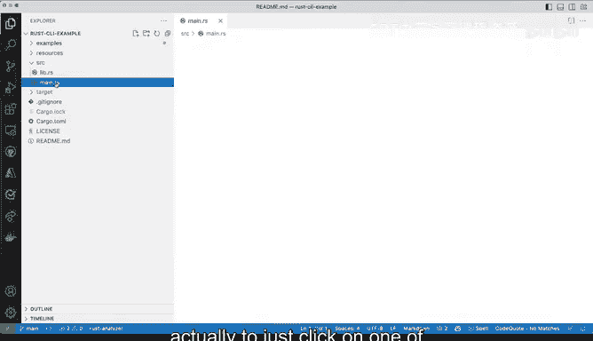

# Rust编程（基础）：P6：启用Rust分析器 🛠️

在本节课中，我们将学习如何在Visual Studio Code中安装和启用Rust分析器（Rust Analyzer）。这是一个强大的扩展，能为Rust开发提供智能代码补全、类型提示和代码导航等功能，极大地提升编程效率。

---

## 安装Rust分析器

我们已经安装并打开了Visual Studio Code。接下来，让我们安装Rust分析器扩展。

请转到扩展面板，搜索“rust”。搜索结果可能会非常多，容易让人眼花缭乱。例如，这里显示了大量与Rust相关的结果。我们需要的是名为“rust-analyzer”的扩展。

为了更精确地查找，你可以直接搜索“analyzer”来过滤结果。但毫无疑问，我们需要的扩展就是“rust-analyzer”。我们可以把窗口调大一些，以便更清楚地查看。这个扩展拥有超过170万的安装量和五星好评，这正是我们需要的。

我将点击这个扩展来查看其详情。它提供了一些基本功能，例如代码补全，这是现代代码编辑器应具备的功能。此外，它还提供了一些更高级的、与IDE相关的增强功能。

代码补全功能非常出色，同时它还提供了代码提示和高亮，这些功能运行良好。我个人非常喜欢，并且对于正在学习Rust或希望更精通Rust的开发者来说非常有用的一点是：它可以显示所有定义、类型及其解释说明。尤其是在你将鼠标悬停在代码上时，这些信息会显示出来。在本课程中，我们将全程看到这一点，因为我们会安装并启用Rust分析器。

现在，让我们开始安装。我将点击这里的“安装”按钮。这需要一点时间。安装完成后，一切就基本准备就绪了，但你可能不会立即看到与仅安装编辑器时有太大不同。

---

## 验证Rust分析器是否工作

你可能会疑惑：我怎么知道它真的在工作呢？

首先需要了解的是，当前这个扩展标签页显示的是关于Rust的信息，但这本身并不是Rust代码。因此，Rust分析器在这里不会有什么动作。

在开始之前，最重要的一步是确保Rust本身已经安装在你的系统上。否则，这个扩展将无法正常工作，因为它在后台依赖于已安装的Rust环境。这就是为什么我们在进行这些步骤之前，已经提前安装好了Rust。

我将关闭这些标签页。很巧，我现在已经在一个包含Rust代码的项目中。让我打开`main.rs`文件。你可以看到，Rust分析器在这里出现了，速度非常快。状态栏上立即显示了一些信息。

为什么现在它出现了呢？因为Visual Studio Code足够智能，能够识别出这是一个Rust代码文件，因此会触发相关功能。我们在这里看到的“运行和调试”按钮非常有用，所有这些功能之所以对我们可用，正是因为我们使用了Rust分析器。

现在它已经启用，你可以在这里再次看到它。如果我点击它，它会重新运行，你可以看到它正在索引和处理一些内容。这就是启用它的方法：安装它，并确保它正在运行。

如果我切换到其他文件，Rust分析器会继续保持活动状态。现在它已经理解这是一个Rust项目。

---

## 常见问题与提示

在刚开始使用时，如果看不到Rust分析器出现，可能会有点困惑，不明白原因。一个简单有效的方法是：只需点击打开一个Rust代码文件（例如`.rs`文件），Rust分析器就会被激活并开始工作，之后一切就会正常了。

---

本节课中我们一起学习了如何在VS Code中安装和配置Rust分析器扩展。我们了解了它的核心功能，如**代码补全**和**类型提示**，并掌握了验证其是否正常工作的基本方法。确保Rust环境已安装是扩展生效的前提。现在，你的开发环境已经具备了更强大的Rust编程支持。