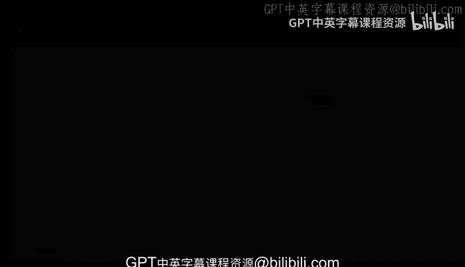
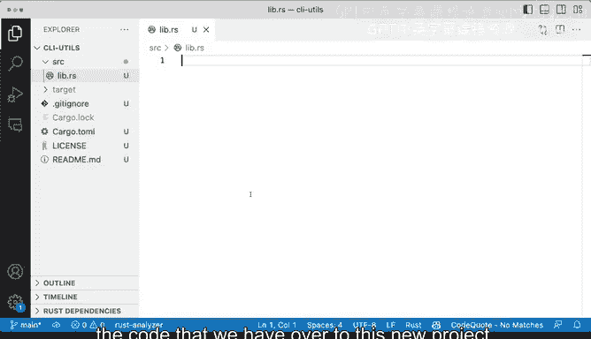

# 杜克大学《rust编程（基础）｜rust programming》中英字幕 - P70：70_04_04_演示：使用Cargo创建库.zh_en - GPT中英字幕课程资源 - BV1dx4y1b7Vo

Oftentime in rust and dealing with different projects you will find a particular situation where you will be working with a project and you might want to split things out or you might want to create things to support other projects in this case I have this project called resplit and what it does and again the details of these are not tremendously important but what it does is it is a CI tool that allows you to cut and select certain fields and certain inputs just like the cut CI。

 this is a particular CI Linux。And what it does it allows you to select an incom in string like this one and say I want to split on say a comma like that one and then I want to get the second field or the first field so this would probably be split into2 one will be that and the other one will be the rest of the string so that's what the command line tool does let's take a very quick look at what we have here is S or C and we have main thatRS and we have the contents of the command line tool now very important for what we want to do and then Li thatRS and we have a CIstruct and then we have a read standard in and a split。

So。What we are going to assume here is a real world scenario where we are going to extract this functionality out and make it a library。

 so we are going to create a utility library so that this specific functionality will exist somewhere else in such way that we don't need to write it here and these Command tool can just be able to rely on that and all throughout these lessons we will see and work with this external library to make it better to figure out some of the problems。

 how to make it better， how to write documentation， how to publish it。All right， so having said that。

 what's the next step。 Well， the next step is to create the library using cargo。

 So here I have an empty almost empty project it is the Ci us I've named that Ci us I have one license and what readmi I actually don't think the readmi does has anything in it。

 you can see there it's plank I'm going expand the Ci and what I'm going do is I'm going to use cargo to build my library。

 we've already seen how to do that。 So I'm very quickly going to type that out So with this command。

 I'm saying cargo in it， I'm going to use dash dash lip to say， hey， by the way。

 I'm not creating a command line I'm creating a library and that to signal that this is the exact directory where I want this to be and we have source C we have or get ignore cargo Tail for our basic dependencies and we don't have any depend。

Let's poke around， I'm going to close the terminal and let's poke around SRC or source。

 We're not going to have main RRS as we've seen before， and we are going to have lived that Rs。

 So this is pretty good this code though will have to go away。

 So I'm going to select it all and I'm going to get rid of it。 So I am going to lift that as that。

 and essentially what I'm going to do next is I will try to figure out how to。

Pour the code that we have over to this new project， this CLI U project。

 which is going to be a library。

